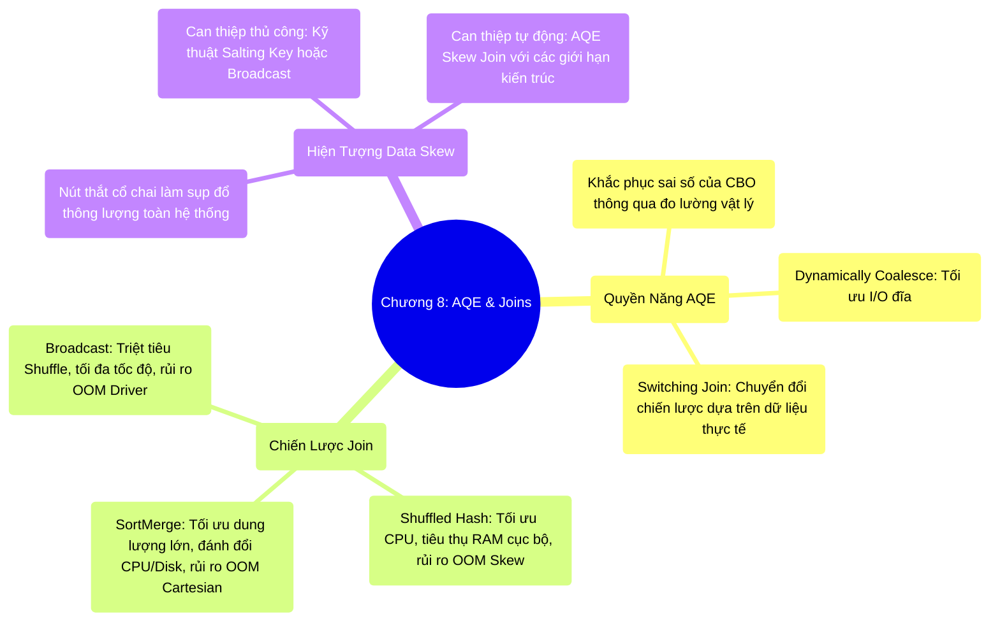

# 8.4 Tổng Kết Chương 8: Sự Chuyển Giao Kiến Trúc AQE và Chiến Lược Join

## 1. Objectives
- [ ] Khẳng định vai trò của AQE trong việc khắc phục điểm mù của hệ thống lập kế hoạch tĩnh (Static Planning).
- [ ] Tổng hợp bức tranh đánh đổi tài nguyên (Trade-offs) của 3 thuật toán Join cốt lõi.
- [ ] Đúc kết nguyên tắc thiết kế hệ thống khi đối mặt với rủi ro phân bổ lệch (Data Skew).

## 2. Mindmap

## 3. Content

Trong kỷ nguyên phát triển của Apache Spark, sự khác biệt giữa kỹ sư vận hành cơ bản và Kỹ sư Hệ thống (Staff Engineer) được thể hiện rõ nhất qua khả năng làm chủ các toán tử phân tán (Joins) và hệ thống AQE (Adaptive Query Execution).

### 3.1. Sự Dịch Chuyển Từ Kế Hoạch Tĩnh (Static Planning)
Các kỹ sư thường đặt niềm tin tuyệt đối vào năng lực của Catalyst Optimizer (CBO), coi đó là một hộp đen hoàn hảo. Tuy nhiên, hệ thống thường gặp sự cố OOM do CBO đưa ra những dự báo sai lệch về kích thước dữ liệu (Đặc biệt là sau các bước Filter hoặc UDF).
Các Kỹ sư Hệ thống thấu hiểu những giới hạn nội tại của CBO trước sự biến động của luồng dữ liệu. Thay vì phụ thuộc hoàn toàn vào kế hoạch tĩnh, họ vận dụng nền tảng **AQE**. AQE tận dụng các điểm dừng vật lý (Stage Boundary) để đo lường chính xác thông lượng I/O thực tế, từ đó can thiệp và tái cấu trúc Kế hoạch Vật lý (Physical Plan) ngay trong thời gian chạy (Runtime).

### 3.2. Nguyên Lý Đánh Đổi (Trade-offs) Của Toán Tử Join
Không tồn tại một chiến lược Join hoàn hảo trong môi trường phân tán. Mỗi thuật toán là một sự đánh đổi (Trade-off) nhằm tối ưu hóa một loại tài nguyên cụ thể:
- Lựa chọn **Broadcast Hash Join** $\rightarrow$ Trao đổi dung lượng RAM của Driver và toàn bộ cụm Executor để đổi lấy thông lượng mạng (Triệt tiêu Shuffle). Đạt tốc độ thực thi tối đa nhưng đi kèm rủi ro sụp đổ hệ thống tức thời nếu vi phạm giới hạn bộ nhớ.
- Lựa chọn **Shuffled Hash Join** $\rightarrow$ Chấp nhận chi phí Network Shuffle nhằm bảo vệ CPU khỏi thuật toán Sort đắt đỏ. Đòi hỏi một vùng RAM cục bộ tương đối lớn và chứa đựng rủi ro OOM khi xuất hiện Data Skew.
- Lựa chọn **Sort-Merge Join** $\rightarrow$ Chiến lược phòng thủ tối ưu trước khối lượng dữ liệu khổng lồ nhờ cơ chế xả đĩa (Spill). Tuy nhiên, nó tiêu hao chu kỳ CPU và I/O đĩa cứng. Đáng lưu ý, SMJ **không hoàn toàn miễn nhiễm OOM**. Hệ thống vẫn sụp đổ nếu gặp phải một Skew Key tạo ra tập hợp Cartesian Product vượt quá dung lượng Execution Memory trong giai đoạn Merge.

### 3.3. Quy Tắc Ứng Phó Data Skew
**Data Skew** là rủi ro ẩn giấu lớn nhất của điện toán phân tán. Đặc tính của nó là làm tê liệt một số lượng nhỏ các luồng Task, trong khi phần lớn hệ thống lại trong trạng thái nhàn rỗi. Tư duy Scale-up phần cứng để xử lý Skew là một sai lầm về mặt kiến trúc.

Cơ chế AQE Skew Join tự động là một bước tiến quan trọng của Spark 3.0+, giúp giảm bớt gánh nặng triển khai kỹ thuật Salting thủ công. Tuy nhiên, Kỹ sư Dữ liệu vẫn cần nắm vững giới hạn của AQE (Ví dụ: Sự bất lực trước hiện tượng Bùng nổ dữ liệu đầu ra - Output Explosion) để có thể can thiệp sâu vào cấu trúc dữ liệu khi cần thiết.

## 4. Key takeaways
- **Thoát ly sự hoàn hảo**: Không có kế hoạch phân tán nào hoàn hảo từ đầu. Kỹ sư phải vận dụng cấu trúc của AQE để hệ thống có khả năng tự sửa lỗi liên tục.
- **Sự thỏa hiệp của Join**: Việc lựa chọn thuật toán Join đòi hỏi sự đánh giá kỹ lưỡng về thể trạng hệ thống (Sự dư thừa của RAM so với CPU/Disk).
- **Lời tựa Phần Cuối**: Chúng ta đã phân tích và tái cấu trúc lại toàn bộ các thành phần lõi của Spark: Vượt rào JVM bằng Tungsten, tối ưu hóa Catalyst bằng AQE, và tái định hình cấu trúc lưu trữ bằng Parquet/Liquid. 
Bức tranh về luồng vận hành nội tại đã hoàn thiện. Hành trình tiếp theo sẽ chuyển sang **Phần Cuối: Kỹ Thuật Quan Sát Và Chẩn Đoán Khắc Phục Sự Cố**. Chúng ta sẽ học cách phân tích Spark UI để giải mã các nút thắt DAG, và chẩn đoán nguyên nhân gốc rễ của các sự cố OOM trên môi trường Production. Mời tiến thẳng vào **Chương 9**.
