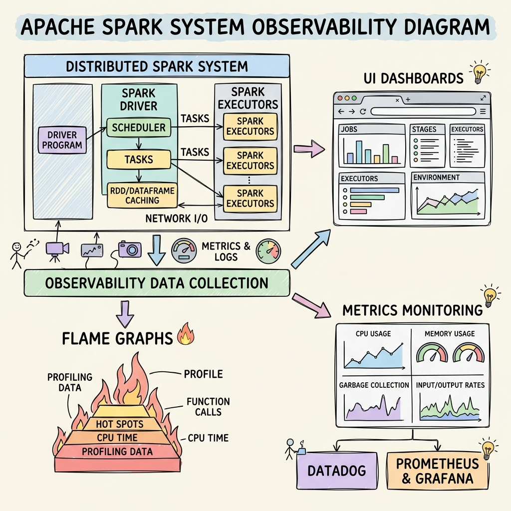
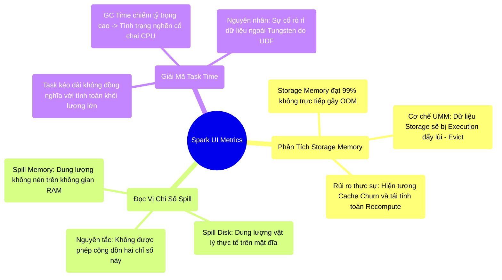

# 9.1 Spark UI: Cơ Chế Quan Sát Và Phân Tích Hiện Trạng Hệ Thống




## 1. Objectives
- [ ] Đính chính cách diễn giải thông số Storage Memory trong việc chẩn đoán sự cố OOM.
- [ ] Phân tích chính xác bản chất vật lý của hai chỉ số `Spill (Memory)` và `Spill (Disk)`.
- [ ] Khảo sát chỉ số `GC Time` để chẩn đoán hiện tượng tắc nghẽn CPU (Stop-the-world).

## 2. Mindmap


## 3. Content

Khi hệ thống gặp sự cố OOM trong môi trường Production, công cụ chẩn đoán (Diagnostic Tool) cơ bản nhất của Kỹ sư là **Spark UI**. 
Tuy nhiên, nếu giám sát Spark UI bằng tư duy tuyến tính (Cho rằng cảnh báo đỏ đồng nghĩa với lỗi, hoặc thanh RAM đầy đồng nghĩa với OOM), kỹ sư sẽ dẫn tới những nhận định sai lệch về kiến trúc. Ở cấp độ Kỹ sư Hệ thống (Staff-Level), Spark UI cung cấp các bằng chứng pháp y về luồng I/O, đòi hỏi khả năng diễn giải sâu sắc về cơ chế vận hành nội tại.

### 3.1. Diễn Giải Đúng Về Storage Memory
Trên giao diện tab Executors, thông số **Storage Memory** thường hiển thị trạng thái đầy (99%), điều này dễ dẫn đến nhận định sai lầm rằng hệ thống sắp cạn kiệt tài nguyên RAM và dẫn đến OOM.

- **Thực tế kiến trúc:** Dựa trên cơ chế phân bổ UMM (Bài 5.3), không gian Storage chỉ quản lý dữ liệu tĩnh (Cache/Broadcast). Trong khi đó, không gian Tính toán (Execution Memory) được cấp đặc quyền ưu tiên tuyệt đối. Khi luồng Execution cạn kiệt RAM, nó sẽ chủ động **đẩy lùi (Evict)** dữ liệu tĩnh khỏi Storage. Tác nhân trực tiếp gây OOM luôn xuất phát từ sự bão hòa của Execution Memory, chứ không phải Storage Memory.
- **Rủi ro vận hành (Cache Churn):** Mặc dù việc bão hòa Storage không gây OOM, nhưng nó tạo ra một hiệu ứng phụ nghiêm trọng. Khi khối dữ liệu Cache bị đẩy ra (Evict), trong những lần truy xuất tiếp theo, hệ thống buộc phải **Tính toán lại (Recompute)** từ dữ liệu gốc, hoặc kích hoạt I/O truyền tải lại Broadcast qua mạng. Hiện tượng luân chuyển liên tục này phá vỡ cam kết về thời gian thực thi (SLA).

> [!TIP] Staff-Level Runbook: Quản Trị Storage
> Không đánh giá rủi ro dựa trên thanh hiển thị màu đỏ của Storage, hãy giám sát:
> 1. Tần suất đẩy dữ liệu (Eviction count) tại tab Storage.
> 2. Tỷ lệ Cache Hit Ratio (Xác định mức độ lãng phí tính toán).
> 3. Tích cực gọi hàm giải phóng bộ nhớ `df.unpersist()` ngay khi hoàn tất tác vụ liên quan đến DataFrame để giảm tải áp lực cho hệ thống UMM.

### 3.2. Chẩn Đoán Bản Chất Thông Số Spill
Tại tab Stages, nếu hệ thống áp dụng thuật toán Sort-Merge Join trên quy mô lớn, hai chỉ số báo động I/O sẽ xuất hiện: `Spill (Memory)` và `Spill (Disk)`. 
Một hiện tượng vật lý phổ biến: Hệ thống báo `Spill (Memory)` lên tới 50GB, nhưng `Spill (Disk)` chỉ ở mức 5GB. Tại sao tồn tại sự chênh lệch này?

> [!CAUTION] Cảnh Báo Kiến Trúc: Đọc Vị Hệ Quy Chiếu Spill
> Tuyệt đối không cộng dồn hai chỉ số Spill này. Chúng đo lường hai định dạng vật chất khác biệt:
> - **Spill (Memory):** Đo lường kích thước dữ liệu khi CHƯA ÁP DỤNG THUẬT TOÁN NÉN, khi luồng dữ liệu mang định dạng Java Object nguyên bản cùng toàn bộ cấu trúc Overhead tại On-Heap.
> - **Spill (Disk):** Đo lường kích thước CHÍNH THỨC VẬT LÝ thực tế sau khi dữ liệu đã được định dạng nhị phân (Serialized), nén (Ví dụ: Snappy) và luân chuyển xuống đĩa từ cục bộ.

Sự chênh lệch lớn về tỷ lệ minh chứng cho mức độ Overhead của Java Object. Cơ chế xả đĩa (Spill) là phản xạ tự bảo vệ của hệ thống. Dấu hiệu hệ thống sắp sụp đổ OOM thực sự là khi nó **không kịp Spill** khối dữ liệu quá lớn, chứ không phải bản thân sự tồn tại của thông số Spill.

### 3.3. Giải Mã Task Time: Hiện Tượng Nghẽn CPU Do Thu Gom Rác
Khảo sát một tiến trình (Task) kéo dài 10 phút. Nếu chỉ phân tích thời gian tổng quát, hệ thống dường như đang thực thi khối lượng tính toán khổng lồ. Kỹ sư Hệ thống cần kiểm tra ngay chỉ số `GC Time` (Garbage Collection Time).

- **Hiện tượng nút thắt cổ chai:** Nếu Task tiêu tốn 10 phút, nhưng `GC Time` chiếm tới 9 phút $\rightarrow$ Hệ thống đang rơi vào trạng thái bão hòa thu gom rác **(GC Thrashing / Death Spiral)**.
- **Bản chất vật lý:** CPU không thực thi thuật toán nghiệp vụ (Ví dụ: Hash, Sort). Hơn 90% chu kỳ CPU bị máy ảo JVM cưỡng chế đóng băng (Stop-The-World) để dọn dẹp hàng tỷ đối tượng dữ liệu dư thừa.
- **Production Runbook:** Nguyên nhân cốt lõi thường xuất phát từ việc Kỹ sư triển khai mã nguồn thông qua Python/Scala UDF tùy biến. Mã tùy biến này vô tình ép Spark chuyển dịch định dạng dữ liệu, thoát khỏi màng bảo vệ của Tungsten Off-Heap và quay trở lại luồng quản lý của On-Heap JVM.

**[Config Snippet: Tránh Hiện Tượng GC Thrashing]**
```python
# Cách 1: Tối đa hóa việc sử dụng Built-in Functions của Spark SQL
# Xấu (Rò rỉ khỏi Off-Heap, bùng nổ Object On-Heap, gây GC Time lớn):
df.withColumn("len", udf(lambda x: len(x))(col("name")))

# Tốt (Khai thác năng lực xử lý Native của Tungsten):
df.withColumn("len", length(col("name")))

# Cách 2: Tăng mức độ phân mảnh để giảm kích thước RAM phân bổ tại một thời điểm
spark.conf.set("spark.sql.shuffle.partitions", "2000")
```

## 4. Key takeaways
- **Giải mã giao diện UI**: Sự bão hòa Storage không gây ra sự cố OOM, mà tạo ra điểm nghẽn Recomputation. Nút thắt thực sự thường biểu hiện qua mức độ đóng băng của CPU (GC Time).
- **Trạng thái vật chất của Spill**: Chênh lệch giữa Spill (Memory) và Spill (Disk) phản ánh rõ mức độ cồng kềnh (Overhead) của cấu trúc Java Object.
- **Chuyển giao**: Spark UI chỉ đóng vai trò chẩn đoán hiện trạng thay vì cung cấp nguyên nhân cấu trúc. Bức tranh định tuyến dữ liệu thực sự (Nút thắt Broadcast, nghẽn mạng Shuffle) được phản ánh chi tiết trên **Tab SQL / Dataframe**. Khả năng đọc vị mạng lưới định tuyến (DAG) này sẽ được giải phẫu tại Bài 9.2.
