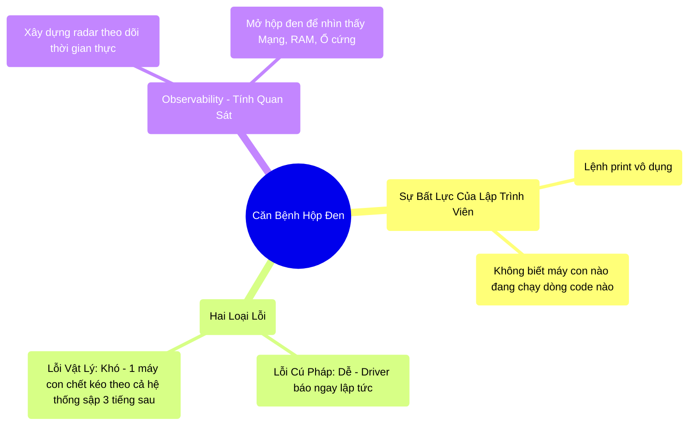

# 9.1 Hộp Đen Phân Tán: Tại Sao Spark Lại Khó Bắt Bệnh?

## 1. Objectives
- [ ] Lý giải sự bất lực của việc dùng lệnh `print()` để debug trong môi trường phân tán qua **Phép ẩn dụ Lái Máy Bay Mù**.
- [ ] Phân biệt hai loại lỗi: Lỗi Cú Pháp (Syntax Error) và Lỗi Vật Lý (Physical Crash).
- [ ] Giới thiệu định nghĩa về Observability (Tính Quan Sát) - Vũ khí sinh tồn cốt lõi.

## 2. Mindmap


## 3. Content

### 3.1. Phép Ẩn Dụ: Lái Máy Bay Mù Trong Sương Mù
Khi bạn viết code Python thông thường (Pandas/Django), nếu có lỗi, màn hình Terminal lập tức hiện ra màu đỏ, chỉ rõ file nào, dòng số mấy bị lỗi. Bạn chỉ việc thêm vài dòng `print(Đang chạy đến đây...)` là tìm ra vấn đề.

Nhưng khi bước chân vào Big Data, lập trình viên như bị ném vào một buồng lái máy bay không có cửa sổ.

> **[Ví Dụ Trực Quan: Lái Máy Bay Mù]**
> Đoạn code của bạn giống như Cần điều khiển máy bay. Hệ thống 100 máy Worker là chiếc Động cơ phản lực.
> Bạn gạt cần (Chạy Code). Cần gạt rất êm. Driver báo: Đã tiếp nhận lệnh.
> 
> Bạn ngồi chờ 1 tiếng, 2 tiếng... Không có màn hình nào sáng lên. Không có dòng chữ `print` nào hiện ra. Bạn hoàn toàn MÙ TỊT không biết chiếc máy bay đang bay ở Đại dương nào.
> Đột nhiên, chiếc máy bay gặp sự cố nghiêm trọng (Lỗi OutOfMemory). 
> Bạn vội vã mở Hộp Đen ra xem, thì thấy hàng triệu dòng Log đổ ập vào mặt. Đoạn log báo lỗi nằm ở một máy tính tên là `Worker-92`, nhưng nó lại báo lỗi Java, không hề chỉ ra là dòng Code Python số mấy của bạn gây lỗi. 

Đây chính là **Vấn Đề Hộp Đen (Black Box Problem)** của Spark.

### 3.2. Sự Vô Dụng Của Lệnh `print`
Tại sao bạn không thể dùng `print()`? 
Hãy nhớ lại Phép ẩn dụ Sổ Công Thức ở Bài 3.1.
Khi bạn viết:
```python
def check_data(row):
    print("Đang xử lý dòng:", row.id) 
    return row.id * 2

df_rdd.map(check_data)
```
Hàm `print` KHÔNG chạy trên máy tính của bạn (Máy Driver). Nó bị Spark gói ghém lại, gửi sang 100 cái máy Worker khác nhau.
Nếu 100 máy đó in ra màn hình, thì nó in ra cái Màn hình Console của... Đám mây (AWS/Google Cloud). Bạn hoàn toàn không nhìn thấy gì trên máy tính cá nhân của mình cả! 
Bạn đang cố gắng gọi điện thoại cho 100 công nhân, nhưng họ đều không mang điện thoại.

### 3.3. Lỗi Cú Pháp vs Lỗi Vật Lý
Sự ức chế lớn nhất của Spark nằm ở sự phân mảnh của 2 loại lỗi:
1. **Lỗi Cú Pháp (Syntax Error / AnalysisException):** Giống như bạn gõ sai tên cột, viết sai tên bảng. Nhờ tính năng Lazy Evaluation (Bài 3.2), Catalyst Optimizer (Driver) sẽ đọc và tát vào mặt bạn NGAY LẬP TỨC trong giây đầu tiên. Chữa rất dễ.
2. **Lỗi Vật Lý (Physical/Runtime Crash):** Code viết đúng 100% cú pháp. Catalyst gật gù khen hay. Hệ thống bắt đầu chạy êm ru.
   - Nhưng đến phút thứ 45, tại máy `Worker-92`, một cục Data Skew của TP.HCM tràn vào. 
   - RAM của `Worker-92` gặp sự cố nghiêm trọng (OOM). 
   - Nó báo về Driver: Tao chết rồi. Driver phải tìm cách chạy lại.
   - Phút thứ 60, hệ thống sập hoàn toàn. 
Đây là loại lỗi cực kỳ khó chữa, vì nguyên nhân sâu xa không nằm ở Code (Cú pháp), mà nằm ở Khối lượng Dữ Liệu và Bản đồ Phân phối Mạng!

### 3.4. Observability: Lắp Radar Cho Buồng Lái
Để không bị rơi máy bay, kỹ sư giỏi không đoán mò. Họ phải phá vỡ Hộp Đen bằng **Observability (Tính Quan Sát)**.
Tính Quan Sát là khả năng gắn các cảm biến (Sensors) vào 100 cỗ máy Worker, đo đạc xem:
- Máy nào đang chạy nhanh, máy nào chạy chậm?
- Máy nào RAM đang phình to?
- Sợi cáp mạng nào đang bị tắc nghẽn?

Chúng ta có 3 công cụ (Radar) chính để làm việc này:
1. **Spark UI:** Bảng điện tâm đồ theo dõi sự sống của Job. (Bài 9.2).
2. **Thread Dumps & Flame Graphs:** Máy chụp X-Quang soi thấu CPU. (Bài 9.3).
3. **Prometheus & Grafana:** Hệ thống Camera an ninh lưu trữ bằng chứng lịch sử (Bài 9.4).

Bạn sẽ học cách sử dụng các Radar này trong những bài tiếp theo. Đã đến lúc chấm dứt chuỗi ngày code mù quáng!

## 4. Key takeaways
- **Bản chất Hộp Đen:** Spark dịch code Python/SQL của bạn thành lệnh Java/Scala, ném qua mạng đến hàng trăm máy vô danh. Lỗi báo về thường là lỗi của JVM (Cấp độ máy ảo Java), đứt đoạn hoàn toàn với dòng code ban đầu của bạn.
- **Sự khác biệt của Lỗi:** Lỗi Logic thì báo ngay. Lỗi Vật Lý (OOM, Disk Spill, Skew) có thể ủ bệnh hàng chục tiếng đồng hồ mới phát nổ. 
- **Giải pháp sinh tồn:** Phải xây dựng văn hóa Observability. Bất cứ một Data Engineer nào chưa từng bật Spark UI lên xem thì mãi mãi chỉ là Coder nghiệp dư.
