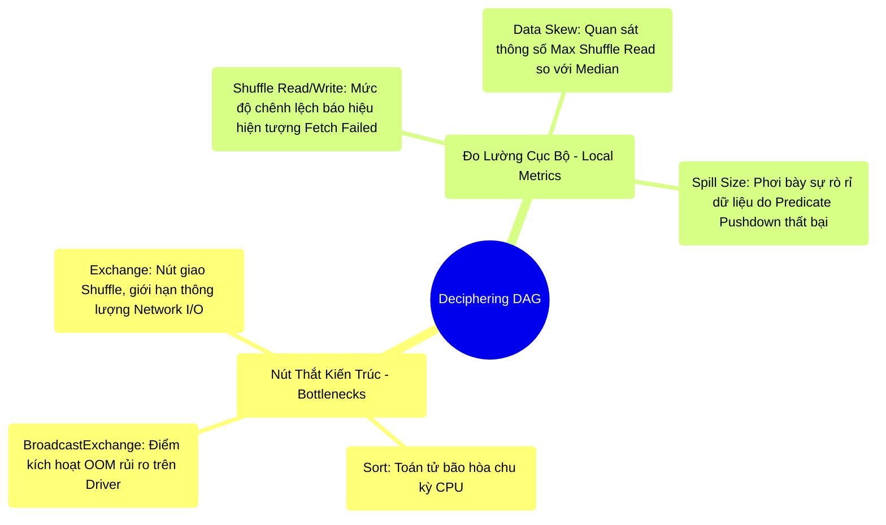

# 9.2 Giải Mã Đồ Thị DAG và Đọc Vị SQL Metrics

## 1. Objectives
- [ ] Phân loại 3 điểm thắt cổ chai kiến trúc trên biểu đồ DAG: `Exchange`, `Sort`, và `BroadcastExchange`.
- [ ] Khảo sát hiện tượng Data Skew và Fetch Failed thông qua phân tích chỉ số I/O luân chuyển mạng (Shuffle Read/Write).
- [ ] Phân tích tương quan giữa chỉ số Spill và điểm nghẽn tối ưu hóa (Pushdown Failure).

## 2. Mindmap


## 3. Content

Tab Stages chỉ ra vị trí đứt gãy của Job, nhưng Tab **SQL/DataFrame** cùng sơ đồ DAG (Directed Acyclic Graph) sẽ cung cấp nguyên nhân cấu trúc (Root Cause). 
Trong môi trường Enterprise, thay vì tập trung Debug mã nguồn (`.py`) theo phương pháp tuyến tính, Staff Engineer ưu tiên khởi đầu quá trình khắc phục sự cố thông qua việc phân tích **Physical Plan DAG**. Nó phơi bày hệ quả vật lý cuối cùng của các lệnh Logic.

### 3.1. Nhận Diện 3 Nút Thắt Kiến Trúc (Bottlenecks)

Tại Tab SQL, kế hoạch vật lý được biểu diễn dưới dạng đồ thị luồng (Flow graph). Có 3 toán tử đóng vai trò là các nút thắt cổ chai quyết định độ ổn định hệ thống:

**1. Toán Tử `Exchange` (Nút Thắt Huyết Mạch)**
- *Bản chất:* Đại diện cho quy trình **Shuffle**. Đây là ranh giới phân tách các Stage, nơi thông lượng In-Memory tốc độ cao bị ngắt quãng, nhường chỗ cho giao thức truyền tải Network I/O chậm chạp.
- *Liên kết Code:* Phát sinh khi gọi các lệnh `join()`, `groupBy()`, hoặc sử dụng cấu trúc điều hướng tốn kém như `repartition()`. 
- *Nguyên tắc thiết kế:* DAG càng tối giản số lượng `Exchange`, độ ổn định của hệ thống càng cao.

**2. Toán Tử `Sort` (Tác Nhân Tiêu Hao CPU)**
- *Bản chất:* Đòi hỏi CPU thực thi vòng lặp thuật toán Sắp xếp cục bộ.
- *Liên kết Code:* Dấu hiệu chuẩn bị cho Sort-Merge Join (SMJ), hoặc xuất phát từ các tác vụ `orderBy()`, Window Functions.
- *Triệu chứng:* Thường đi kèm với thông số Spill tăng vọt khi không gian RAM bão hòa.

**3. Toán Tử `BroadcastExchange` (Nguy Cơ OOM Tàng Hình)**
- *Bản chất:* Dấu hiệu ghi nhận hệ thống đang kích hoạt quy trình Broadcast Hash Join (Nhân bản dữ liệu lên không gian RAM của toàn cụm).
- *Liên kết Code:* Xảy ra khi kỹ sư thiết lập `/*+ BROADCAST */` Hint hoặc do sai số dự báo của CBO. Cần kiểm tra chỉ số `data size total`. Nếu dung lượng phát sóng tiến gần đến giới hạn cấp phát của Driver (Ví dụ >2GB), hệ thống đang đối diện nguy cơ sụp đổ (OOM) cao.

### 3.2. Đọc Vị Metrics Cục Bộ (Đo Lường I/O)

Việc quan sát đồ thị DAG cần phải kết hợp phân tích thông số tại từng nút (Node Metrics). Hai bộ thông số quyết định trạng thái I/O bao gồm:

**1. Thông Số Cáp Mạng (Shuffle Read/Write Size)**
- Hiển thị lân cận toán tử `Exchange`.
- *Chẩn đoán Fetch Failed:* Nếu hệ thống ghi nhận `Shuffle Write = 500GB` nhưng `Shuffle Read = 1GB`. Điều này chứng tỏ dữ liệu đã được xả đĩa thành công, nhưng kết nối mạng bị gián đoạn (Network Timeout) hoặc Node chứa dữ liệu bị vô hiệu hóa (Node Loss), khiến Stage tiếp theo không thể thu thập dữ liệu (Fetch Failed).
- **[QUAN TRỌNG] Chẩn đoán Data Skew:** Mở rộng bảng thông số Details. Khảo sát tương quan `Max Shuffle Read` và `Median`. Nếu hệ thống hiển thị `Max = 10GB` trong khi `Median = 5MB`, đây là bằng chứng vật lý của hiện tượng **Data Skew**. Một Task (Task đơn lẻ) đang phải xử lý tải trọng 10GB, trong khi hàng ngàn Task khác chỉ xử lý 5MB. 

**2. Thông Số Tràn Đĩa (Spill Size)**
- Biểu hiện xung quanh các toán tử `Sort` hoặc `HashAggregate`.
- *Lý thuyết vật chất:* `Spill (Memory)` đo lường dung lượng Object (Chưa nén), `Spill (Disk)` phản ánh dung lượng I/O thực tế ghi chép vào mặt đĩa (Đã nén).
- *Tư duy tối ưu:* Khi phát hiện toán tử `Sort` tạo ra `Spill (Disk) = 100GB`, giải pháp không phải là nâng cấp cấu hình RAM. Câu hỏi kiến trúc cần đặt ra: Tại sao 100GB dữ liệu không cần thiết lại lọt được vào vòng Sort? Tại sao màng lọc tối ưu **Predicate Pushdown** (Tầng Storage) bị vô hiệu hóa? Thiết kế hiện tại có đang bỏ sót bộ lọc `Filter` sớm (Early Filtering) không?

**[Code Snippet: Thiết Lập Bộ Lọc Chủ Động]**
```python
# CODE CƠ BẢN (Nguy cơ tràn đĩa - Spill Disk lớn tại Sort do dữ liệu đẩy lên RAM dư thừa):
df1.join(df2, "id").filter(col("age") > 50).show()

# CODE TỐI ƯU PRODUCTION (Triệt tiêu dữ liệu rác trước Exchange/Sort):
# Dù Catalyst (CBO) có khả năng tự động Pushdown, nhưng việc Filter chủ động
# giúp bảo vệ mã nguồn không bị phụ thuộc vào phán đoán cấu trúc tĩnh.
df1_filtered = df1.filter(col("age") > 50) 
df2_filtered = df2.filter(col("age") > 50)
df1_filtered.join(df2_filtered, "id").show()
```

## 4. Key takeaways
- **Bản chất của Mã nguồn**: Mã nguồn logic (API) không phản ánh rủi ro I/O thực tế. Một toán tử `df.join()` đơn giản có thể hình thành sơ đồ DAG phức tạp, tiêu tốn băng thông (Exchange) và chu kỳ CPU (Sort).
- **Tư duy Kiến trúc Nghịch đảo**: Xử lý sự cố Spill không ưu tiên phương án tăng RAM, mà phải tập trung vào việc bổ sung các bộ lọc dữ liệu (Filters) càng sớm càng tốt để tối ưu hóa Predicate Pushdown.
- **Tiền đề Chẩn đoán Pháp y**: Bất chấp việc tinh chỉnh mã nguồn và đo lường thông số, hệ thống vẫn tồn tại nguy cơ sụp đổ do thiếu bộ nhớ đột ngột. Kỹ thuật phân tích các tệp lưu vết (Error Logs) và chẩn đoán cấu trúc Crash sẽ được làm rõ trong Bài 9.3.
