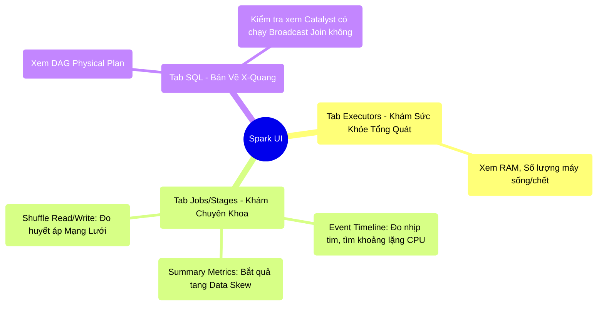

# 9.2 Giải Mã Spark UI: Màn Hình Điện Tâm Đồ Sinh Tồn

## 1. Objectives
- [ ] So sánh các thành phần của Spark UI với **Phép ẩn dụ Màn Hình Điện Tâm Đồ (ECG) Bệnh Viện**.
- [ ] Hướng dẫn cách đọc 3 tab quan trọng nhất: Jobs, Stages, và Executors.
- [ ] Định vị các căn bệnh vật lý (Spill, Skew) ngay trên giao diện.

## 2. Mindmap

## 3. Content

### 3.1. Phép Ẩn Dụ: Màn Hình Điện Tâm Đồ (ECG)
Ở Bài 9.1, chúng ta biết rằng hệ thống Spark là một hộp đen. Để sống sót, Spark cung cấp cho bạn một cánh cửa sổ vô giá: **Giao diện Web Spark UI (Mặc định chạy ở cổng 4040)**.

> **[Ví Dụ Trực Quan: Cấp Cứu Bệnh Nhân]**
> Giao diện Spark UI giống hệt cái màn hình đo Điện Tâm Đồ (ECG) trong phòng cấp cứu. 
> Bệnh nhân (Job của bạn) đang nằm trên giường bệnh.
> - **Tab Executors (Đo phần cứng):** Bạn nhìn vào đó để xem bệnh nhân có đủ tay chân không (Số lượng máy Worker)? Có bị phình to gan ruột không (RAM Memory Usage)? Có máy nào đang hấp hối không (Dead Executors)?
> - **Tab Stages (Đo nhịp tim):** Nơi hiển thị những biểu đồ chớp nháy (Event Timeline). Nhìn vào đó, bạn biết chính xác khoảnh khắc nào bệnh nhân bị trụy tim (Kẹt Data Skew).
> - **Tab SQL (Máy chụp X-Quang DAG):** Cho bạn thấy hệ xương sống bên trong. Cục xương nào đang bị gãy (Spill to Disk). 

Đừng chờ đến khi Job sập mới mở UI. Kỹ sư giỏi mở UI ngay khi Job vừa nổ máy.

### 3.2. Bắt Bệnh Đột Quỵ Qua Tab Executors
Tab này trả lời câu hỏi: *Tài nguyên vật lý bạn cấp cho Spark có được dùng hiệu quả không?*

- **Cột Storage Memory:** Liệu vùng Sách giáo khoa (Bài 5.2) có đang bị đầy không?
- **Số lượng Executors:** Bạn xin cụm máy chủ 100 máy, nhưng Tab này chỉ hiện có 5 máy? Bệnh nhân đang bị thiếu máy móc trầm trọng (Tài nguyên YARN/Kubernetes chưa được cấp đủ).
- **Cột Tasks (Failed):** Một cái máy liên tục có Task đỏ lòm (Thất bại). Lỗi có thể nằm ở chính phần cứng ổ cứng của cái máy đó bị hỏng, chứ không phải do code của bạn!

### 3.3. Bắt Bệnh Data Skew Qua Tab Stages (Cực Kì Quan Trọng)
Tab Stages là chiến trường ác liệt nhất. Nó phân tách Job của bạn ra thành từng Đoạn (Stages - Bị cắt bởi các lệnh Shuffle như Bài 3.4).

Khi bạn bấm vào một Stage, hãy nhìn vào bảng **Summary Metrics (Chỉ số tổng hợp)**. Ở đó có 5 cột phân vị (Min, 25%, Median, 75%, Max). Đây là chiếc gương soi chiếu sự công bằng.

> **[Nhận Diện Kẻ Bắt Nạt - Data Skew]**
> Hãy nhìn vào hàng thời gian chạy (Duration).
> - Nếu Min = 1s, Median = 1.2s, Max = 1.5s $\rightarrow$ Công việc được chia đều hoàn hảo.
> - Nếu Min = 1s, Median = 1s, **Max = 4 GIỜ ĐỒNG HỒ!** $\rightarrow$ CHUÔNG BÁO ĐỘNG ĐỎ! 
> 
> Triệu chứng này nói lên rằng: Hàng chục ngàn máy tính đã làm xong việc chỉ trong 1 giây. Có ĐÚNG MỘT CÁI MÁY phải gánh cục dữ liệu khổng lồ (Data Skew - Bài 8.3) và hì hục làm suốt 4 tiếng. (Đó chính là Cục Max).

Bên dưới là biểu đồ **Event Timeline (Nhịp tim)**.
Bạn sẽ thấy 200 vệt màu Xanh (Thời gian tính toán). Đột nhiên có 1 vệt Xanh kéo dài miên man về bên phải, trong khi 199 vệt khác đã kết thúc. Vệt màu xanh miên man đó chính là cục Data Skew đang bóp chết hệ thống.

### 3.4. Bắt Bệnh Tràn Đĩa Qua Tab SQL
Bạn chuyển sang Tab SQL, bấm vào query đang chạy, màn hình sẽ vẽ ra sơ đồ cây DAG (Bản đồ kiến trúc Catalyst - Bài 4.2).

Hãy dán mắt vào các ô vuông có tên là `Sort` hoặc `Exchange`. 
Nếu bên trong ô vuông đó hiện lên dòng chữ đỏ/đen: **`Spill (Memory): 50 GB` và `Spill (Disk): 10 GB`**
$\rightarrow$ Lỗi Spill (Bài 6.3) đang tàn phá hệ thống! RAM không đủ chỗ xếp hàng, hệ thống đang phải vứt dữ liệu xuống ổ cứng.

**Cách chữa trên UI:**
- Thấy chữ `SortMergeJoin`? $\rightarrow$ Đi kiểm tra code xem có thể bóp thành `BroadcastHashJoin` không.
- Thấy cột `Shuffle Read` khổng lồ ở Tab Stages? $\rightarrow$ Kỹ sư viết code thiếu tối ưu đã quên dùng lệnh `Filter` trước khi Join/GroupBy.

## 4. Key takeaways
- **UI là sự sống:** Đọc Spark UI là một kỹ năng mềm bắt buộc. Code chạy ra kết quả đúng là chưa đủ. Code đúng mà thanh Timeline bị móp méo, Skew, Spill thì đó vẫn là rác công nghệ.
- **Nghệ thuật soi Timeline:** Mọi khoảng trống màu trắng trên thanh Event Timeline đại diện cho sự lãng phí CPU. Bất cứ khi nào 1 vệt dài xuất hiện làm kẹt cụm, đó là Data Skew.
- **X-Quang vật lý:** Những gì Code ẩn giấu (Catalyst tối ưu ngầm), Tab SQL sẽ bóc trần sự thật. Thấy Spill là phải tăng Partitions hoặc tăng RAM (Execution Memory) ngay lập tức.
