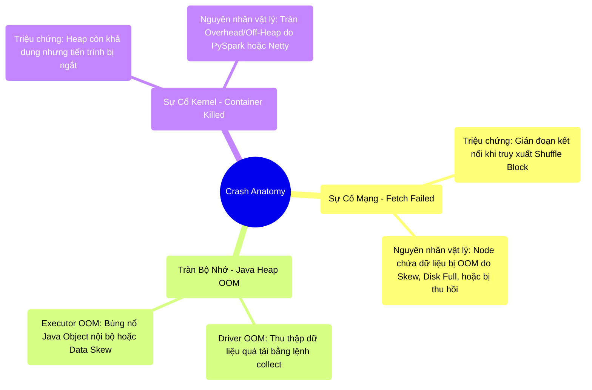

# 9.3 Khám Nghiệm Sự Cố (Forensics): Chẩn Đoán Lỗi Hệ Thống

## 1. Objectives
- [ ] Thiết lập hệ thống phân loại (Taxonomy) 3 tầng cho các sự cố gián đoạn và OOM.
- [ ] Phân định rõ ranh giới giữa OOM thuộc không gian Java Heap (JVM) và sự kiện kết liễu tiến trình từ Kernel (Container Killed) do rò rỉ Off-Heap.
- [ ] Truy xuất nguyên nhân gốc rễ (Root Cause) của ngoại lệ FetchFailedException.

## 2. Mindmap


## 3. Content

Hệ thống phân tán, dù được trang bị các cơ chế bảo vệ tối tân (UMM, AQE), vẫn đối mặt với giới hạn vật lý tại môi trường Production. 
Khi một ứng dụng sụp đổ (Crash) đi kèm hàng trăm dòng Stacktrace, kỹ năng cốt lõi của Staff Engineer là **Phân tích sự cố (Forensics)**. Thay vì phỏng đoán, quy trình chuẩn yêu cầu phân loại sự cố vào 3 nhóm (Taxonomy) rành mạch để đưa ra phác đồ can thiệp chính xác.

### 3.1. Nhóm 1: Gián Đoạn Trung Chuyển (FetchFailedException)
Đây là lỗi hiển thị phổ biến nhất trên bề mặt UI, nhưng thường gây nhầm lẫn về nguyên nhân.
- **Triệu chứng:** Hệ thống ném ngoại lệ `FetchFailedException`. Tiến trình không kết thúc ngay mà sẽ kích hoạt cơ chế thử lại (Task Retries) trước khi sụp đổ hoàn toàn.
- **Cơ chế vật lý:** Stage B yêu cầu truy xuất (Fetch) khối dữ liệu Shuffle đã xả đĩa từ Stage A. Tuy nhiên, Node chứa dữ liệu của Stage A không phản hồi mạng.
- **Production Runbook:** Lỗi này hiếm khi xuất phát từ sự cố đứt gãy kết nối mạng vật lý thuần túy. Cần điều tra 4 nguyên nhân sâu xa:
  1. **OOM do Data Skew:** Một phân mảnh Skew làm bão hòa Node A, khiến hệ điều hành kết liễu tiến trình (OOM Killer).
  2. **Node Preemption (Thu hồi tài nguyên):** Nếu hạ tầng vận hành trên AWS Spot / GCP Preemptible Instances, các Node có thể bị Cloud Provider thu hồi đột ngột.
  3. **Disk Full:** Phân vùng đĩa cục bộ (Local Disk) ghi dữ liệu Shuffle bị lấp đầy, làm Node A dừng hoạt động.
  4. **Netty Timeout:** Block Transfer Service quá tải do hàng nghìn kết nối đồng thời vượt ngưỡng băng thông cấu hình.

### 3.2. Nhóm 2: Tràn Bộ Nhớ Trong (Java Heap OOM)
Sự cố OOM nội tại phân làm 2 nhánh chính, tùy thuộc vào Node bị tác động:

**1. Tràn Bộ Nhớ Khởi Tạo (Driver OOM)**
- *Triệu chứng:* Toàn bộ ứng dụng bị ngắt đột ngột. Giao diện Spark UI mất kết nối.
- *Nguyên nhân:* Phổ biến nhất là do việc lạm dụng lệnh `df.collect()` hoặc `df.toPandas()`, ép buộc hàng trăm GB dữ liệu dồn về RAM giới hạn của Driver (thường chỉ 4-8GB). Nguyên nhân phụ có thể do CBO dự báo sai, kích hoạt **Broadcast Hash Join** đối với bảng kích thước lớn.
- *Phác đồ:* Hạn chế tối đa sử dụng lệnh thu thập dữ liệu toàn cục. Cân chỉnh lại ngưỡng `autoBroadcastJoinThreshold`.

**2. Tràn Bộ Nhớ Cục Bộ (Executor OOM)**
- *Triệu chứng:* Một số Task hiển thị trạng thái Failed, kéo dài thời gian hoàn thành Job.
- *Nguyên nhân:* Tác nhân **Data Skew** làm quá tải một phân mảnh (Xem Bài 8.3). Hoặc do sử dụng UDF phức tạp sinh ra khối lượng lớn Java Objects cục bộ, phá vỡ định dạng nén nhị phân của Tungsten.
- *Phác đồ:* Áp dụng Salting Key hoặc AQE Skew Join. Loại bỏ UDF và thay thế bằng các hàm Spark Built-in.

### 3.3. Nhóm 3: Can Thiệp Của Hệ Điều Hành (Container Killed)

> [!CAUTION] Cảnh Báo Kiến Trúc: Sự Nhầm Lẫn Giữa Heap và Container
> Một hiện tượng khó gỡ lỗi: Khung giám sát JVM không ghi nhận OOM, Heap Memory vẫn dư thừa, nhưng YARN/K8s báo lỗi: `Container killed for exceeding memory limits`. 

- **Cơ chế vật lý:** Hệ điều hành (Kernel) can thiệp kết liễu tiến trình do vượt giới hạn cấp phát vật lý của Container. Giả sử Container được cấp **10GB**. Kỹ sư cấu hình JVM Heap là **8GB**. Tuy nhiên, vùng bộ nhớ **bên ngoài Heap (Off-heap / Overhead)** đã vượt quá giới hạn an toàn 2GB còn lại.
- **Thủ phạm tiêu thụ Overhead:** Các thành phần bao gồm: Vùng nhớ Tungsten Off-heap, bộ đệm Netty (Network buffer), hoặc đặc biệt là **PySpark Worker**. Khi chạy PySpark, tiến trình Python hoạt động độc lập với JVM. Nếu mã Python tiêu thụ RAM lố giới hạn Overhead, hệ điều hành sẽ kích hoạt OOM Killer tiêu diệt toàn bộ Container.
- **Production Runbook:** Trong trường hợp này, hành động tăng `spark.executor.memory` (Nhồi thêm RAM vào Heap) là sai lầm vì nó càng bóp nghẹt không gian Overhead còn lại. Phác đồ chuẩn là mở rộng không gian ngoại vi.

**[Config Snippet: Cấp Phát Vùng Nhớ Ngoại Vi]**
```bash
# Nới rộng lớp Overhead để cấp thêm RAM cho PySpark Worker và Netty
--conf spark.executor.memoryOverhead=4096 
--conf spark.memory.offHeap.enabled=true
--conf spark.memory.offHeap.size=4096
```

## 4. Key takeaways
- **Nguyên tắc chẩn đoán nghịch đảo**: Khi hệ thống báo lỗi bộ nhớ, việc tăng thông số `executor-memory` một cách mù quáng không giải quyết được vấn đề nếu căn nguyên nằm ở Data Skew hoặc tràn giới hạn Container Overhead.
- **Phân tách vùng giám sát**: Cần phân biệt rõ trạng thái bão hòa của bộ nhớ Heap nội bộ (Nơi chứa Java Object) và sự bùng nổ của bộ nhớ Off-heap/Overhead (Tiến trình C/Python/Netty). Đánh giá nhầm nhóm OOM sẽ đưa quá trình Debug vào ngõ cụt.
- **Giao điểm cuối**: Hành trình phân tích hệ thống quan trắc (Observability) sẽ được đúc kết thành nguyên lý cân bằng thiết kế ở Bài 9.4.
