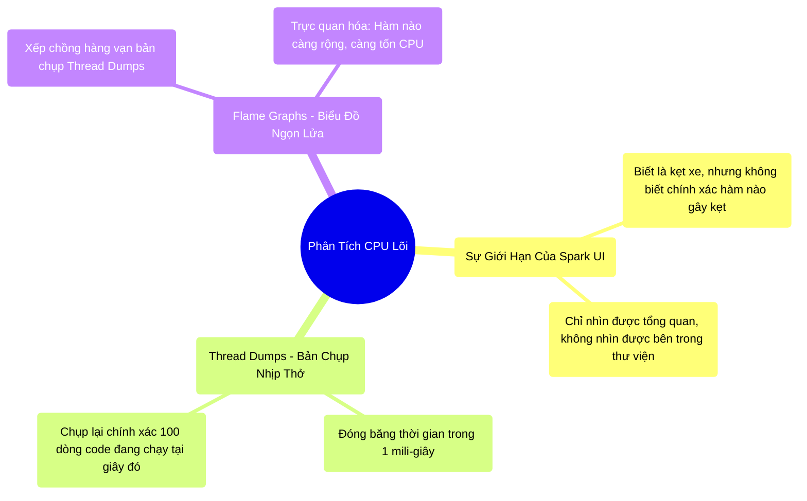

# 9.3 Thread Dumps & Flame Graphs: Tia X-Quang Bắt Mạch CPU

## 1. Objectives
- [ ] Mở rộng khả năng chẩn đoán vượt ra khỏi Spark UI bằng **Phép ẩn dụ Máy chụp X-Quang cắt lớp MRI**.
- [ ] Phân tích cách Thread Dumps bắt quả tang Kẻ ngốn CPU.
- [ ] Giới thiệu Flame Graphs (Biểu đồ ngọn lửa) để hình ảnh hóa độ sâu của hàm thực thi.

## 2. Mindmap

## 3. Content

### 3.1. Phép Ẩn Dụ: Máy Chụp Cắt Lớp MRI
Spark UI (Bài 9.2) rất tuyệt vời để báo cho bạn biết: Bệnh nhân (Máy Worker số 92) đang kẹt cứng ở Stage số 4 suốt 2 tiếng.
NHƯNG, Spark UI không thể trả lời câu hỏi hóc búa nhất: **Bên trong cái Stage số 4 đó, cụ thể là Dòng Code Hàm Python nào đang vắt kiệt CPU?** Hàm regex, hàm parse JSON, hay hàm format chuỗi?

Đó là lúc chúng ta phải đưa bệnh nhân vào Máy chụp MRI (Chụp cắt lớp từ tính). Trong máy tính, máy chụp MRI đó có tên là **Thread Dump (Bản đổ trạng thái luồng)**.

> **[Ví Dụ Trực Quan: Đóng Băng Thời Gian]**
> Chụp Thread Dump giống như bạn bấm nút Pause (Tạm dừng) toàn bộ vũ trụ trong đúng 1 mili-giây.
> Trong mili-giây đó, bạn mở đầu của CPU ra xem: Ah, anh CPU Core 1 đang nhai dở dòng lệnh số 45 (hàm Tách chuỗi Regex). Anh CPU Core 2 đang bị kẹt ở dòng lệnh đợi Mạng (Network Wait).
> 
> Bạn chụp liên tục 1.000 tấm ảnh như thế trong 10 giây.
> Nếu 900 tấm ảnh đều bắt gặp CPU đang nằm ở hàm `Regex_Match()`, bạn kết luận chắc nịch: Hàm Regex gây lỗi này chính là Kẻ Bóp Cổ hệ thống!.

### 3.2. Đọc Thread Dumps Trên Spark UI
Rất may mắn, bạn không cần phải đăng nhập vào máy chủ bằng SSH để chụp MRI. Giao diện Spark UI có sẵn tính năng này.

Tại tab **Executors**, ở cột Thread Dump, bạn bấm vào một Executor đang bị kẹt. Hệ thống sẽ ngay lập tức Chụp ảnh cái máy đó.
Bạn sẽ thấy một bảng danh sách các luồng (Thread) đỏ lòm hoặc xanh lá cây.
- Trạng thái **RUNNABLE**: Máy đang chạy hết công suất tính toán (CPU 100%). Nếu nó kẹt ở đây quá lâu, hãy dò đọc từng dòng chữ (Stack trace) để xem nó đang gọi hàm gì (Thường là do lỗi UDF lặp vô hạn hoặc Regex bùng nổ).
- Trạng thái **WAITING / BLOCKED**: CPU đang rảnh rỗi ở trạng thái rảnh rỗi. Tại sao? Vì nó đang đợi dữ liệu kéo từ Cáp quang (Network Shuffle) về, hoặc đợi xin thêm RAM từ JVM GC. Lỗi không nằm ở CPU, mà nằm ở I/O Mạng hoặc Đĩa cứng.

### 3.3. Flame Graphs: Biểu Đồ Ngọn Lửa
Đọc chữ trong Thread Dumps rất nhức mắt (Hàng vạn dòng chữ Stack trace chồng chéo). Các Kỹ sư Netflix đã sáng chế ra một loại vũ khí đồ họa cốt lõi: **Flame Graphs (Biểu đồ ngọn lửa)**.

Thay vì đọc chữ, người ta vẽ hàng ngàn bức ảnh Thread Dumps thành một ngọn lửa.
- **Trục dọc (Y):** Chiều sâu của các hàm lồng nhau (Hàm A gọi Hàm B, Hàm B gọi Hàm C). Ngọn lửa càng cao, stack trace càng sâu.
- **Trục ngang (X):** Thời gian CPU bị chiếm dụng.

**Cách đọc X-Quang Ngọn Lửa:**
Rất đơn giản, bạn chỉ cần tìm **Cục Gạch Rộng Nhất Nằm Ở Phía Trên Cùng**.
Cục gạch (Hàm) nào càng rộng (chiếm nhiều diện tích theo chiều ngang), nghĩa là nó xuất hiện trong bức ảnh MRI cực kỳ nhiều lần. Đó chính là Cục máu đông gây kẹt xe!

*(Spark thế hệ mới 3.x đã tích hợp sẵn Flame Graphs vào trong Tab Executors. Bạn chỉ việc nhấn nút và nhìn ngọn lửa bùng cháy để biết dòng code UDF nào của mình đang ăn mòn CPU).*

## 4. Key takeaways
- **Giới hạn của Spark UI:** Spark UI báo lỗi ở quy mô vĩ mô (Tầng Network, Tầng Memory, Tầng Stage). Để soi lỗi ở tầng Vi mô (Dòng code nào gây tốn CPU), phải dùng Thread Dumps.
- **Bắt quả tang thủ phạm:** Bằng cách chụp ảnh CPU liên tục, ta biết được chính xác CPU đang bận tính toán thật sự (Runnable) hay đang ngồi chờ mỏi mòn (Waiting) do hệ thống đĩa/mạng hiệu năng thấp.
- **Flame Graphs:** Là bức tranh nghệ thuật của Observability. Chỉ với một cái nhìn, Kỹ sư hệ thống có thể định vị ngay lập tức hàm `to_json` hay hàm `regex_extract` nào đang làm tổn hao 80% sức mạnh của cả cụm 1.000 máy chủ.
