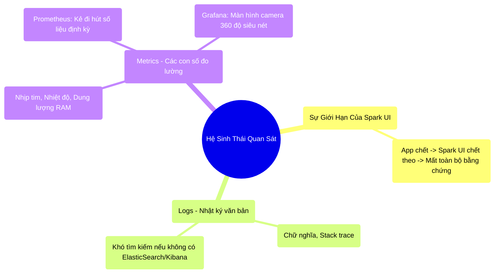

# 9.4 Hệ Sinh Thái Quan Sát: Prometheus & Grafana

## 1. Objectives
- [ ] So sánh vai trò của Log và Metrics qua **Phép ẩn dụ Cuốn Nhật Ký và Camera An Ninh**.
- [ ] Nhận diện sự mỏng manh của Spark UI (Chết là mất dữ liệu).
- [ ] Giới thiệu bộ đôi Prometheus & Grafana để xây dựng đài quan sát vĩnh cửu.

## 2. Mindmap

## 3. Content

### 3.1. Phép Ẩn Dụ: Cuốn Nhật Ký Bị Cháy (Điểm Yếu Của Spark UI)
Spark UI và Flame Graphs (Bài 9.2, 9.3) rất xuất sắc. Nhưng chúng có một điểm yếu CHÍ MẠNG: Chúng sống ký sinh vào sự sống của Máy Quản Đốc (Driver).

> **[Ví Dụ Trực Quan: Đốt Cháy Nhật Ký]**
> Spark UI giống như cuốn sổ khám bệnh mà vị Bác sĩ (Driver) cầm trên tay. Bác sĩ vừa khám vừa ghi chép nhịp tim của cụm máy chủ vào đó.
> Đột nhiên, Bệnh OOM (Hết RAM) ập tới. Trụ sở gặp sự cố nghiêm trọng, Bác sĩ ngừng hoạt động.
> 
> Chuyện gì xảy ra với cuốn sổ khám bệnh (Spark UI)? Nó CHÁY RỤI THEO BÁC SĨ.
> Cổng 4040 của giao diện UI chính thức sập. Bạn (Kỹ sư hệ thống) chạy tới hiện trường 5 phút sau đó, và bạn không còn bất cứ một dữ kiện nào để biết tại sao hệ thống lại sập.

Đó là lý do các hệ thống Enterprise / Big Tech không bao giờ phụ thuộc 100% vào Spark UI. Họ xây dựng đài quan sát bằng **Logs** và **Metrics**.

### 3.2. Logs (Nhật Ký) vs Metrics (Đo Lường)
Để giải quyết bài toán Chết là mất hết, chúng ta phải lắp đặt hệ thống Camera truyền dữ liệu ra một máy chủ lưu trữ bên ngoài.

- **Logs (Cuốn Nhật Ký):** Là những dòng chữ văn bản (Ví dụ: `ERROR 10:45 AM: JVM Out of Memory in Worker 92`). Logs rất tốt để phân tích sâu, nhưng với 1000 máy chủ, nó xả ra hàng tỷ dòng Log mỗi giờ. Bạn không thể đọc nổi. Người ta thường dùng hệ thống **ELK (ElasticSearch - Logstash - Kibana)** để tìm kiếm chữ trong mớ hỗn độn này.
- **Metrics (Các con số đo lường):** Thay vì in ra chữ, hệ thống đo lường đếm số. (Ví dụ: `worker_92_ram_usage: 95%`, `cpu_core_1: 100%`). Metrics là những chuỗi số liệu theo thời gian (Time-series). Đọc số nhanh và dễ vẽ biểu đồ hơn đọc chữ vạn lần.

### 3.3. Bộ Đôi Hoàn Hảo: Prometheus & Grafana
Trong giới Cloud Native và Big Data hiện đại, cặp đôi Prometheus và Grafana là tiêu chuẩn vàng để làm Camera an ninh.

> **[Ví Dụ Trực Quan: Hệ Thống Camera 360]**
> - **Prometheus (Cỗ máy hút bụi số liệu):** Spark được cài đặt một cái vòi (Metrics Exporter). Cứ mỗi 5 giây, Prometheus lại hút toàn bộ số liệu (RAM, Disk Spill, Shuffle Read) của Spark về máy chủ an toàn của nó. Kể cả khi Spark gặp sự cố nghiêm trọng, số liệu 5 giây trước khi nổ vẫn nằm gọn trong két sắt của Prometheus.
> - **Grafana (Phòng điều khiển trung tâm):** Prometheus chỉ toàn là số, rất khô khan. Grafana là các màn hình TV siêu đẹp. Nó lấy số từ Prometheus, và vẽ ra các biểu đồ nhịp tim, biểu đồ thanh, cảnh báo đỏ lòm rất trực quan.

**Sức mạnh của đài quan sát Grafana:**
- **Cảnh báo (Alerting):** Bạn không cần phải ngồi dán mắt vào màn hình. Bạn cài luật: Nếu RAM của bất kỳ máy Worker nào vượt quá 95% trong 2 phút $\rightarrow$ Bắn tin nhắn chửi vào Slack/Zalo của Data Engineer.
- **Khám phá quá khứ (Post-mortem):** Thứ 6 tuần trước Job chạy 1 tiếng, thứ 6 tuần này chạy 3 tiếng (Bị chậm). Bạn không thể mở Spark UI của tuần trước vì Job đã tắt. Nhưng với Grafana, bạn cuộn chuột lùi về tuần trước, vẽ 2 biểu đồ Network Shuffle chồng lên nhau. Bạn lập tức phát hiện ra: Tuần này lượng dữ liệu tăng đột biến gây nghẽn cáp mạng.

## 4. Key takeaways
- **Thoát khỏi Spark UI:** Spark UI sinh ra để debug trong lúc code đang chạy (Runtime). Nhưng để vận hành hệ thống ổn định 24/7 (Production), bạn bắt buộc phải xuất dữ liệu ra một hệ thống thứ 3.
- **Prometheus là tiêu chuẩn:** Đây là hệ cơ sở dữ liệu chuỗi thời gian (Time-series Database) thống trị mảng giám sát (Observability). Nó lưu lại nhịp tim của máy chủ trước khoảnh khắc cái máy đó quá tải.
- **Kỷ nguyên Grafana:** Data Engineer chuyên nghiệp phải biết tự thiết kế Dashboard (Bảng điều khiển) trên Grafana, theo dõi 3 chỉ số cốt tử của Tam giác quỷ: RAM Usage (Có OOM không?), Network I/O (Có Shuffle rác không?), và Disk Spill (Vùng nháp có bị chật không?).
