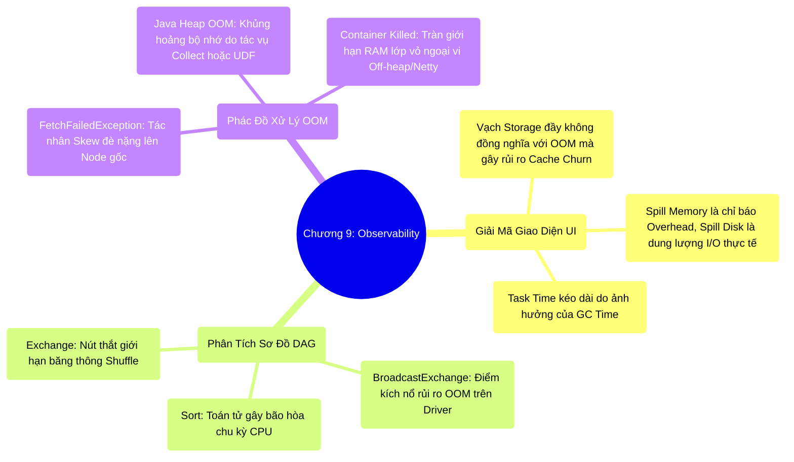

# 9.4 Tổng Kết Chương 9: Khả Năng Quan Sát (Observability) và Nguyên Lý Cân Bằng

## 1. Objectives
- [ ] Tổng hợp phương pháp luận pháp y hệ thống để đọc vị UI và DAG.
- [ ] Xóa bỏ tư duy tuyến tính trong việc giải quyết sự cố thiếu hụt tài nguyên (OOM).
- [ ] Đúc kết nguyên lý hệ thống cốt lõi: The Ultimate Trade-off (Sự đánh đổi trong luân chuyển rủi ro).

## 2. Mindmap

## 3. Content

Chương 9 khép lại chuỗi phân tích kiến trúc vận hành Spark bằng một nguyên tắc khắt khe: **Trong môi trường phân tán, khả năng chẩn đoán sự cố (Forensics) đóng vai trò quan trọng ngang bằng, thậm chí vượt trội hơn so với kỹ năng viết mã logic.**
Ở quy mô Production xử lý Petabytes dữ liệu, hệ thống không tồn tại sự ngẫu nhiên. Mọi sự cố đều để lại các bằng chứng vật lý mà Kỹ sư Hệ thống (Staff Engineer) cần phải làm chủ để truy vết.

### 3.1. Rào Cản Của Tư Duy Mở Rộng Phần Cứng (Hardware Scaling)
Khi Job đối mặt với hiệu năng suy giảm hoặc sự cố OOM, phản xạ tuyến tính nhất là gia tăng thông số RAM (`spark.executor.memory`) hoặc yêu cầu cấp phát thêm CPU Cores.
Tuy nhiên, Kỹ sư Hệ thống tiếp cận bài toán từ khía cạnh kiến trúc. Việc bổ sung phần cứng cho một hệ thống đang chịu tác động của Data Skew, bị thắt nút tại toán tử Exchange, hoặc bị hệ điều hành kết liễu tiến trình do tràn Overhead Netty là một khoản đầu tư không giải quyết được căn nguyên gốc rễ (Root Cause). Cấu trúc của hệ thống chỉ có thể được cải thiện thông qua việc can thiệp trực tiếp vào sơ đồ định tuyến DAG.

### 3.2. Dữ Liệu Vật Lý Định Đoạt Mã Nguồn Logic
Đoạn mã SQL thanh lịch không thể che giấu những điểm nghẽn vật lý bên dưới hệ thống. Khả năng giám sát (Observability) là kỹ năng cốt lõi để giữ hệ thống ổn định:
- Chẩn đoán sự chênh lệch lớn giữa `Shuffle Write` và `Shuffle Read` để phát hiện dấu hiệu của Data Skew hoặc mất kết nối mạng cục bộ.
- Đo lường tác động của `GC Time` để từ chối các Python UDF kém hiệu quả, buộc luồng thực thi phải tuân thủ chuẩn nén nhị phân của Tungsten CodeGen.

### 3.3. Nguyên Lý Đánh Đổi Tối Thượng (The Ultimate Trade-off)
Không tồn tại một bộ cấu hình (Configuration Profile) tối ưu nào có thể tối ưu hóa cho mọi định dạng tải công việc (Workloads) Big Data. Hệ thống phân tán luôn là một phương trình cân bằng những giới hạn:
- Triệt tiêu quá trình phân mảnh mạng (Shuffle)? $\rightarrow$ Hệ thống phải đánh đổi dung lượng RAM qua Broadcast Join.
- Phòng tránh bão hòa RAM? $\rightarrow$ Hệ thống phải chấp nhận tải trọng CPU cho thuật toán Sort và băng thông đĩa cứng do Disk Spill.
- Ngăn chặn I/O thừa từ mặt đĩa? $\rightarrow$ Phải đầu tư chu kỳ xử lý để thiết lập cấu trúc Z-Ordering/Liquid Clustering nhằm tối ưu Parquet Footer.

**Định Nghĩa Về Việc Tối Ưu (Tuning):** Năng lực cốt lõi của một Kỹ sư Staff-Level không nằm ở việc loại bỏ triệt để mọi rủi ro, mà là khả năng **điều phối và luân chuyển luồng áp lực tải trọng** xoay quanh các ranh giới phần cứng (Network, RAM, CPU, Disk) sao cho hệ thống cục bộ không bao giờ chạm tới mốc đứt gãy gây sụp đổ (OOM).

## 4. Key takeaways
- **Thắng ở khâu chẩn đoán**: Mã nguồn sạch (Clean Code) không đảm bảo sự ổn định của hệ thống Production nếu thiếu hụt khả năng đọc vị DAG và diễn giải thông số đo lường vật lý.
- **Lời tựa Phần Cuối**: Chúng ta đã đi qua sự dịch chuyển kiến trúc từ điểm giới hạn vật lý `M x R Explosion` (Chương 1), luồn lách qua bộ tối ưu logic Catalyst (Chương 4), mổ xẻ cơ chế cấp phát tài nguyên UMM (Chương 5), thao túng định dạng lưu trữ Parquet/Liquid (Chương 7), khắc chế hiện tượng Data Skew (Chương 8), và cuối cùng là giải mã các chỉ báo của Spark UI (Chương 9). 
Hành trình tiếp theo sẽ chuyển sang Chương 10, nơi chúng ta đứng ở góc nhìn vĩ mô nhất để liên kết tất cả các bánh răng hệ thống lại với nhau dưới góc độ kiến trúc tổng thể: **The Full Stack & Philosophy**.
