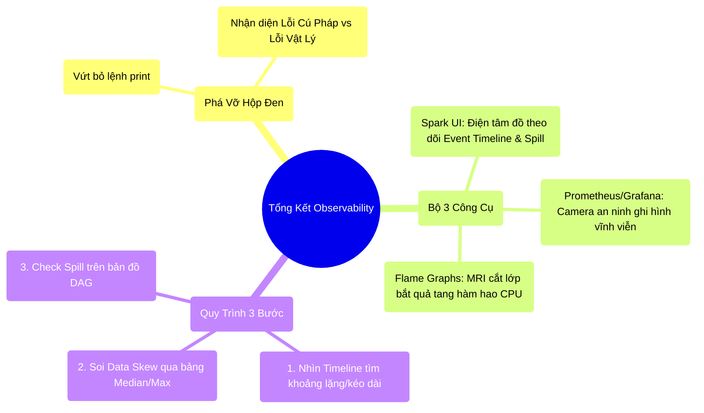

# 9.5 Tổng Kết: Nghệ Thuật Khám Bệnh Hệ Thống

## 1. Objectives
- [ ] Cô đọng lại bộ công cụ Y Khoa (Observability) của Kỹ sư dữ liệu.
- [ ] Hệ thống hóa quy trình Debug 3 bước chuẩn Enterprise.
- [ ] Chuyển tiếp sang Chương 10: Vận hành thực chiến.

## 2. Mindmap

## 3. Content

### 3.1. Sự Tỉnh Táo Của Kỹ Sư Hệ Thống
Chương 9 đã tháo bỏ chiếc rèm đen che phủ toàn bộ hệ thống phân tán. Bạn đã hiểu rằng viết một đoạn code Spark chạy ra kết quả đúng (ở Local) chỉ là 10% công việc. 90% thời gian còn lại của một Data Engineer cấp cao là ngồi dán mắt vào các màn hình xanh đỏ để trả lời các câu hỏi vật lý học:
- Tại sao Job hôm nay chạy chậm hơn hôm qua 2 tiếng?
- Có hàm Python nào đang tạo ra hàng triệu Garbage Collection không?
- Dữ liệu bị Skew ở bước nào, tại máy nào?

Không có Observability (Tính Quan Sát), bạn chỉ là một gã mù lái chiếc máy bay siêu tốc đâm thẳng vào vách núi OOM.

### 3.2. Quy Trình Cấp Cứu 3 Bước (Troubleshooting Framework)
Mỗi khi hệ thống báo đỏ hoặc chạy rùa bò, hãy hít một hơi thật sâu và áp dụng quy trình khám bệnh sau:

**Bước 1: Bắt mạch thời gian (Event Timeline)**
Đừng vội mở code ra sửa. Hãy mở Spark UI $\rightarrow$ Tab Stages.
Nhìn vào dải màu xanh lá cây. Mọi khoảng trống (khoảng trắng) giữa các vệt xanh nghĩa là CPU đang bị bỏ đói (CPU underutilization). Mọi vệt xanh kéo dài miên man một mình nó nghĩa là Data Skew. Bạn phải định vị được điểm mù thời gian trước.

**Bước 2: Siêu âm Ổ cứng & Mạng lưới (Spill & Shuffle)**
Nhảy sang Tab SQL, xem lại bản đồ DAG. Nếu bạn thấy chữ `Spill` hiện lên, nghĩa là Vùng Nháp RAM đang rỉ máu (Bài 6.3). Hãy tăng Memory hoặc tăng Partitions.
Nếu thấy `Shuffle Read` khổng lồ, nghĩa là Dây Cáp mạng đang quá tải (Bài 6.1). Hãy đi kiểm tra lại xem có thể Filter sớm, hoặc dùng Broadcast Join (Bài 8.2) hay không.

**Bước 3: Chụp MRI ngọn lửa (Flame Graphs)**
Nếu Timeline đẹp, không Spill, không Skew, nhưng Job vẫn chạy chậm, thì thủ phạm chắc chắn nằm ở Tầng Logic (Code UDF của bạn viết quá tệ). Bật Flame Graphs lên để xem cái hàm Regex hay JSON parse nào đang trương phình như cục máu đông trên biểu đồ.

### 3.3. Từ Phòng Khám Ra Bệnh Viện (Chuyển Giao Chương 10)
Chúng ta đã mổ xẻ mọi ngóc ngách vật lý của Spark (Memory, Network, Storage) và học cách soi chiếu chúng bằng Spark UI, Grafana.
Tuy nhiên, tất cả những thứ đó chỉ mới dừng lại ở phạm vi **Một Ứng Dụng Đơn Lẻ (One Spark Application)**.

Trong thực tế, một công ty Enterprise không chạy 1 ứng dụng. Họ chạy 10.000 ứng dụng đồng thời trên một cụm máy chủ khổng lồ. 10.000 Kỹ sư tranh giành nhau số lượng RAM và CPU ít ỏi. 
Làm thế nào để hệ thống chia chác tài nguyên mà không xung đột nghiêm trọng? Làm sao để đóng gói đoạn code của bạn thành một chiếc Hộp Kín (Container) ném lên Mây (Cloud)?

Chúng ta sẽ bước sang **Chương 10 (Production Deployment)** để tìm hiểu về Quản đốc YARN, Docker, và nghệ thuật Đóng tàu trong môi trường triển khai thực tế.
