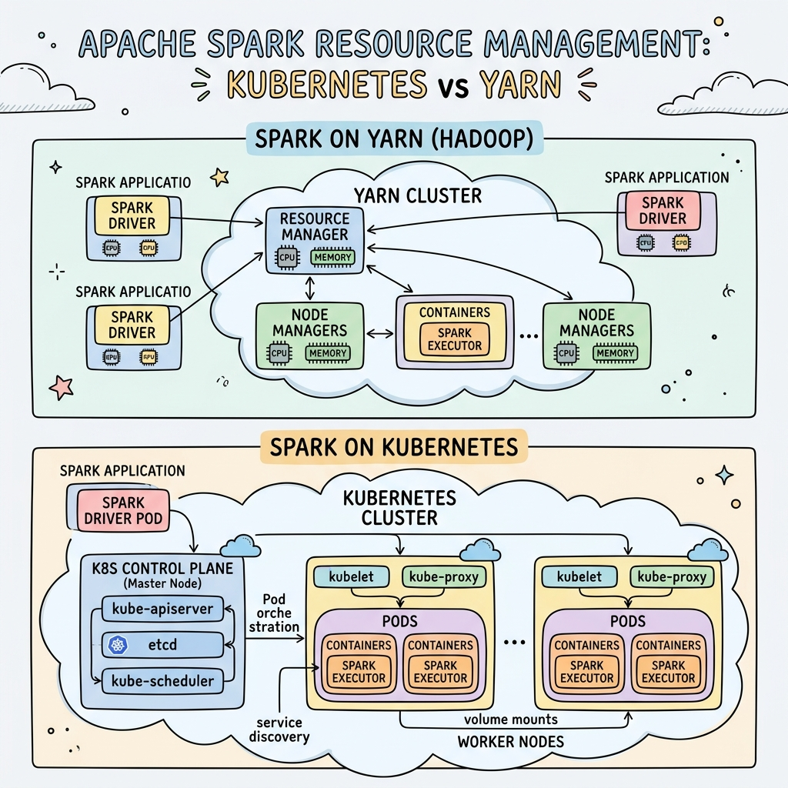
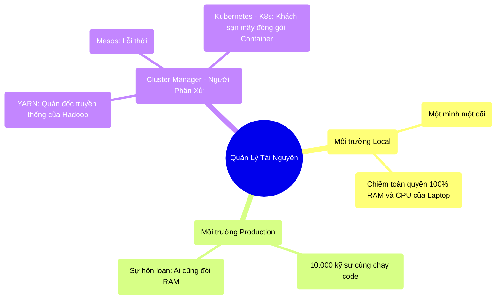

# 10.1 Cuộc Chiến Tranh Giành Tài Nguyên: YARN vs Kubernetes

## 1. Objectives
- [ ] So sánh môi trường Local và Production qua **Phép ẩn dụ Phòng Xếp Hình Trẻ Em vs Công Trường Xây Dựng**.
- [ ] Phân tích vai trò của Cluster Manager (Người quản lý Cụm) như YARN và Kubernetes.
- [ ] Giải phẫu sự thất sủng của YARN và sự trỗi dậy của K8s.

## 2. Mindmap

## 3. Content

### 3.1. Phép Ẩn Dụ: Phòng Chơi Trẻ Em vs Đại Công Trường
Từ Chương 1 đến Chương 9, khi bạn tập tành chạy lệnh Spark trên laptop cá nhân (Chế độ `local[*]`), bạn đang sống trong một thế giới màu hồng.

> **[Ví Dụ Trực Quan: Một Mình Một Cõi]**
> Chạy Spark Local giống như bạn là một Đứa Trẻ ngồi xếp hình lego trong phòng riêng.
> Tất cả đồ chơi (RAM, CPU của Laptop) ĐỀU LÀ CỦA BẠN. Bạn làm vương làm tướng, tha hồ xả rác mà không ai tranh giành. Đồ chơi vương vãi khắp nhà (Spill) cũng không sao.
> 
> **Thực Tế Đẫm Máu (Production):**
> Ở các công ty lớn, cụm máy chủ Big Data là một Đại Công Trường dùng chung. Có 10.000 Đứa Trẻ (Các kỹ sư Data, Data Scientist, BI) cùng xông vào công trường đó lúc 8h sáng để xếp hình.
> Kỹ sư A chạy Job báo cáo tháng xin 500GB RAM. Kỹ sư B chạy Job AI xin 1.000GB RAM. 
> Nếu không có ai quản lý, Kỹ sư B sẽ cướp hết đồ chơi (RAM) của Kỹ sư A. Job của Kỹ sư A bị OOM và sập, dù Kỹ sư A chẳng làm gì sai!

Trở thành Kỹ sư Senior có nghĩa là bạn biết cách chạy Spark trên một công trường có **Cluster Manager (Quản đốc chia chác tài nguyên)**.

### 3.2. YARN: Lão Quản Đốc Truyền Thống Của Kỷ Nguyên Hadoop
Trong suốt 10 năm qua, **YARN (Yet Another Resource Negotiator)** là vị thần tối cao quản lý mọi cụm Hadoop/Spark trên thế giới.

Cách YARN hoạt động:
1. Bạn nộp Tờ đơn xin việc (App): *Thưa chú YARN, cháu cần 1 ông Quản lý (Driver) 2GB RAM, và 50 thằng Công nhân (Executors), mỗi thằng 4GB RAM.*
2. YARN (ResourceManager) nhìn lướt qua cả công trường 1.000 máy chủ. 
3. Thấy Máy số 92 đang rảnh 4GB RAM. YARN cử 1 thằng Công nhân của bạn vào đó ngồi.
4. Thấy Máy số 10 hết RAM. YARN chặn cửa không cho ai vào nữa.

Tuy nhiên, YARN có một điểm yếu chết người: **Nó bị kẹt trong tư duy Cài đặt phần mềm cứng (Bare-metal)**. Mọi máy chủ đều phải cài đặt chung một phiên bản Java, chung một phiên bản thư viện Python. Nếu Kỹ sư A muốn dùng Python 3.8, nhưng Kỹ sư B khăng khăng đòi dùng Python 3.10 cho thư viện AI, YARN sẽ quá tải và báo lỗi và bắt cả 2 phải thỏa hiệp dùng chung 1 phiên bản. (Hell Dependency).

### 3.3. Sự Trỗi Dậy Của Kubernetes (K8s) & Container
Hệ thống mạng hiện đại đã vứt bỏ YARN để theo đuổi K8s (Kubernetes). Sự vi diệu nằm ở khái niệm **Container (Thùng Container/Docker)**.

> **[Ví Dụ Trực Quan: Cắm Trại Bằng Xe Nhộng]**
> - **Thời YARN (Ở trọ chung phòng):** 10 kỹ sư cùng nhét đồ đạc vào chung một phòng trọ. Người thích nghe nhạc Rock (Python 3.10), người thích nghe nhạc Bolero (Python 3.8). Cả phòng xung đột nghiêm trọng.
> - **Thời Kubernetes (Đóng thùng Container):** Kỹ sư A và B được nhét vào 2 chiếc Xe Nhộng (Container) riêng biệt CÁCH ÂM HOÀN TOÀN. Kỹ sư A tha hồ hát Rock trong xe của mình. Kỹ sư B hát Bolero trong xe của B. Sau đó, K8s (Chiếc máy cẩu) cẩu 2 chiếc xe nhộng đó đặt lên cùng 1 Bãi Cỏ (Máy tính vật lý). 

Hai người dùng chung một mảnh đất vật lý (RAM/CPU), nhưng không bao giờ biết đến sự tồn tại của nhau. Không bao giờ cãi nhau về phiên bản phần mềm.
Khi Job của Kỹ sư A chạy xong, K8s ném chiếc Xe Nhộng đó vào sọt rác, giải phóng đất trống không để lại một tì vết!

**Đó chính là Tương lai của Big Data (Cloud Native Spark).**

## 4. Key takeaways
- **Production là sự tranh giành:** Viết code tốt chưa đủ, bạn phải biết cách xin xỏ tài nguyên RAM/CPU một cách hợp lý từ Cluster Manager. Xin quá nhiều sẽ bị từ chối, xin quá ít sẽ bị Spill/OOM.
- **Tạm biệt YARN:** YARN là ông vua của kỷ nguyên On-Premise (Máy chủ vật lý tự mua). Nó nặng nề, khó cài đặt và gặp vấn đề xung đột phiên bản phần mềm (Python/Java).
- **Chào đón Kubernetes:** Docker/K8s cô lập triệt để mọi phần mềm thành từng khối riêng biệt (Container). Spark 3.x đã chính thức hỗ trợ K8s làm Cluster Manager hạng nhất (First-class citizen), mở ra trào lưu phân tích dữ liệu trên Cloud vô cùng linh hoạt.
