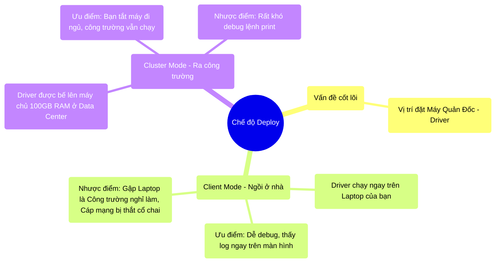

# 10.2 Chế Độ Chạy: Client Mode vs Cluster Mode

## 1. Objectives
- [ ] Phân biệt rõ sự khác nhau về vị trí địa lý của Máy Quản Đốc (Driver) qua **Phép ẩn dụ Điều Khiển Tại Nhà vs Ra Tận Công Trường**.
- [ ] Giải phẫu rủi ro tắc nghẽn mạng cá nhân khi dùng Client Mode.
- [ ] Quy tắc sinh tồn: Khi nào dùng Client, khi nào BẮT BUỘC dùng Cluster.

## 2. Mindmap


## 3. Content

### 3.1. Phép Ẩn Dụ: Vị Trí Của Người Quản Đốc (Driver)
Ở các chương trước, bạn biết rằng Spark có 1 Driver (Quản Đốc) và 100 Executors (Công nhân).
Khi chạy lệnh Nộp code lên Data Center (Lệnh `spark-submit`), bạn phải trả lời một câu hỏi then chốt: **Anh Quản Đốc sẽ ngồi ở đâu?**

> **[Ví Dụ Trực Quan: Đặt Căn Lều Chỉ Huy]**
> Công trường (Data Center) đang nằm ở Mỹ. Kỹ sư (Bạn) đang ôm Laptop ngồi ở quán Cafe tại Việt Nam.
> 
> - **Cách 1 - Client Mode (Điều khiển từ xa):** Bạn biến chiếc Laptop hiệu năng thấp của mình thành Người Quản Đốc (Driver). Laptop của bạn sẽ phải GỌI ĐIỆN THOẠI XUYÊN LỤC ĐỊA sang Mỹ để chỉ đạo 100 ông công nhân làm việc. 
> 
> - **Cách 2 - Cluster Mode (Cử người sang Mỹ):** Bạn gói quyển Sổ tay công việc (Code Python của bạn), ném sang Mỹ. Máy chủ ở Mỹ tự động bổ nhiệm một cái máy Siêu mạnh (100GB RAM) nằm ngay trong Công trường làm Người Quản Đốc. Quản Đốc ở Mỹ tự dùng Loa cầm tay hét vào mặt 100 công nhân mà không cần gọi điện thoại nữa.

### 3.2. Rủi Ro Chết Cụm Của Client Mode
Nhiều người mới học thích dùng Client Mode (Chạy Notebook Jupyter trên máy cá nhân). Nó rất sướng vì bạn gõ code đến đâu, kết quả in ra màn hình Laptop đến đó. 
Nhưng nếu bạn mang thói quen đó áp dụng cho Dữ liệu 1 Terabyte, bạn sẽ nếm mùi tuyệt vọng.

1. **Rủi Ro Mạng Nhện (Network Bottleneck):** Ở Bài 6.4 (Broadcast Join), chúng ta biết Quản đốc phải photo Sổ Tay (Hàng trăm MB) phát cho Công nhân. Nếu Driver là Laptop của bạn (Mạng Wifi quán Cafe), việc truyền 500MB tài liệu từ Việt Nam sang Mỹ cho 100 công nhân sẽ mất 3 tiếng đồng hồ!
2. **Rủi Ro Mất Kết Nối:** Bạn đang chạy Job. Quán Cafe rớt mạng 1 giây. Laptop của bạn (Driver) đứt liên lạc với 100 công nhân ở Mỹ. 100 công nhân hoảng loạn ngưng việc. HỆ THỐNG SẬP (Dù code đúng 100%).
3. **Quên Lời Thề Bất Tử:** Bạn dùng hàm `collect()` gom 10GB kết quả về in ra màn hình. Laptop của bạn có 8GB RAM. LỖI PHÁT SINH: Quả bóng nổ ngay trên bàn uống cafe của bạn.

### 3.3. Tiêu Chuẩn Sản Xuất: Cluster Mode
Khi một Job được mang vào Production (Chạy lịch trình hàng đêm, xuất báo cáo cho Giám đốc), nó **BẮT BUỘC 100% PHẢI CHẠY BẰNG CLUSTER MODE**.

Khi nộp Job bằng Cluster Mode (`--deploy-mode cluster`), Laptop của bạn (Việt Nam) chỉ làm đúng 1 việc: Bắn ném cuộn Code sang bên Mỹ, và đóng gói đi ngủ.
Toàn bộ quá trình Broadcast, Collect, hay Phân chia Tasks đều diễn ra Nội bộ bên trong Data Center (Sử dụng đường cáp quang 100 Gigabit/giây cực nhanh). Tốc độ nhanh gấp ngàn lần, và không bao giờ bị đứt mạng.

```bash
# =========================================================================
# LỆNH NỘP CODE VÀO TRUNG TÂM DỮ LIỆU
# =========================================================================

# 1. Cách chạy nghiệp dư (Local/Client)
spark-submit \
  --master yarn \
  --deploy-mode client \
  my_script.py
# -> Cấm gập Laptop, gập là tắt ngóm!

# 2. Cách chạy của Senior Data Engineer (Production)
spark-submit \
  --master yarn \
  --deploy-mode cluster \
  --driver-memory 8g \
  my_script.py
# -> Nhấn Enter, Laptop hiển thị chữ "Submitted", rồi bạn có thể đi ngủ.
# Sáng mai lên cty bật Grafana lên xem kết quả.
```

## 4. Key takeaways
- **Bản chất 2 chế độ:** Sự khác biệt duy nhất giữa Client và Cluster mode là **Vị trí vật lý của chiếc máy tính đóng vai trò làm Driver**.
- **Chế độ Client:** Chỉ dành cho môi trường Khám phá dữ liệu (Jupyter Notebook, Zeppelin) hoặc Debug nhanh. Tuyệt đối không dùng cho Job chạy hàng ngày vì phụ thuộc vào mạng Wifi cá nhân.
- **Chế độ Cluster:** Chuẩn mực của Production. Giao khoán toàn bộ sinh mạng của Driver vào tay Data Center. Giao tiếp mạng nội bộ siêu nhanh. Nhưng bù lại, bạn không thể dùng lệnh `print()` để in kết quả ra màn hình máy mình được nữa.
