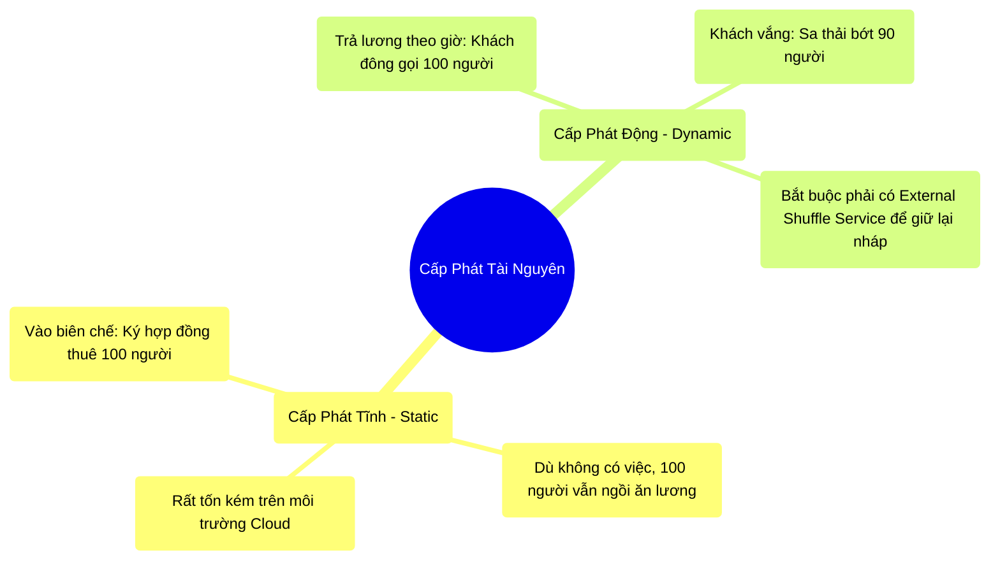

# 10.3 Cấp Phát Động (Dynamic Allocation): Bãi Bỏ Chế Độ Biên Chế

## 1. Objectives
- [ ] So sánh cơ chế xin tài nguyên Tĩnh (Static) và Động (Dynamic) qua **Phép ẩn dụ Công ty nhà nước vs Công ty Grab**.
- [ ] Phân tích cách Dynamic Allocation giải quyết bài toán lãng phí phần cứng.
- [ ] Cấu hình những thông số sinh tồn cho Dynamic Allocation.

## 2. Mindmap


## 3. Content

### 3.1. Phép Ẩn Dụ: Hợp Đồng Biên Chế vs Trả Lương Theo Giờ
Ở Bài 10.1, chúng ta biết Data Center là một đại công trường dùng chung. Kẻ thù lớn nhất của Data Center không phải là thiếu máy móc, mà là **Sự Lãng Phí (Underutilization)** do lòng tham của Lập trình viên.

> **[Ví Dụ Trực Quan: Nuôi Báo Cô Công Nhân]**
> Khi bạn nộp Job bằng lệnh `spark-submit --num-executors 100` (Cấp phát tĩnh).
> Điều đó có nghĩa là bạn bắt Công ty (YARN/K8s) phải ký hợp đồng BIÊN CHẾ cho 100 người công nhân, cấm YARN đưa 100 người này cho dự án khác làm.
> 
> Vấn đề là: Job của bạn chạy trong 5 tiếng.
> - Tiếng thứ 1: Cần 100 người gánh 10TB dữ liệu (Làm quần quật).
> - 4 tiếng sau: Đoạn code của bạn chỉ đang tải 5MB dữ liệu để vẽ biểu đồ. Lúc này ĐÚNG 1 NGƯỜI LÀM là xong.
> 
> Chuyện gì xảy ra với 99 người còn lại? Họ **Ngồi Chơi Xơi Nước suốt 4 tiếng**! 
> Nhưng vì YARN đã trót ký biên chế, YARN không dám đuổi họ đi. 99 máy tính rảnh rỗi đó tiêu tốn hàng ngàn Đô-la tiền điện (Nếu bạn dùng AWS/GCP), trong khi các Kỹ sư khác trong công ty lại đang khóc lóc vì không mượn được máy (Resource Starvation).

### 3.2. Cứu Cánh: Dynamic Allocation (Sa Thải Tự Động)
Để chấm dứt cảnh nuôi báo cô, Spark tung ra tính năng **Dynamic Allocation (Cấp phát động)**. (Giống như mô hình gọi xe Grab).

> **[Ví Dụ Trực Quan: Sa Thải Tự Động]**
> Lúc này, bạn chỉ nói với YARN: Anh cấp cho em TỐI THIỂU 1 người, và TỐI ĐA 100 người. Còn lại anh tự lo.
> 
> - Tiếng thứ 1 (Việc ập đến): Spark thấy hàng ngàn rổ hàng (Tasks) đang ùn ứ. Nó lập tức gọi điện cho YARN: Alo, tuyển gấp cho tôi thêm 99 người!. Cụm tự động phình to (Scale-up) lên 100 người.
> - Tiếng thứ 2 (Việc đã xong, rảnh rỗi): Spark thấy 99 người ngồi chơi quá 1 phút (`executorIdleTimeout`). Nó lập tức cầm loa hét: **MẤY ĐỨA KIA BỊ SA THẢI, TRẢ LẠI MÁY CHO CÔNG TY**. Cụm tự động teo lại (Scale-down) chỉ còn 1 người.

Công ty tiết kiệm hàng triệu đô, Kỹ sư khác có máy để dùng. Mọi người đều vui vẻ!

### 3.3. Rủi Ro Xóa Mất Nháp Của Việc Sa Thải
Việc sa thải tự động nghe rất màu hồng, nhưng nó chứa đựng 1 lỗ hổng vật lý chết người.

Hãy nhớ lại **Vùng Giấy Nháp (Shuffle Data)** ở Chương 6. 
Nếu Máy số 92 đang giữ bản nháp của cuộc hẹn hò. Công việc tạm thời rảnh rỗi. Spark sa thải Máy số 92. TỨC LÀ NGUYÊN CÁI MÁY ĐÓ BỊ CÚP ĐIỆN.
$\rightarrow$ TOÀN BỘ TỜ GIẤY NHÁP TRONG MÁY 92 CHÁY THÀNH TRO!
5 phút sau, Máy số 93 cần bản nháp đó để làm việc tiếp. Nó sang hỏi Máy 92. Máy 92 đã bị tiêu diệt. Spark quá tải và báo lỗi và phải CHẠY LẠI TỪ ĐẦU (Recompute) mọi thứ.

**Giải Pháp:** Để bật Dynamic Allocation, bạn BẮT BUỘC phải bật thêm một tính năng tên là **External Shuffle Service (Máy Tủ Đồ Độc Lập)**. 
Trang bị thêm một Máy Tủ Đồ (Không bao giờ bị tắt điện). Trước khi Máy 92 bị sa thải, nó phải ném toàn bộ giấy nháp vào Tủ đồ. Lúc đó nó có bị bốc hơi thì Máy 93 vẫn có thể đến Tủ đồ để lấy nháp. (Bảo toàn được công sức tính toán).

### 3.4. Code Khởi Động Tính Năng

```bash
# =========================================================================
# LỆNH SUBMIT CHUẨN MỰC TRÊN CLOUD / YARN
# =========================================================================

spark-submit \
  --master yarn \
  --deploy-mode cluster \
  --conf spark.dynamicAllocation.enabled=true \
  --conf spark.dynamicAllocation.minExecutors=2 \
  --conf spark.dynamicAllocation.maxExecutors=100 \
  --conf spark.dynamicAllocation.executorIdleTimeout=60s \
  --conf spark.shuffle.service.enabled=true \
  my_script.py

# Giải nghĩa: 
# Khởi đầu với 2 công nhân. Nếu thấy tắc đường, gọi thêm tối đa 100 người.
# Nếu thấy ông nào ngồi chơi quá 60 giây, thẳng tay ĐUỔI VIỆC (Trả máy về cho YARN).
# Bật Tủ Đồ (Shuffle Service) để công nhân bị đuổi không làm mất giấy nháp.
```

## 4. Key takeaways
- **Từ bỏ cấp phát tĩnh:** Trong môi trường Data Center dùng chung (hoặc Cloud tính tiền theo phút), sử dụng `--num-executors` (Cấp phát tĩnh) là hành động ích kỷ và lãng phí tài nguyên khủng khiếp.
- **Dynamic Allocation là tiêu chuẩn:** Giao quyền Thuê mướn & Sa thải công nhân tự động cho Spark. Vừa tiết kiệm tiền công ty, vừa đảm bảo Job có đủ sức mạnh khi cần thiết (Giống khái niệm Auto-Scaling).
- **Quy định Tủ Đồ:** Đã chơi trò sa thải (Dynamic Allocation) thì bắt buộc phải trang bị két sắt lưu nháp (External Shuffle Service). Nếu không bật Shuffle Service, Spark sẽ từ chối khởi động vì nó thừa biết hệ thống sẽ bị lỗi mất dữ liệu khi Scale-down.
