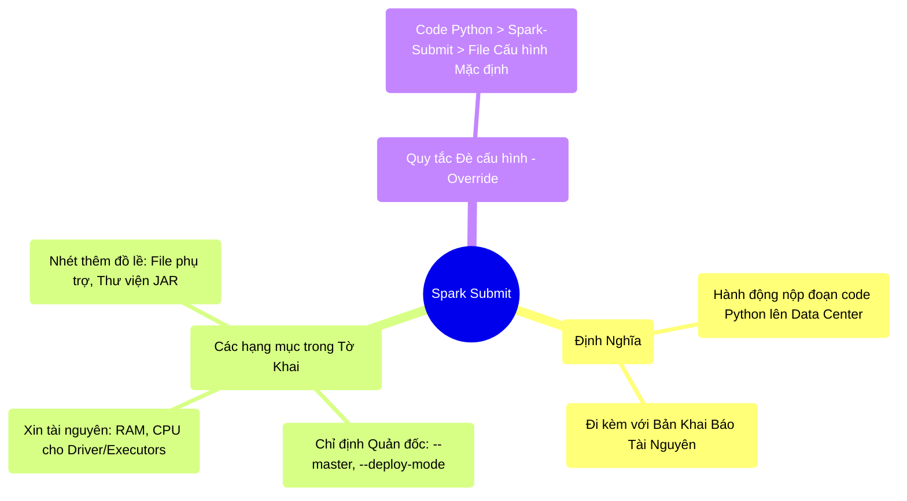

# 10.4 Nghệ Thuật Cấu Hình: Nộp Đơn Xin Việc Bằng `spark-submit`

## 1. Objectives
- [ ] Phân tích cấu trúc của lệnh `spark-submit` qua **Phép ẩn dụ Tờ Khai Xin Việc**.
- [ ] Phân biệt thứ tự ưu tiên của các tầng cấu hình (Config Hierarchy).
- [ ] Xây dựng một Template `spark-submit` chuẩn mực cho Production.

## 2. Mindmap


## 3. Content

### 3.1. Phép Ẩn Dụ: Điền Tờ Khai Xin Việc (Job Submission)
Khi bạn code xong một file `report.py`, máy tính cá nhân của bạn không hề chạy file đó. Bạn phải gửi file đó lên Đại Công Trường (Cluster). Thao tác gửi đó gọi là **Submit**.

> **[Ví Dụ Trực Quan: Nộp Đơn Xin Việc]**
> Lệnh `spark-submit` chính là việc bạn mang một tờ đơn lên Phòng Nhân Sự của Công Trường (YARN/K8s).
> Trong tờ đơn, bạn bắt buộc phải khai báo 3 phần cốt lõi:
> 
> **Phần 1: Thông tin liên lạc (Nơi chạy Job)**
> - Tôi muốn nộp đơn cho cụm YARN (`--master yarn`)
> - Hãy cho Quản đốc (Driver) của tôi vào hẳn trong công trường (`--deploy-mode cluster`)
> 
> **Phần 2: Mặc cả Lương bổng (Tài nguyên)**
> - Cấp cho Quản đốc 4GB RAM (`--driver-memory 4g`)
> - Cấp cho tôi linh hoạt từ 2 đến 100 công nhân (Bài 10.3), mỗi người 8GB RAM (`--executor-memory 8g`)
> 
> **Phần 3: Hành lý xách tay (Dependencies)**
> - Nhớ cầm theo cho tôi cuốn từ điển tiếng Pháp này, vì tôi sẽ cần tra cứu (`--files french_dict.csv`)
> - Nhớ mang theo bộ kìm búa chuyên dụng này (`--jars mysql-connector.jar`)

Nếu bạn quên khai báo hành lý (Ví dụ: Bạn import một thư viện bên ngoài mà không đính kèm vào `--jars`), code sẽ chạy hoàn hảo trên Laptop của bạn, nhưng lập tức báo lỗi `ClassNotFound` ngay khi ném lên Data Center!

### 3.2. Hệ Thống Đè Cấu Hình (Hierarchy of Configurations)
Một cấu hình Spark (Ví dụ: `spark.sql.shuffle.partitions`) có thể được cài đặt ở 3 nơi khác nhau. Giống như 3 cấp bậc quản lý trong công ty, lệnh của Cấp Cao sẽ đè bẹp lệnh của Cấp Thấp.

1. **Cấp Thấp Nhất (Default Conf):** Nằm trong file `spark-defaults.conf` trên máy chủ. Đây là luật chung của cả công ty. Nếu không ai nói gì, công ty sẽ chia mọi thứ làm 200 partitons.
2. **Cấp Trung Hợp (spark-submit flag):** Khi nộp đơn xin việc, bạn ghi `--conf spark.sql.shuffle.partitions=500`. YARN sẽ bỏ qua luật công ty, cấp cho bạn 500 partitions.
3. **Cấp Tối Cao (Hard-code trong code Python):** Bên trong file `report.py`, bạn viết lệnh `spark.conf.set(spark.sql.shuffle.partitions, 1000)`. Mệnh lệnh này có quyền uy tuyệt đối. Nó xé nát tờ khai `spark-submit`, ép hệ thống chạy với 1.000 partitons!

*(Lời khuyên Senior: Hạn chế nhúng cấu hình cứng (Hard-code) vào trong file Python. Hãy truyền nó qua lệnh `spark-submit` để Job của bạn linh hoạt thay đổi mà không cần sửa code).*

### 3.3. Template Chuẩn Mực Cho Production

Dưới đây là một mẫu `spark-submit` mà bất cứ Kỹ sư dữ liệu Enterprise nào cũng nằm lòng khi thả Job vào cụm Production (Kết hợp kiến thức Chương 5, 8, 10).

```bash
# =========================================================================
# THE ULTIMATE SPARK SUBMIT TEMPLATE
# =========================================================================

spark-submit \
  --master yarn \
  --deploy-mode cluster \
  --name "Nightly_Sales_Report_Job" \
  \
  # --- QUẢN LÝ DRIVER (Máy Quản Đốc) ---
  --driver-memory 4g \
  --driver-cores 2 \
  \
  # --- QUẢN LÝ EXECUTORS (Máy Công Nhân - Trả lương theo giờ) ---
  --executor-memory 8g \
  --executor-cores 4 \
  --conf spark.dynamicAllocation.enabled=true \
  --conf spark.dynamicAllocation.minExecutors=2 \
  --conf spark.dynamicAllocation.maxExecutors=50 \
  --conf spark.shuffle.service.enabled=true \
  \
  # --- TỐI ƯU VÙNG NHỚ & MẠNG LƯỚI (Tuning) ---
  --conf spark.sql.shuffle.partitions=1000 \
  --conf spark.sql.adaptive.enabled=true \
  --conf spark.memory.fraction=0.8 \
  \
  # --- HÀNH LÝ ĐÍNH KÈM (Dependencies) ---
  --files /local/path/to/config.yaml \
  --jars /local/path/to/mysql-connector.jar \
  \
  # --- FILE CODE CHÍNH BẮT BUỘC NẰM CUỐI CÙNG ---
  main_report.py
```

## 4. Key takeaways
- **Bản chất Submit:** Không phải là việc nhấn nút Play. Đó là việc đàm phán tài nguyên phần cứng (CPU/RAM) với một Hệ điều hành cấp cao (YARN/K8s) và ném cục Code của bạn vào bên trong môi trường cô lập đó.
- **Dependency Hell:** 90% lỗi khi submit lần đầu tiên lên Production không phải do Code sai, mà do Quên đính kèm thư viện phụ trợ (`--jars`, `--py-files`). Máy trạm (Laptop) có cài thư viện, nhưng 100 máy Worker ở Công trường không hề có. Bạn phải ném nó theo qua lệnh submit!
- **Luật ghi đè:** Nhớ rõ nguyên tắc: Code vùi sâu trong file Python (`SparkConf.set()`) chiến thắng lệnh truyền ngoài (`spark-submit`), lệnh truyền ngoài chiến thắng file cài đặt gốc (`spark-defaults`).
