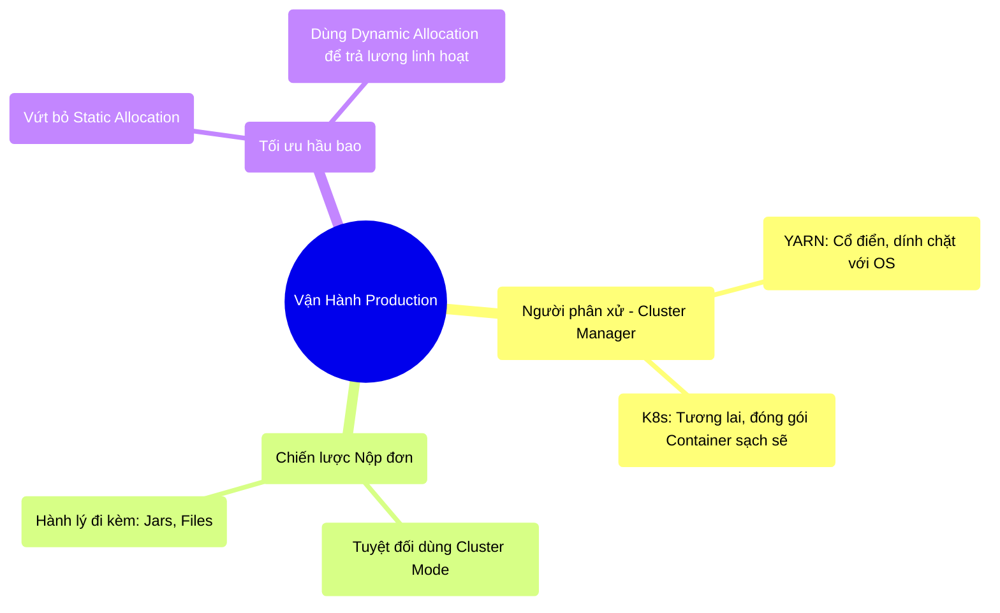

# 10.5 Tổng Kết: Vận Hành Thực Chiến

## 1. Objectives
- [ ] Cô đọng lại vòng đời của một ứng dụng Spark từ lúc gõ phím đến lúc chạy trên Data Center.
- [ ] Ghi nhớ các cảnh báo đỏ (Red Flags) khi ném code lên Production.
- [ ] Chuẩn bị bước vào 2 kỷ nguyên chuyên sâu: Streaming và Delta Lake.

## 2. Mindmap

## 3. Content

### 3.1. Hành Trình Của Một Đoạn Code
Bạn đã viết xong thuật toán (Chương 3, 4). Bạn đã hiểu cách Spark quản lý RAM, Network, Disk (Chương 5, 6, 7). Bạn đã biết cách dùng AQE và tránh Skew (Chương 8). Bạn có đủ Radar để giám sát nó (Chương 9). 

Và ở Chương 10 này, bạn chính thức nhấn nút Phóng tên lửa đưa đoạn Code đó vào Vũ trụ (Production Cluster). Hành trình đó tóm gọn lại như sau:

1. **Chuẩn bị Tờ Khai:** Viết lệnh `spark-submit`. Xin RAM, CPU vừa đủ. Gói gém các thư viện phụ trợ (`--jars`, `--py-files`).
2. **Kích hoạt Auto-Scaling:** Bật tính năng Dynamic Allocation (Và đừng quên bật Shuffle Service đi kèm). Đừng bao giờ giữ bo bo 100 cái máy chạy 24/7.
3. **Cử Quản Đốc Đi Xa:** Ép hệ thống dùng `--deploy-mode cluster` để bế Quản Đốc (Driver) ra khỏi chiếc Laptop yếu ớt của bạn, ném nó vào cỗ máy an toàn nhất trong Data Center.
4. **Theo Dõi Nhịp Tim:** Mở Grafana lên, quan sát dòng máu dữ liệu bắt đầu chảy qua cụm máy chủ và mỉm cười thư giãn.

### 3.2. Ba Cái Bẫy Tử Thần (Red Flags) Trên Production
Mặc dù bạn đã nắm trong tay lệnh Submit hoàn hảo, hãy khắc cốt ghi tâm 3 cái bẫy này trước khi nộp việc:

- **Bẫy số 1: Hàm `collect()` trong Code.** Dù bạn cấp cho Driver 32GB RAM (Bằng `--driver-memory`), nhưng nếu bảng dữ liệu của bạn nặng 1TB và bạn gọi `df.collect()`, toàn bộ Data Center vẫn sẽ sụp đổ.
- **Bẫy số 2: Quên Import Thư Viện vào Worker.** Đoạn code Python dùng thư viện `boto3` (Giao tiếp AWS S3). Nó chạy cực ngon trên máy bạn. Lên Production, 100 máy Worker gào thét báo lỗi `ModuleNotFoundError`. Lý do: Bạn chỉ cài `boto3` vào Driver, mà quên cài cho các máy Worker (Hoặc quên nhét nó vào trong Container Docker của K8s).
- **Bẫy số 3: Đường dẫn tuyệt đối bị cứng (Hard-coded Paths).** Bạn viết `df = spark.read.csv(C:/Users/Admin/Desktop/data.csv)`. Máy chủ Linux trên Production (Vốn không có ổ C:) sẽ khạc nhổ vào mặt bạn. Mọi đường dẫn (Path) trong Big Data phải là đường dẫn của Hệ thống file phân tán (`hdfs://...` hoặc `s3a://...`).

### 3.3. Từ Tĩnh Bất Động Sang Chảy Không Ngừng (Chuyển Giao)
Từ Chương 1 đến Chương 10, chúng ta chỉ mới giải quyết bài toán: **Xử Lý Dữ Liệu Tĩnh (Batch Processing)**.
Tức là: Cả một file 100GB đã nằm ngoan ngoãn sẵn trên Ổ cứng chờ chúng ta đến xử lý. 

Nhưng thế giới thực không tĩnh lặng như thế. 
Mỗi giây, hệ thống thanh toán của Shopee sinh ra hàng ngàn giao dịch. Dữ liệu là một Vòi Nước Đang Chảy (Streaming Data) liên tục 24/7, không có điểm kết thúc. Bạn không thể đợi qua đêm mới xử lý dữ liệu của ngày hôm qua được! Giám đốc muốn thấy doanh thu thay đổi MỖI GIÂY trên biểu đồ.

Làm thế nào để áp dụng sức mạnh kinh hoàng của Spark (Vốn sinh ra để đập vỡ khối đá tĩnh) vào việc xử lý một Dòng Sông Nước Chảy mà không bị tràn bộ nhớ?
Chúng ta sẽ bước sang **Chương 11 (Structured Streaming)** - Đỉnh cao của xử lý Dữ Liệu Thời Gian Thực (Real-time).
