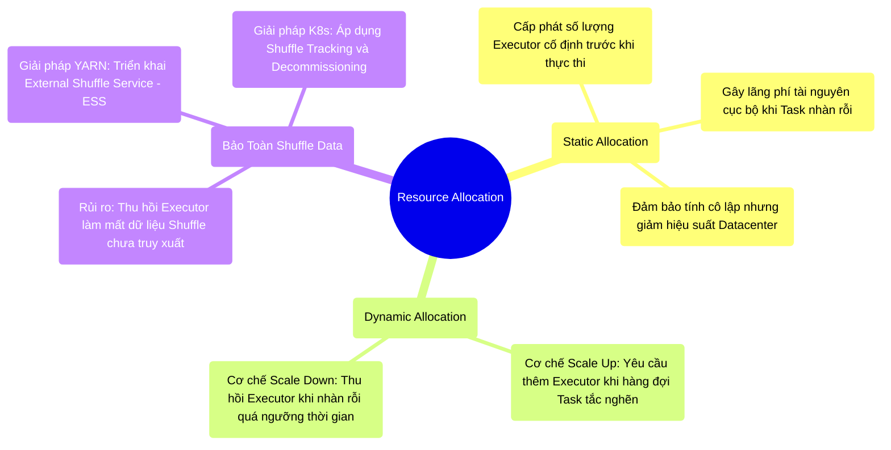

# 10.1 Cấp Phát Tài Nguyên: Tĩnh (Static) vs Động (Dynamic Allocation)


## 1. Objectives
- [ ] Phân tích điểm nghẽn kiến trúc của mô hình Cấp phát tĩnh (Static Allocation).
- [ ] Mổ xẻ cơ chế Cấp phát động (Dynamic Resource Allocation - DRA) và sự phụ thuộc vào External Shuffle Service.
- [ ] Khảo sát giải pháp bảo toàn dữ liệu Shuffle trong môi trường K8s (Shuffle Tracking & Decommissioning).

## 2. Mindmap


## 3. Content

Trong môi trường Production (YARN hoặc Kubernetes), các ứng dụng Spark thường xuyên phải chia sẻ tài nguyên tính toán (Multi-tenant Cluster). Việc cấu hình cấp phát tài nguyên sai lệch không chỉ làm chậm tiến trình hiện tại mà còn gây hiệu ứng tắc nghẽn dây chuyền (Starvation) cho toàn bộ cụm Datacenter.

### 3.1. Hạn Chế Của Lập Kế Hoạch Tĩnh (Static Allocation)
Phương pháp truyền thống yêu cầu Kỹ sư xác định tài nguyên thông qua cờ `--num-executors N`.
- **Cơ chế hoạt động:** Spark gửi yêu cầu cấp phát N Executor từ Cluster Manager. Số lượng Executor này được giữ cố định (Locked) trong suốt vòng đời của Ứng dụng (Application Lifecycle).
- **Hạn chế kiến trúc:** Đặc tính Workload của Spark không bao giờ đồng đều. Giả sử Job kéo dài 5 tiếng, nhưng ở giai đoạn giữa (Giai đoạn quy tụ về Driver), phần lớn Executor rơi vào trạng thái nhàn rỗi (Idle). Tuy nhiên, tài nguyên không được trả lại cho hệ thống, dẫn đến việc các Job khác bị xếp hàng chờ (Pending) trong khi RAM và CPU của cụm đang bị lãng phí nghiêm trọng.

### 3.2. Chuyển Đổi Sang Cấp Phát Động (Dynamic Resource Allocation - DRA)
Để tối ưu hóa ROI (Return on Investment) cho hạ tầng, kiến trúc **Dynamic Resource Allocation (DRA)** được thiết kế.
- **Cơ chế mở rộng (Scale Up):** Hệ thống giám sát hàng đợi Task (Pending Tasks). Nếu hàng đợi ứ đọng vượt quá khoảng thời gian cấu hình (Ví dụ 1 giây qua `spark.dynamicAllocation.schedulerBacklogTimeout`), Spark sẽ phát tín hiệu yêu cầu Cluster Manager cấp phát thêm Executor để giải tỏa nút thắt.
- **Cơ chế thu hẹp (Scale Down):** Nếu một Executor không nhận thêm Task nào trong khoảng thời gian nhất định (Mặc định 60 giây qua `spark.dynamicAllocation.executorIdleTimeout`), Spark sẽ chủ động giải phóng Executor đó để nhường tài nguyên cho ứng dụng khác.

### 3.3. Giải Bài Toán Vật Lý: Bảo Toàn Dữ Liệu Shuffle
Sự linh hoạt của DRA đi kèm với một rủi ro kiến trúc nghiêm trọng liên quan đến quá trình luân chuyển dữ liệu **(Shuffle Data)**.
- *Rủi ro mất mát (Data Loss):* Giả sử Executor A hoàn tất giai đoạn Map và xả thành công 50GB Shuffle Data xuống đĩa cục bộ. Theo quy tắc DRA, nếu Executor A nhàn rỗi quá 60 giây, nó sẽ bị thu hồi (Terminated). Đồng nghĩa 50GB dữ liệu Shuffle vật lý của nó bị xóa sổ hoàn toàn.
- *Hậu quả (Fetch Failed):* Khi các Node đảm nhiệm giai đoạn Reduce yêu cầu truy xuất khối 50GB đó, chúng sẽ gặp lỗi mạng (FetchFailedException). Hệ thống bắt buộc phải tính toán lại (Recompute) toàn bộ giai đoạn Map, phá vỡ SLA.

**[Giải Pháp Kiến Trúc 1: YARN External Shuffle Service - ESS]**
Trên hạ tầng YARN, Enterprise yêu cầu triển khai một Daemon độc lập trên mỗi Node vật lý: **External Shuffle Service (ESS)**.
Khi Executor xả dữ liệu Shuffle, nó bàn giao quyền quản lý (File descriptors) cho ESS. Sau đó, Executor có thể an toàn bị thu hồi bởi DRA. Quá trình truy xuất dữ liệu từ các Node khác sẽ kết nối trực tiếp với tiến trình ESS thay vì Executor gốc.

**[Giải Pháp Kiến Trúc 2: K8s Shuffle Tracking & Decommissioning]**
Trên hạ tầng Kubernetes (K8s), mô hình ESS truyền thống gặp hạn chế do đặc tính phi trạng thái của Pod. Spark 3.x đã cung cấp các cơ chế mới:
- **Shuffle Tracking:** Hệ thống lưu vết (Track) các Executor đang lưu trữ các khối Shuffle quan trọng. DRA sẽ chủ động từ chối thu hồi (Do not kill) các Executor này ngay cả khi chúng đang nhàn rỗi.
- **Decommissioning:** Kích hoạt quá trình chuyển giao chủ động (Graceful Decommissioning). Trước khi bị thu hồi, Executor sẽ tranh thủ sao chép khối Shuffle của nó sang một Executor khác hoặc lưu trữ bền vững (Ví dụ S3, HDFS).

**[Config Snippet: Thiết Lập Cấp Phát Động]**
```bash
# Kích hoạt tính năng DRA và thiết lập biên độ giao động
--conf spark.dynamicAllocation.enabled=true
--conf spark.dynamicAllocation.minExecutors=10
--conf spark.dynamicAllocation.maxExecutors=500

# Bắt buộc trên môi trường YARN:
--conf spark.shuffle.service.enabled=true 

# Khuyến nghị trên K8s (Spark 3.0+):
--conf spark.dynamicAllocation.shuffleTracking.enabled=true
```

## 4. Key takeaways
- **Thỏa hiệp cấp phát**: DRA mang lại khả năng tối ưu hóa tài nguyên cho Datacenter nhưng đi kèm với yêu cầu thiết lập cơ sở hạ tầng bổ trợ (ESS/Tracking).
- **Phân tách vòng đời**: Yếu tố then chốt để DRA hoạt động an toàn là phân tách vòng đời của Executor (Ngắn hạn) khỏi vòng đời của dữ liệu Shuffle (Dài hạn cho đến khi Stage kết thúc).
- **Tiền đề của cấu trúc Executor**: Sau khi xác định phương thức cấp phát (Tĩnh/Động), Kỹ sư đối mặt với bài toán định dạng vật lý: Nên thiết lập Executor với cấu hình nhỏ gọn hay khối lượng lớn (Fat vs Thin)? Lật sang Bài 10.2 để phân tích nghịch lý tỷ lệ này.
