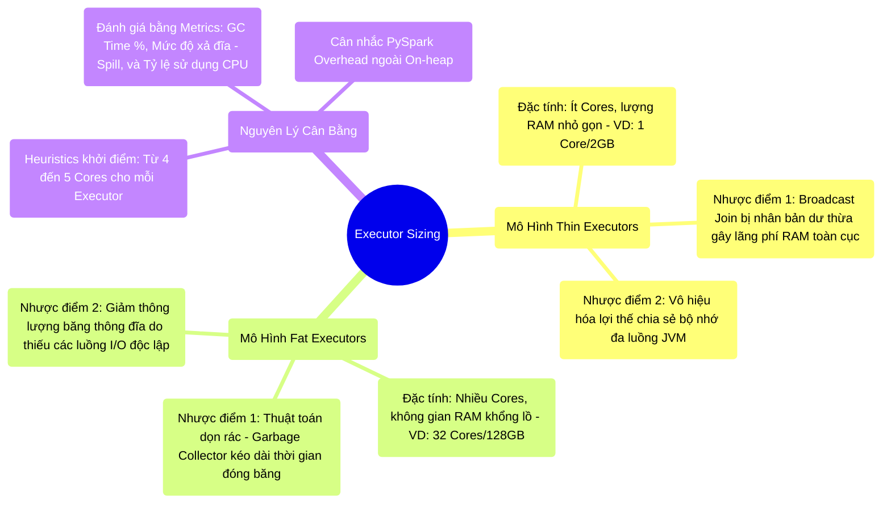

# 10.2 Tối Ưu Cấu Hình Kích Thước Executor (Fat vs Thin Sizing)

## 1. Objectives
- [ ] Khảo sát rủi ro kiến trúc khi định dạng Executor quá nhỏ (Thin Executors): Lãng phí tài nguyên Broadcast, tăng Overhead hệ điều hành, vô hiệu hóa Shared Memory.
- [ ] Phân tích điểm nghẽn vật lý khi cấp phát Executor quá lớn (Fat Executors): Hiện tượng nút thắt cổ chai I/O và sự kiện tạm dừng do Garbage Collector (GC Pause).
- [ ] Xác lập tỷ lệ cấu hình tiêu chuẩn (Heuristics) và thiết kế hệ thống giám sát dựa trên đặc tính của tải công việc (Workload).

## 2. Mindmap


## 3. Content

Khi cấu hình luồng thực thi trên Cluster, Staff Engineer luôn phải đối mặt với bài toán định dạng (Sizing) cơ bản: Với tổng ngân sách phần cứng (Ví dụ 100 Cores và 400GB RAM), hệ thống nên cấp phát thành **100 Thin Executors** (Mỏng nhẹ: 1 Core/4GB) hay hợp nhất thành **3 Fat Executors** (Đồ sộ: 32 Cores/128GB)? Cả hai lựa chọn phân bổ ở mức thái cực (Extreme) đều dẫn đến suy giảm thông lượng nghiêm trọng.

### 3.1. Hạn Chế Của Cấu Hình Phân Tán Mỏng (Thin Executors)
Việc phân bổ Executor với cấu hình tối thiểu (1 Core/Executor) dường như tạo ra khả năng cô lập lỗi tốt, nhưng thực tế chứa đựng 3 rủi ro ẩn:
1. **Lãng phí không gian Broadcast:** Đối với Broadcast Hash Join, dữ liệu được nhân bản tới từng Executor. Nếu hệ thống có 100 Executor, một bảng dữ liệu 1GB sẽ bị sao chép thành 100 bản (Tiêu tốn 100GB RAM của toàn cụm).
2. **Khuyết tật cơ chế chia sẻ (Shared Memory):** Một trong những ưu thế cốt lõi của máy ảo JVM là năng lực chia sẻ bộ nhớ giữa các Thread (Luồng thực thi). Nếu chỉ cấp 1 Core cho mỗi JVM, Task không thể mượn phần RAM dư thừa từ các Task khác đang hoạt động nhàn rỗi.
3. **Bùng nổ chi phí Overhead:** Hệ điều hành và YARN/K8s thường yêu cầu một khoản RAM duy trì (Reserved Memory) cố định cho mỗi Executor (Thường trên 300MB). Triển khai 100 Executor đồng nghĩa với việc tiêu tốn 30GB RAM hệ thống chỉ để duy trì trạng thái hoạt động của các tiến trình phụ trợ.

### 3.2. Điểm Nghẽn Của Cấu Hình Tập Trung Béo Phì (Fat Executors)
Ngược lại, cấu hình một vài Executor với cấu hình phần cứng tối đa (Ví dụ: 32 Cores / 128GB RAM) lại tạo ra các nút thắt cổ chai cục bộ:
1. **Nút thắt I/O thông lượng mạng (HDFS/S3 Bottleneck):** Việc đọc/ghi dữ liệu từ HDFS/S3 yêu cầu luồng kết nối I/O đa phân mảnh. Một Executor lớn có tới 32 Cores nhưng thường chỉ được cấp phát một dải thông lượng luồng mạng vật lý duy nhất, khiến 32 Cores thường xuyên phải chờ đợi dữ liệu I/O rớt xuống.
2. **Khoảng thời gian đóng băng Garbage Collector (GC Pause):** Tốc độ dọn rác của JVM không tương xứng với kích thước RAM đồ sộ. Quét toàn bộ khối lượng 128GB RAM có thể khiến JVM kích hoạt trạng thái Stop-The-World trong thời gian dài (Phút thay vì Giây). Quá trình đóng băng kéo dài khiến các Executor mất kết nối với Cluster Manager (Heartbeat Timeout) và bị hệ thống tự động kết liễu, dẫu chưa chạm ngưỡng OOM.

### 3.3. Tỷ Lệ Thiết Lập Cân Bằng (Heuristic Ratio)
Thực tiễn ngành công nghiệp Data Engineering cung cấp một mức ước lượng điểm xuất phát (Starting Heuristic) an toàn: Cấu hình từ **4 đến 5 Cores cho mỗi Executor**, đi kèm với 16GB-32GB RAM tương xứng. Mốc tỷ lệ này đạt được 3 sự dung hòa:
- Cung cấp đủ số lượng Thread (Luồng) để tận dụng mô hình Shared Memory.
- Đủ nhỏ để luồng I/O mạng giao tiếp hiệu quả mà không bão hòa HDFS.
- Giữ dung lượng RAM ở mức an toàn (Dưới 32GB) để thuật toán Garbage Collector duy trì hiệu suất quét nhanh gọn.

> [!CAUTION] Cảnh Báo Kiến Trúc: Bẫy Con Số Thần Kỳ (Magic Numbers)
> Không tồn tại bất kỳ một thông số 5 Cores nào hoàn hảo cho tất cả Workload. Kỹ sư Hệ thống phân loại Workload (CPU-bound, I/O-bound, hoặc Memory-bound) và cấu trúc kiến trúc phần cứng nền (NVMe, S3) để hiệu chỉnh. Việc áp dụng khuôn mẫu một cách mù quáng làm phân mảnh Datacenter và tạo áp lực không cần thiết lên hệ thống giám sát.

### 3.4. Định Hướng Tối Ưu Thông Qua Observability (Metrics-Driven Sizing)
Sử dụng dữ liệu đo lường (Metrics) thay vì phỏng đoán để tinh chỉnh cấu hình vật lý:
1. **Giám sát Garbage Collection (GC) Time:** Nếu `GC Time` tiêu tốn > 10% tổng thời gian thực thi Task $\rightarrow$ Hệ thống báo hiệu sự bão hòa vùng nhớ cấp phát, cần xem xét việc tối ưu hóa chu kỳ sinh Object hoặc phân bổ thêm RAM.
2. **Khảo sát cường độ Xả Đĩa (Spill):** Tràn `Spill (Disk)` số lượng lớn $\rightarrow$ Phân vùng RAM cục bộ không đáp ứng đủ nhu cầu Sort của thuật toán Shuffle, buộc phải mở rộng Execution Memory hoặc chia nhỏ `shuffle.partitions`.
3. **Hiệu suất luồng CPU (CPU Utilization):** Tỷ lệ nhàn rỗi (Idle) cao trong khi Job thực thi kéo dài $\rightarrow$ Đặc tính của I/O-Bound Workload (Thắt cổ chai tại Network). Việc cấp thêm CPU Cores trong trường hợp này không mang lại bất cứ lợi ích nào.
4. **Giới hạn ngoại vi PySpark:** Khởi chạy mã nguồn Python đẻ ra một không gian tiến trình ngoại vi, đòi hỏi biến số `spark.executor.memoryOverhead` phải được nới rộng tương xứng, tránh tình trạng Container Killed do hệ điều hành can thiệp (Xem Bài 9.3).

**[Config Snippet: Mô Phỏng Thiết Lập Tiêu Chuẩn]**
Ví dụ với một Node YARN vật lý (16 Cores, 64GB RAM):
- Phân bổ 1 Core & 1GB RAM cho luồng Daemon (Hadoop/OS). Tài nguyên khả dụng: 15 Cores, 63GB.
- Phân tách thành 3 Executors. Mỗi Executor sở hữu: **5 Cores và 21GB RAM (Bao gồm Overhead)**.
```bash
--executor-cores 5 \
--executor-memory 18G \    # 18G cho JVM Heap
--conf spark.executor.memoryOverhead=3G # 3G cấp phát cho lớp Overhead
```

## 4. Key takeaways
- **Loại bỏ quy chuẩn tuyệt đối**: Hiệu suất tốt nhất không đến từ kích thước phần cứng lớn nhất (Vướng rào cản GC Pause) cũng như độ phân mảnh sâu nhất (Vướng rào cản Overhead).
- **Phản ứng dựa trên số liệu**: Thông số Cấu hình chỉ có giá trị khi liên tục được đánh giá chéo bằng chỉ số đo lường thực tế (GC Time, Spill Size) trên Spark UI.
- **Tiến trình tiếp theo**: Sau khi làm rõ bức tranh cấp phát vật lý của mô hình xử lý theo lô (Batch Processing), chúng ta đối mặt với bài toán Dòng chảy dữ liệu (Streaming). Làm sao để đảm bảo luồng truy xuất liên tục và bất biến? Vấn đề sẽ được luận giải tại Chương 11.
