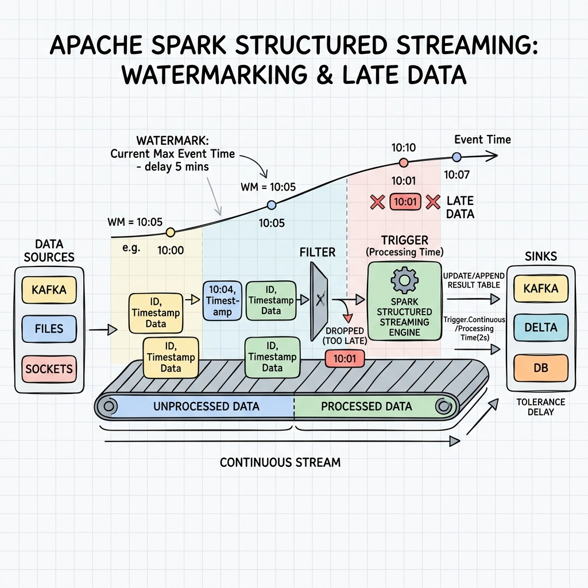
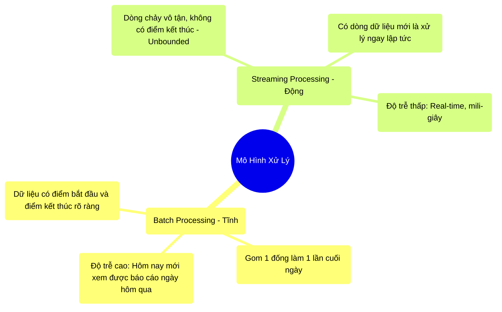

# 11.1 Dịch Chuyển Mô Hình: Từ Tĩnh Lặng Đến Chảy Xiết (Batch vs Streaming)




## 1. Objectives
- [ ] Phân biệt ranh giới vật lý giữa Batch (Xử lý lô) và Streaming (Xử lý dòng chảy) qua **Phép ẩn dụ Rửa Bát Đĩa**.
- [ ] Lý giải tại sao Dữ liệu thế giới thực luôn là Streaming.
- [ ] Định nghĩa lại khái niệm Unbounded Table (Bảng không đáy).

## 2. Mindmap


## 3. Content

### 3.1. Phép Ẩn Dụ: Chiến Lược Rửa Bát
Suốt 10 chương qua, mọi thao tác chúng ta làm với Spark đều được gọi là **Batch Processing (Xử lý theo Lô)**. 

> **[Ví Dụ Trực Quan: Rửa Bát Cuối Ngày]**
> Hãy tưởng tượng Data Center là một Nhà hàng. Dữ liệu chạy vào là Bát đĩa dơ do khách ăn xong.
> 
> **Mô hình Batch (Lô):**
> Suốt cả ngày, nhân viên cứ ném bát dơ vào một cái Thùng lớn (Ổ cứng HDFS). Thùng bát này không ai đụng tới. 
> Đến 12h đêm, nhà hàng đóng cửa (File dữ liệu chốt sổ, đóng lại). Quản lý thuê 10 ông công nhân (Spark Job) tới. 10 ông này chia nhau cái thùng 1.000 cái bát, rửa một lèo trong 1 tiếng là xong. Sáng hôm sau, Giám đốc xem báo cáo: À, hôm qua bán được 1.000 bát.
> 
> **Vấn đề:** Nếu lúc 12h trưa, Giám đốc muốn biết nhà hàng đang bán được bao nhiêu bát? KHÔNG BIẾT! Phải chờ đến 12h đêm hệ thống Batch mới chạy. Độ trễ dữ liệu lên tới 24 giờ.

Để đáp ứng nhu cầu xem báo cáo ngay lập tức (Real-time), hệ thống biến hình thành **Streaming Processing (Xử lý dòng chảy)**.

> **[Ví Dụ Trực Quan: Rửa Bát Dây Chuyền]**
> Nhà hàng dẹp bỏ cái Thùng cất bát dơ. Thay vào đó là một Dây chuyền băng tải (Ví dụ: Apache Kafka).
> Có 10 ông công nhân túc trực liên tục ở băng tải. Khách vừa ăn xong 1 cái bát, bát ném lên băng chuyền. 1 giây sau, công nhân nhặt lên rửa luôn!
> Báo cáo doanh thu trên màn hình của Giám đốc nhảy số LÊN TỤC MỖI GIÂY.

### 3.2. Bản Chất Vật Lý Của Dòng Chảy (Unbounded Table)
Trong Batch, Spark đọc một File Parquet. Nó đếm dòng từ 1 đến 1 Triệu. Đến dòng 1 Triệu thì hết file (End-of-File). Spark báo: Job SUCCESS (Hoàn thành) và tắt máy đi ngủ. Bảng dữ liệu này gọi là **Bảng có giới hạn (Bounded Table)**.

Nhưng trong hệ thống Shopee, Lazada hay Ngân hàng, các giao dịch diễn ra liên tục 24/7. Sẽ không bao giờ có Giao dịch cuối cùng. Bảng dữ liệu của bạn cứ liên tục được đẻ thêm dòng mới, kéo dài vô tận. Đó gọi là **Unbounded Table (Bảng không đáy)**.

Lúc này, Kỹ sư dữ liệu không thể viết một cái Job chạy xong rồi tắt được. Job phải là một vòng lặp vĩnh cửu (Túc trực ở băng chuyền), liên tục lắng nghe và tính toán. Nếu Job tắt, hệ thống sập!

### 3.3. Cuộc Cách Mạng Structured Streaming
Spark là một hệ thống vốn sinh ra để xử lý Batch (Nhát chém 1 lần). Vậy làm sao để Spark bẻ lái sang xử lý Streaming?

Các kỹ sư Databricks đã tạo ra một phép màu mang tên **Structured Streaming**.
Thay vì bắt Kỹ sư dữ liệu phải học một bộ code hoàn toàn mới để xử lý Streaming, Spark lừa Kỹ sư bằng cách nói rằng: 
*Cậu cứ viết code (select, filter, groupBy) y hệt như đang làm với Bảng Tĩnh (Batch). Dưới gầm máy, tôi sẽ tự động nhặt các dòng code đó ném vào một Vòng lặp vĩnh cửu để xử lý dòng chảy cho cậu!*

```python
# =========================================================================
# SỰ TƯƠNG ĐỒNG KỲ DIỆU GIỮA BATCH VÀ STREAMING
# =========================================================================

# --- 1. CODE BATCH (Rửa bát 1 lần) ---
# Đọc 1 file cố định.
df_batch = spark.read.parquet("hdfs://sales_yesterday.parquet")
# Tính tổng. Sau dòng này, Job tắt.
df_batch.groupBy("store").count().write.parquet("hdfs://report.parquet")

# --- 2. CODE STREAMING (Rửa bát liên tục) ---
# Thay chữ "read" bằng "readStream". Spark sẽ kết nối vào Băng tải Kafka.
df_stream = spark.readStream.format("kafka").option("subscribe", "sales").load()
# VẪN LÀ CODE CŨ! Cú pháp y hệt Batch.
# Nhưng lệnh writeStream sẽ mở ra một Vòng Lặp Vĩnh Cửu. 
# Cứ có đơn hàng mới bắn vào Kafka, báo cáo sẽ tự update!
df_stream.groupBy("store").count() \
    .writeStream.outputMode("update").format("console").start()
```

## 4. Key takeaways
- **Từ Tĩnh sang Động:** Dữ liệu thực tế không nằm yên một chỗ. Streaming là bắt buộc đối với các hệ thống cần báo cáo Real-time, phát hiện gian lận thẻ tín dụng, hay gợi ý sản phẩm ngay khi khách đang lướt Web.
- **Unbounded Table:** Trong Streaming, dữ liệu là một Bảng dài vô tận. Khái niệm Xong Job bị xóa sổ, thay vào đó là Job chạy mãi mãi.
- **Sức mạnh của Structured Streaming:** Che giấu sự phức tạp của Dòng chảy. Ép dòng chảy vô tận đó vào trong khuôn khổ của DataFrame/SQL thông thường, giúp lập trình viên dùng lại được 100% kiến thức Tối ưu (Catalyst, Tungsten) đã học ở các chương trước.
