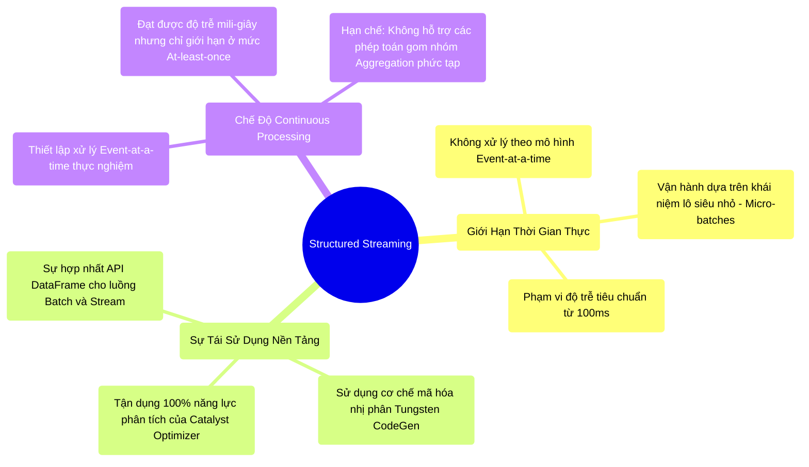

# 11.1 Structured Streaming: Bản Chất Thực Thi Micro-Batch

## 1. Objectives
- [ ] Xóa bỏ lầm tưởng về xử lý thời gian thực tuyệt đối (True Real-time): Định nghĩa lại giới hạn của Spark Streaming.
- [ ] Phân tích kiến trúc của động cơ Micro-batch và lợi ích của việc tái sử dụng nền tảng Catalyst.
- [ ] Khảo sát chế độ Continuous Processing: Đánh giá sự thỏa hiệp (Trade-offs) giữa độ trễ (Latency) thấp và tính toàn vẹn (Exactly-once).

## 2. Mindmap


## 3. Content

Trong lĩnh vực tính toán phân tán, khái niệm thời gian thực (Real-time) thường bị diễn giải sai lệch. Khi tiếp cận Spark Streaming, Kỹ sư thường giả định dữ liệu được tiếp nhận và xử lý tức thời theo từng sự kiện (Event-at-a-time) tương tự kiến trúc của Apache Flink hoặc Storm. Tuy nhiên, đó là một hiểu lầm về mặt kiến trúc lõi của Spark.

### 3.1. Phân Tích Kiến Trúc: Động Cơ Micro-Batch
Lõi của Apache Spark ban đầu được thiết kế để xử lý lượng lớn dữ liệu thông qua mô hình Map/Reduce (Batch Processing). Để tích hợp khả năng xử lý luồng (Stream Processing), Databricks áp dụng một kiến trúc mô phỏng: **Micro-batch (Lô siêu nhỏ)**.

- **Cơ chế hoạt động:** Spark không khởi động tiến trình tính toán ngay khi sự kiện đầu tiên đến. Thay vào đó, hệ thống tích lũy dữ liệu trong một khoảng thời gian chờ (Ví dụ: 100 mili-giây). Sau khoảng thời gian này, tập hợp các sự kiện được đóng gói thành một Micro-batch.
- **Ưu thế mô phỏng:** Khối Micro-batch này được hệ thống đối xử như một khối Batch truyền thống. Nó được đệ trình lên **Catalyst Optimizer** để tối ưu hóa và chuyển giao cho **Tungsten** để thực thi. Khi tiến trình hoàn tất, Spark lặp lại chu kỳ với Micro-batch tiếp theo.

> [!CAUTION] Cảnh Báo Kiến Trúc: Giới Hạn Của Low-Latency & Exactly-Once
> 1. **Về độ trễ (Low-Latency):** Nếu yêu cầu hệ thống (Ví dụ: Giao dịch HFT) đòi hỏi tốc độ phản hồi dưới 10 mili-giây, chế độ Micro-batch sẽ không đáp ứng được do độ trễ trung bình thường dao động từ 100ms - 500ms. Mặc dù Spark cung cấp chế độ Continuous Processing, nó lại đi kèm với những hạn chế nghiêm trọng về mặt toán tử.
> 2. **Về tính toàn vẹn (Exactly-Once):** Đảm bảo Exactly-Once Guarantee không phải là một tính năng mặc định tự động. Nó đòi hỏi một hệ thống khép kín: Nguồn dữ liệu (Source) phải hỗ trợ tính năng Replay (Ví dụ: Kafka Offsets), Nơi lưu trữ (Sink) phải tuân thủ tính Idempotent hoặc Giao dịch (Ví dụ: Delta Lake), và Checkpoint Location phải được lưu trữ trên một hệ thống bền vững (HDFS/S3). Nếu Sink chỉ là định dạng Text/CSV thông thường, rủi ro trùng lặp dữ liệu (At-least-once) vẫn tồn tại khi có sự cố ngắt quãng.

### 3.2. Lợi Ích Của Việc Hợp Nhất API (DataFrame API)
Lý do hệ sinh thái Spark duy trì kiến trúc Micro-batch xuất phát từ nguyên lý tái sử dụng phần mềm. 
Trong thế hệ Spark 1.x (D-Stream), việc xử lý Batch và Stream yêu cầu Kỹ sư bảo trì hai bộ mã nguồn (Codebases) tách biệt.
Với Structured Streaming, bằng cách chuyển đổi mọi luồng Stream thành một chuỗi các Batch, Kỹ sư chỉ cần triển khai **một cấu trúc API DataFrame duy nhất**. Một đoạn mã có thể vừa phục vụ phân tích lô tĩnh (Historical Batch) vừa có thể xử lý luồng sự kiện (Kafka Stream). Sự hợp nhất này đảm bảo rằng luồng Stream luôn được thừa hưởng sự nâng cấp từ bộ tối ưu hóa tĩnh Catalyst và engine Tungsten.

**[Code Snippet: Sự Hợp Nhất Nền Tảng]**
```python
# MÔ HÌNH BATCH (Truy xuất từ tệp Parquet tĩnh)
df_batch = spark.read.parquet("s3://data/")
df_batch.groupBy("city").count().write.format("console").save()

# MÔ HÌNH STREAM (Truy xuất liên tục từ Kafka) - Tái sử dụng cấu trúc logic
df_stream = spark.readStream.format("kafka").load()
df_stream.groupBy("city").count().writeStream.format("console").start()
```

### 3.3. Sự Thỏa Hiệp Của Continuous Processing Mode
Nhằm đáp ứng yêu cầu độ trễ thấp hơn (Dưới 100ms), Spark giới thiệu chế độ **Continuous Processing** (Xử lý liên tục 1ms).
Chế độ này loại bỏ cơ chế chờ gom lô Micro-batch, tạo một đường dẫn trực tiếp (Pipeline) xuyên suốt qua các Executor.
Tuy nhiên, đây là một sự đánh đổi (Trade-off) về mặt kiến trúc:
- Nó không tương thích với các toán tử gom nhóm (`GROUP BY`) hoặc Aggregation phức tạp.
- Chỉ giới hạn trong các phép biến đổi một đối một (`Map`, `Filter`).
- Giảm cấp độ đảm bảo tính toàn vẹn (Chỉ cam kết mức At-least-once thay vì Exactly-once).
Do các giới hạn khắt khe này, chế độ Continuous Processing hiếm khi được triển khai cho các bài toán kinh doanh phức tạp trên môi trường Production Enterprise.

## 4. Key takeaways
- **Bản chất kiến trúc**: Spark Streaming vận hành trên cơ chế chuỗi Job Batch siêu nhỏ (Micro-batch) nối tiếp nhau thay vì luồng thời gian thực tuyệt đối.
- **Tối ưu hóa phát triển**: Sự đánh đổi độ trễ ~100ms cung cấp khả năng tái sử dụng toàn bộ Engine phân tích tĩnh (Catalyst/Tungsten) và hợp nhất hoàn toàn trải nghiệm lập trình thông qua DataFrame API.
- **Tiền đề quản lý trạng thái**: Khi xử lý một luồng dữ liệu vô hạn, làm thế nào Spark có thể thực hiện phép toán cộng dồn (Ví dụ: Tổng doanh thu) mà không gặp sự cố tràn RAM do lưu trữ dữ liệu lịch sử? Cơ chế kiểm soát bộ nhớ qua các ranh giới thời gian sẽ được mổ xẻ ở Bài 11.2 (Watermarks).
