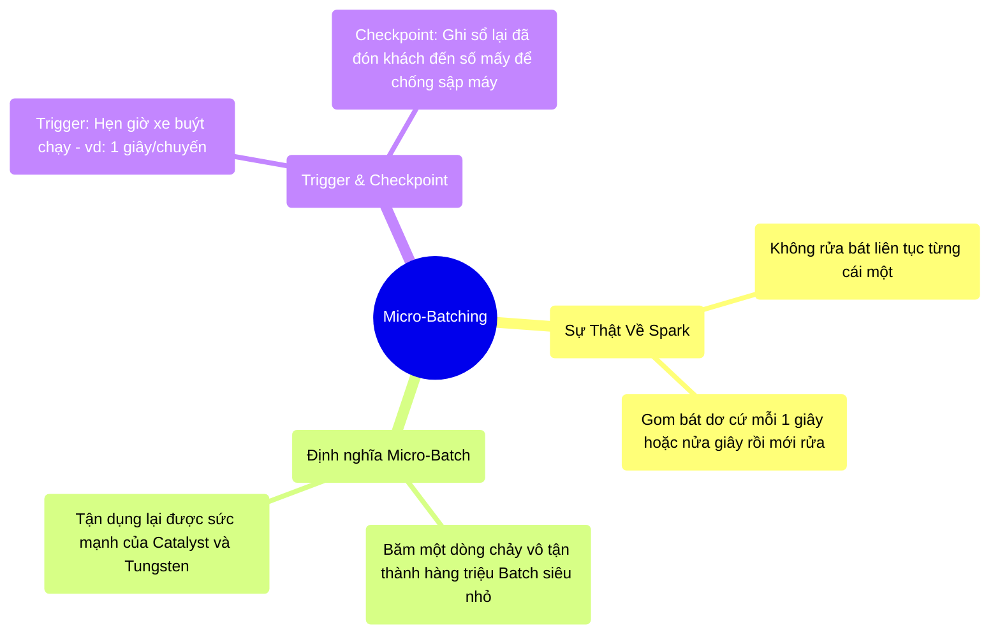

# 11.2 Giải Phẫu Động Cơ: Bí Mật Của Micro-Batching

## 1. Objectives
- [ ] Bóc trần sự lừa dối của Spark Streaming qua **Phép ẩn dụ Xe Buýt Đón Khách Mỗi Giây**.
- [ ] So sánh Micro-Batch (Spark) với Continuous Streaming (Flink).
- [ ] Hiểu được vai trò của Trigger và cơ chế Checkpoint lưu nháp trạng thái.

## 2. Mindmap


## 3. Content

### 3.1. Sự Lừa Dối Ngọt Ngào: Không Phải Real-time Đích Thực
Ở Bài 11.1, tôi đã nói rằng Structured Streaming giúp bạn rửa bát liên tục. Đó là một nửa sự thật.
Sự thật bên dưới động cơ vật lý: **Spark Structured Streaming KHÔNG HỀ XỬ LÝ TỪNG DÒNG DỮ LIỆU MỘT**. Nó vẫn là Batch, nhưng là **Lô Siêu Nhỏ (Micro-Batch)**.

> **[Ví Dụ Trực Quan: Xe Buýt Đón Khách Mỗi Giây]**
> Hãy tưởng tượng một hệ thống Streaming đích thực (Continuous Streaming - như Apache Flink): Một hành khách vừa đi đến bến, một chiếc Taxi lao tới đón chở đi ngay lập tức. (Độ trễ = 1 mili-giây). Tốn rất nhiều chi phí vận hành hàng triệu chiếc Taxi.
> 
> Còn Spark Structured Streaming thì dùng **Xe Buýt (Micro-Batch)**:
> Cứ hễ đồng hồ đếm đúng 1 Giây. Cửa xe buýt mở ra. Gom tất cả những người đang đứng ở bến (Dù là 1 người hay 10.000 người) lùa hết lên xe buýt. Cửa đóng. Xe chạy (Xử lý 1 Lô Dữ Liệu).
> Xử lý xong, Xe quay lại. Mở cửa tiếp nhận lô người thứ 2. 

Spark cố tình dùng Micro-batch vì nếu xử lý từng dòng dữ liệu (Taxi), nó không thể dùng được **Tungsten (Ép nhị phân)** và **Catalyst (Tỉa cột, Pushdown)**. Bằng cách gom thành các Khối (Batch) nửa giây hoặc 1 giây, Spark lại áp dụng trọn vẹn 100% công lực đã học ở Chương 4 để tính toán siêu tốc! Độ trễ 1 giây là hoàn toàn chấp nhận được với 99% các bài toán kinh doanh.

### 3.2. Trigger: Hẹn Giờ Xe Buýt Chạy
Trong code Spark Streaming, lập trình viên có quyền thiết lập Lịch trình chạy của Xe buýt thông qua hàm `trigger()`.

```python
# =========================================================================
# LẬP LỊCH TRÌNH CHẠY XE BUÝT (MICRO-BATCH TRIGGER)
# =========================================================================

# Xe buýt chạy nhanh: Cứ 1 giây đến bến gom khách 1 lần.
df_stream.writeStream \
    .trigger(processingTime='1 seconds') \
    .start()

# Xe buýt chạy từ tốn: Cứ 1 phút gom 1 lần (Tiết kiệm CPU cho máy chủ).
df_stream.writeStream \
    .trigger(processingTime='1 minutes') \
    .start()

# Tính năng mới đỉnh cao: CÓ SẴN (AvailableNow)
# Cực kì hữu dụng trên Cloud để tiết kiệm tiền. 
# Xe buýt đến, gom SẠCH SÀNH SANH khách đang đứng ở bến thành 1 chuyến siêu bự,
# Xử lý xong thì TẮT MÁY (Tắt Server đi ngủ luôn không chờ nữa). Rất rẻ!
df_stream.writeStream \
    .trigger(availableNow=True) \
    .start()
```

### 3.3. Checkpoint: Lưu Sổ Điểm Danh Chống Mất Điện
Chạy vòng lặp vô tận (24/7/365) kéo theo một nỗi sợ hãi tột cùng: **Lỡ máy chủ bị CÚP ĐIỆN thì sao?**

Nếu bạn đang đọc luồng Kafka có 1 tỷ tin nhắn. Bạn xử lý đến tin nhắn thứ 5 triệu thì máy chết. Khi khởi động lại máy, làm sao Spark biết để đọc tiếp từ số 5 triệu + 1, mà không phải đọc lại từ số 1 (Gây lặp dữ liệu) hoặc bỏ sót?

Vũ khí bắt buộc là **Checkpoint (Chốt chặn lưu nháp)**.

> **[Ví Dụ Trực Quan: Đóng Dấu Đã Xong]**
> Trước khi đóng cửa chiếc xe buýt số 1 (Micro-batch 1) chứa khách từ số 1 đến 5 triệu, Spark lấy một cuốn sổ tay (Ghi lên HDFS ổ cứng an toàn) và viết vào: *Tôi đã nhận khách đến số 5.000.000*.
> 
> LỖI PHÁT SINH: Máy bay nổ, điện cúp.
> 1 tiếng sau bạn mua máy tính mới, bật Spark lên. 
> Spark KHÔNG NHẢY VÀO LÀM NGAY. Việc đầu tiên nó làm là **Mở cuốn sổ Checkpoint trên ổ cứng ra đọc**.
> À, đời trước chết lúc đang làm dở đến 5.000.000. Lập tức Spark ra bến xe, nhặt người thứ 5.000.001 lên xe chạy tiếp. Hoàn hảo, không sai 1 li!

Nếu bạn viết một Job Streaming lên Production mà QUÊN viết đường dẫn Checkpoint vào code, 100% khi có sự cố, dữ liệu của bạn sẽ bị rác hoặc sai lệch toàn bộ.

## 4. Key takeaways
- **Bản chất giả lừa:** Spark Structured Streaming thực chất là một chuỗi các Job Batch siêu nhỏ (Micro-batch) nối tiếp nhau đến vô tận. Nhờ vậy nó có sức bền bỉ và tốc độ cao, đánh đổi lại độ trễ dao động từ nửa giây đến vài giây.
- **Trigger điều tiết nhịp thở:** Dùng Trigger để không làm cụm CPU bị vắt kiệt sức khi lượng dữ liệu đổ về quá ít hoặc quá nhiều.
- **Két sắt Checkpoint:** Không bao giờ chạy Streaming mà không có Checkpoint. Nó là điểm tựa duy nhất của hệ thống phân tán để đảm bảo tính chất **Exactly-Once** (Xử lý ĐÚNG MỘT LẦN, không trùng lặp, không bỏ sót) bất chấp thiên tai địch họa đứt cáp sập nguồn.
