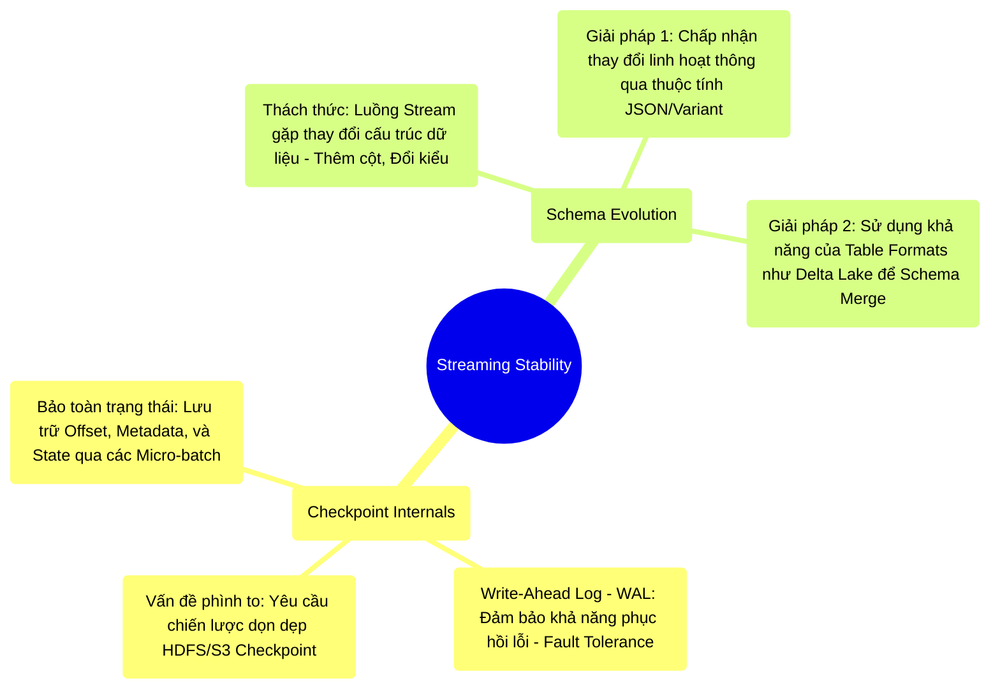

# 11.3 Checkpoint Internals & Schema Evolution: Sự Bền Vững Của Nền Tảng Streaming

## 1. Objectives
- [ ] Phân tích bản chất vật lý của cơ chế Checkpoint trong Structured Streaming.
- [ ] Mổ xẻ cấu trúc thư mục Checkpoint và tầm quan trọng của Write-Ahead Log (WAL).
- [ ] Giải quyết thách thức Schema Evolution: Khi luồng dữ liệu thay đổi cấu trúc động.

## 2. Mindmap


## 3. Content

Trong một ứng dụng Streaming vận hành 24/7, sự cố dừng hoạt động (Node Failure, Network Partition, Deployment Restart) là điều hiển nhiên (Inevitable). Để hệ thống tái khởi động thành công mà không gây mất dữ liệu (Data Loss) hay trùng lặp (Duplication) – đáp ứng tính toàn vẹn Exactly-Once – kiến trúc Streaming phụ thuộc hoàn toàn vào cơ chế **Checkpoint**. Cùng với đó là bài toán biến đổi cấu trúc động (Schema Evolution) của các sự kiện luân chuyển.

### 3.1. Bản Chất Vật Lý Của Cấu Trúc Checkpoint
Không giống như `df.cache()` chỉ lưu trên RAM (Và bốc hơi khi sụp nguồn), **Checkpoint trong Streaming** là quá trình vật lý hóa trạng thái xuống một hệ thống lưu trữ bền vững (HDFS, S3).
Khi cấu hình `writeStream.option(checkpointLocation, s3://...)`, Kỹ sư đang thiết lập một thư mục với cấu trúc lõi bao gồm:

1. **`offsets/` (Write-Ahead Log cho Source):** Trước khi xử lý Micro-batch, Spark ghi lại Offset (Ví dụ: Số thứ tự bản ghi trên Kafka) mà nó sẽ xử lý vào thư mục này. Quá trình này mô phỏng **Write-Ahead Log (WAL)**. Nếu quá trình xử lý thất bại, Spark khởi động lại, đọc từ `offsets/` và biết chính xác phải tiếp tục kéo dữ liệu từ đâu.
2. **`commits/` (Bằng chứng hoàn tất cho Sink):** Sau khi hoàn tất ghi một Micro-batch xuống Sink, hệ thống tạo một tệp báo hiệu trong `commits/`. Thao tác này giúp Spark duy trì trạng thái Idempotent, tránh ghi lặp dữ liệu xuống kho lưu trữ.
3. **`state/` (Lưu vết của Stateful Processing):** Bản sao vật lý định kỳ của State Store (Phân tích tại Bài 11.2). Nó cho phép hệ thống khôi phục toàn bộ quá trình Aggregation dù đã bị sụp OOM trước đó.
4. **`metadata/`:** Ghi nhận cấu trúc Schema của luồng tại thời điểm khởi tạo hệ thống.

> [!CAUTION] Cảnh Báo Kiến Trúc: Bùng Nổ I/O Checkpoint
> Việc ghi Checkpoint cho mọi Micro-batch tạo ra một luồng I/O rất lớn. Nếu độ trễ hệ thống Storage (S3, HDFS) cao, quá trình ghi Checkpoint có thể trở thành nút thắt cổ chai, làm suy giảm nghiêm trọng Latency của hệ thống Streaming. Ở cấp độ Enterprise, quá trình lưu trữ Checkpoint luôn được định tuyến về các phân vùng I/O tốc độ cao (Ví dụ HDFS trên NVMe thay vì Standard S3). Hơn nữa, sự gia tăng liên tục của tệp tin Checkpoint yêu cầu Kỹ sư phải có chiến lược dọn dẹp tương đối (Retention Policy) nếu không muốn làm nghẽn Data Lake.

### 3.2. Quản Trị Khủng Hoảng Cấu Trúc (Schema Evolution)
Một ứng dụng Streaming có thể vận hành nhiều năm. Trong khi đó, nhóm kỹ sư Upstream có thể liên tục cập nhật định dạng dữ liệu (Thêm một cột `user_id`, đổi kiểu dữ liệu `amount` từ INT sang DOUBLE). Nếu một hệ thống Streaming không được thiết kế cho **Schema Evolution**, nó sẽ sụp đổ (Crash) ngay khi nhận định dạng sự kiện mới.

Tồn tại 2 trường phái giải quyết bài toán tiến hóa Schema trong kiến trúc Enterprise:

**Trường Phái 1: Kiến Trúc Schema Linh Hoạt (Schemaless / Variant)**
Sử dụng một trường dữ liệu cấp cao có định dạng linh hoạt như JSON String, Map, hoặc kiểu dữ liệu Variant (Được tối ưu trong các hệ thống hiện đại). Spark không bị ràng buộc vào cấu trúc Schema tĩnh. Mã ứng dụng (Application Logic) sẽ đảm nhận vai trò bóc tách và phản ứng với các thay đổi cấu trúc, duy trì Job Streaming hoạt động ổn định bất chấp dữ liệu Upstream.

**Trường Phái 2: Ủy Quyền Cho Table Formats (Delta Lake / Iceberg)**
Tận dụng sức mạnh của định dạng lưu trữ hiện đại. Thay vì để Spark giải quyết sự cố, hệ thống ủy quyền quá trình này cho cơ chế của Delta Lake. Khi luồng dữ liệu mới chứa cột lạ, ứng dụng được thiết lập cờ `mergeSchema` (Chấp nhận tiến hóa cấu trúc) xuống Sink. 
Khi ứng dụng khởi động lại với cấu trúc Schema mở rộng, các tập Checkpoint cũ sẽ yêu cầu cơ chế bù trừ và đồng nhất với Schema mới, đảm bảo tính liên tục của luồng Streaming.

**[Code Snippet: Thiết Lập Schema Evolution Qua Delta]**
```python
# Cho phép tiến hóa cấu trúc tự động qua Delta Sink
streaming_df.writeStream \
  .format("delta") \
  .option("checkpointLocation", "s3://lake/checkpoints/sales/") \
  .option("mergeSchema", "true") \ # Mấu chốt xử lý Schema Evolution
  .outputMode("append") \
  .start("s3://lake/tables/sales/")
```

## 4. Key takeaways
- **Bảo hiểm của tiến trình**: Thư mục Checkpoint (Với cơ chế WAL) là cốt lõi đảm bảo khả năng khôi phục tính toàn vẹn của ứng dụng Streaming sau sự cố phần cứng.
- **Rủi ro I/O ẩn**: Tính năng Checkpoint không miễn phí; nó đánh đổi tốc độ xử lý I/O cục bộ và tiềm ẩn rủi ro phân mảnh Small Files.
- **Tiến hóa cấu trúc**: Thay đổi Schema là đặc tính không thể tránh khỏi của hệ thống Big Data liên tục. Sự ra đời của Delta Lake (và Iceberg, Hudi) đóng vai trò trung tâm hỗ trợ tiến trình Schema Evolution. Đã đến lúc chúng ta mở rộng tầm nhìn để đánh giá các nền tảng Table Formats này ở Chương 12 (Lakehouse & Delta Lake).
