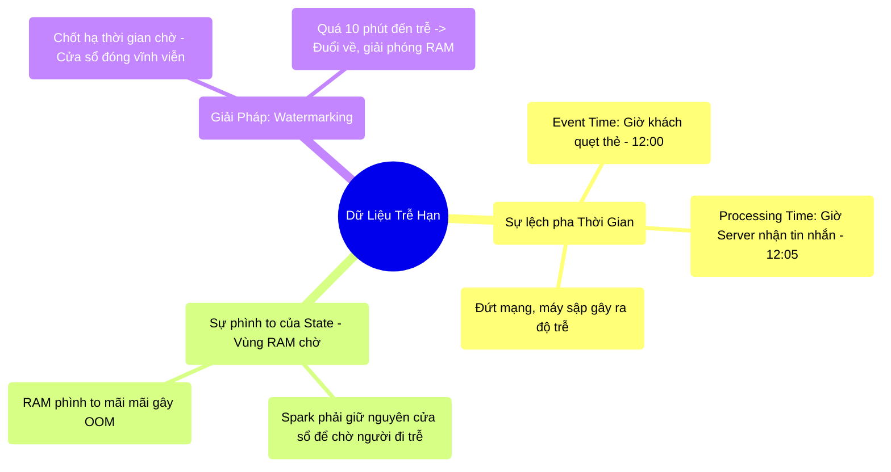

# 11.3 Nghệ Thuật Chờ Đợi: Xử Lý Dữ Liệu Trễ (Watermarking)

## 1. Objectives
- [ ] Mổ xẻ căn bệnh Event Time vs Processing Time qua **Phép ẩn dụ Thời gian Ghi Sổ và Thời gian Chụp Ảnh**.
- [ ] Giải thích bài toán lãng phí RAM khi phải chờ đợi dữ liệu đến muộn (Late Data).
- [ ] Áp dụng vũ khí Watermarking (Cột mốc chờ) qua **Phép ẩn dụ Điểm danh và Khóa sổ**.

## 2. Mindmap


## 3. Content

### 3.1. Sự Lệch Pha Giữa Hiện Thực Và Máy Chủ
Trong xử lý luồng (Streaming), khó khăn lớn nhất không phải là Code, mà là **Mạng Internet rất tệ**.

> **[Ví Dụ Trực Quan: Máy Chấm Công Bị Offline]**
> Cửa hàng cà phê quy định: Thống kê doanh thu theo từng Khung Giờ (Ví dụ: Từ 12:00 đến 13:00).
> - **Event Time (Thời gian thật):** Lúc `12:45`, Khách hàng quẹt thẻ mua 1 ly cà phê. Dữ liệu ghi nhận lúc `12:45`. Lẽ ra nó phải được cộng vào báo cáo của khung giờ 12:00 - 13:00.
> - **Sự cố đứt cáp:** Máy quẹt thẻ bị mất Wifi. Nó ôm cái hóa đơn đó trong bụng. 
> - **Processing Time (Thời gian tới bến):** 2 tiếng sau, mạng có lại. Lúc `14:45`, nó mới đẩy tờ hóa đơn đó về cho Máy chủ Spark ở trung tâm!

Lúc này, Máy chủ Spark (Đang xử lý dữ liệu của 14:00) tự dưng nhận được một tờ hóa đơn đến từ quá khứ (12:45). Đây gọi là **Late Data (Dữ liệu đi trễ)**. 

### 3.2. Cơn Ác Mộng Của Việc Nhớ Nhau (Stateful OOM)
Để đối phó với người đi trễ, Máy chủ Spark phải làm một việc: **Mở sẵn cái Sổ Kế Toán (State) của Khung giờ 12:00 - 13:00 để đó, không được phép cất đi.** 
Lỡ đâu 2 tiếng nữa có đứa nào đi trễ nộp hóa đơn 12h thì mình còn có chỗ mà ghi cộng vào!

Vấn đề vật lý nảy sinh:
Để mở sẵn cuốn sổ, Spark phải chiếm một khoảng RAM (State Memory). 
- Hôm nay mở cuốn sổ 12h.
- Ngày mai vẫn phải mở cuốn sổ 12h hôm qua (Lỡ ai nộp trễ 1 ngày?).
- Tháng sau vẫn phải mở cuốn sổ của tháng trước (Lỡ 1 tháng sau máy POS mới có mạng?).

RAM của Máy chủ Spark sẽ phình to không giới hạn, giữ lại toàn bộ cửa sổ thời gian từ lúc khai thiên lập địa. **LỖI PHÁT SINH: OOM (Chết Máy).**

### 3.3. Áp Dụng Chế Tài: Watermarking (Lằn Ranh Giới Hạn)
Để giải cứu bộ nhớ RAM, Kỹ sư phải dùng quyền lực của người quản lý: Thiết lập **Watermark (Mốc Khóa Sổ / Dấu Chìm)**.

> **[Ví Dụ Trực Quan: Đóng Cửa Lớp Học]**
> Thầy giáo (Spark) thông báo: Lớp bắt đầu lúc 12:00. Thầy cho phép các em đi trễ tối đa **10 Phút** (Watermark = 10 mins). Sau 12:10, thầy ĐÓNG CỬA LỚP. Mọi người đến sau bị nhốt ở ngoài (Rớt môn).
> 
> Nhờ có quy định này, Thầy giáo biết chắc chắn: Đến 12:11, mình có thể khóa cuốn Sổ Điểm Danh (Giải phóng RAM) và nộp lên phòng đào tạo, vứt nó ra khỏi đầu.

Chỉ bằng một dòng code Watermark, bạn đã cứu sống toàn bộ Cluster khỏi việc phình RAM (State Store) theo thời gian.

```python
# =========================================================================
# CODE CỨU RỖI BỘ NHỚ VỚI WATERMARK
# =========================================================================
import pyspark.sql.functions as F

# 1. Đọc dòng chảy
df_stream = spark.readStream.format("kafka").load()

# 2. BẬT WATERMARK TRƯỚC KHI GOM NHÓM
# Lời dặn: "Tôi chỉ chấp nhận dữ liệu đi trễ tối đa 10 phút. 
# Quá 10 phút, tự động Xóa Sổ Nháp, giải phóng RAM, vứt rác dữ liệu trễ!"
df_windowed = df_stream \
    .withWatermark("event_time", "10 minutes") \
    .groupBy(
        # Gom nhóm theo Cửa sổ thời gian 1 tiếng.
        F.window("event_time", "1 hour"), 
        "store_id"
    ).count()

# Hậu quả vật lý:
# Trạng thái (State) trong RAM của các cửa sổ cũ (ví dụ cửa sổ 8h sáng) 
# sẽ bị XÓA HOÀN TOÀN khỏi RAM ngay khi đồng hồ điểm 9h10 sáng. 
# Bộ nhớ RAM được giải phóng liên tục, hệ thống chạy mượt mà đến tận ngày tận thế!
```

## 4. Key takeaways
- **Sự khác biệt Thời gian:** Trong Big Data, thời gian sự việc xảy ra (Event Time) và thời gian nó bơi đến máy chủ của bạn (Processing Time) là hai khái niệm hoàn toàn khác nhau.
- **Ám ảnh State Store:** Mọi phép tính Gom nhóm (Aggregation / GroupBy / Windowing) trong Streaming đều đòi hỏi RAM phải duy trì Bảng nháp (State). Nếu không kiểm soát, Bảng nháp sẽ phình to ăn sập toàn cụm.
- **Vũ khí Watermark:** Là cơ chế Khóa sổ vĩnh viễn giúp Spark dọn dẹp các Bảng nháp trong quá khứ, giải phóng RAM. Bất cứ lập trình viên nào làm Window Streaming mà không gọi hàm `withWatermark` thì người đó đang viết ra một quả bom nổ chậm OOM.
