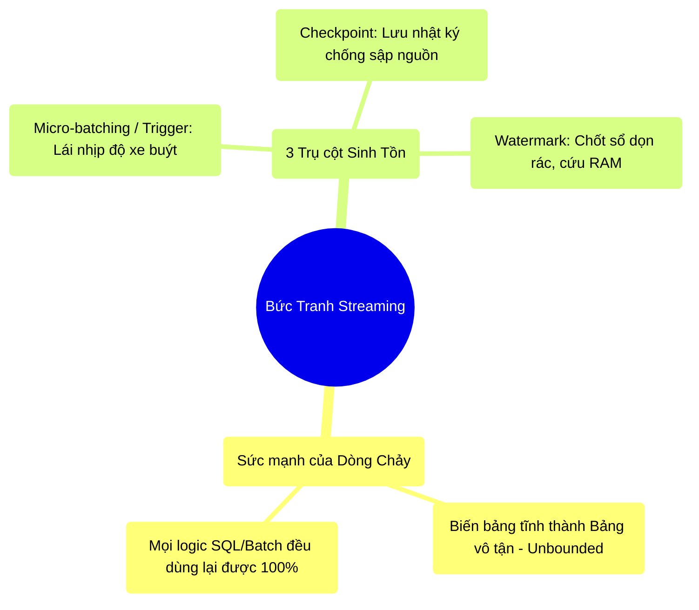

# 11.4 Tổng Kết: Kỷ Nguyên Dòng Chảy Thời Gian Thực

## 1. Objectives
- [ ] Chốt lại bức tranh toàn cảnh về sự chuyển dịch từ Batch sang Streaming.
- [ ] Nhắc lại 3 điều kiện tiên quyết để vận hành Streaming trên Production.
- [ ] Mở lối sang Chương 12 (Delta Lake) để giải quyết vấn đề chèn/xóa dữ liệu thời gian thực.

## 2. Mindmap

## 3. Content

### 3.1. Nghịch Lý Kỹ Sư: Batch Làm Nền, Streaming Trả Tiền
Hầu hết các kỹ sư khi mới học Big Data đều dồn toàn bộ thời gian cho Batch Processing (Xử lý theo Lô). Họ cắm cúi viết code chạy lúc 12h đêm. 
Nhưng khi đi làm, giá trị kinh doanh (Business Value) cao nhất lại luôn nằm ở Streaming. Giám đốc muốn thấy doanh thu thay đổi Real-time trên Dashboard. Hệ thống bảo mật muốn bắt quả tang tin tặc đang chuyển tiền ra nước ngoài TRONG TÍCH TẮC, chứ không phải là chờ đến 12h đêm ngày mai mới báo cáo.

Ai làm chủ được Streaming, người đó làm chủ được ví tiền của công ty.

### 3.2. Cẩm Nang Sinh Tồn Trong Dòng Chảy Vô Tận
Khi bạn chuyển một Job từ Batch sang Streaming, tâm thế của bạn phải thay đổi 180 độ. Bạn không còn xây dựng một cái hố rác tĩnh lặng nữa, bạn đang xây dựng một Cỗ Máy Bơm Nước chạy 24/7. Nó đòi hỏi sự bảo trì khắt khe hơn vạn lần:

1. **Phải có Checkpoint:** Nếu không có thư mục Checkpoint trỏ vào một hệ thống lưu trữ bền vững (HDFS/S3), thì chỉ cần máy ảo (EC2/Pod) của bạn khởi động lại, toàn bộ tiến trình đọc dữ liệu của bạn sẽ quay về số 0.
2. **Khắc cốt ghi tâm Watermark:** Mọi câu lệnh `groupBy`, `dropDuplicates`, hay `join` (đặc biệt là Stream-Stream Join) đều sinh ra các bản Nháp (State) nằm chình ình trong RAM của Máy con (Executors). Nếu bạn quên lệnh `withWatermark`, RAM sẽ bị thổi phồng vô tận cho đến khi OOM bóp nát cụm máy.
3. **Đừng cố gắng Real-time tuyệt đối:** Nếu bài toán không bắt buộc độ trễ 1 mili-giây, hãy vứt bỏ Continuous Streaming (Flink). Việc dùng Micro-batching (Trigger 5 giây, 10 giây) của Spark đem lại cho bạn sức mạnh của Catalyst Optimizer, Tungsten Encoding và khả năng phục hồi lỗi (Fault Tolerance) mượt mà hơn rất nhiều. Hãy để xe buýt gom khách rồi chạy, đừng điều taxi rước từng người.

### 3.3. Câu Hỏi Trăn Trở (Chuyển giao Chương 12)
Streaming rất tuyệt vời. Bạn đọc tin nhắn từ Kafka, bạn tính tổng doanh thu, bạn đổ (Write) kết quả xuống Data Lake (S3/HDFS).
Nhưng một vấn đề động trời của nền tảng Hadoop/S3 xuất hiện: **NÓ KHÔNG CHO PHÉP BẠN SỬA HOẶC XÓA (UPDATE/DELETE) DỮ LIỆU!**

Data Lake truyền thống (Lưu bằng Parquet, CSV) chỉ cho phép Ghi Nối (Append-only).
- Nếu Khách hàng muốn đổi địa chỉ? Data Lake không làm được.
- Nếu Luật pháp yêu cầu xóa thông tin của 1 người? Parquet không tự xóa được 1 dòng ở giữa file. Nó ép bạn phải lôi cả File 100GB lên, xóa 1 dòng, rồi ghi đè lại 100GB! Cực kỳ thiếu tối ưu!

Vậy làm sao để có được tính năng Update/Delete mạnh mẽ của MySQL trên một biển dữ liệu Parquet khổng lồ? Làm sao để đảm bảo đang Ghi mà sập mạng thì dữ liệu không bị hỏng (ACID)?

Chào mừng bạn đến với Siêu anh hùng của kỷ nguyên dữ liệu hiện đại: **Chương 12 - Lakehouse & Delta Lake (Cuốn Nhật Ký Giao Dịch)**.
