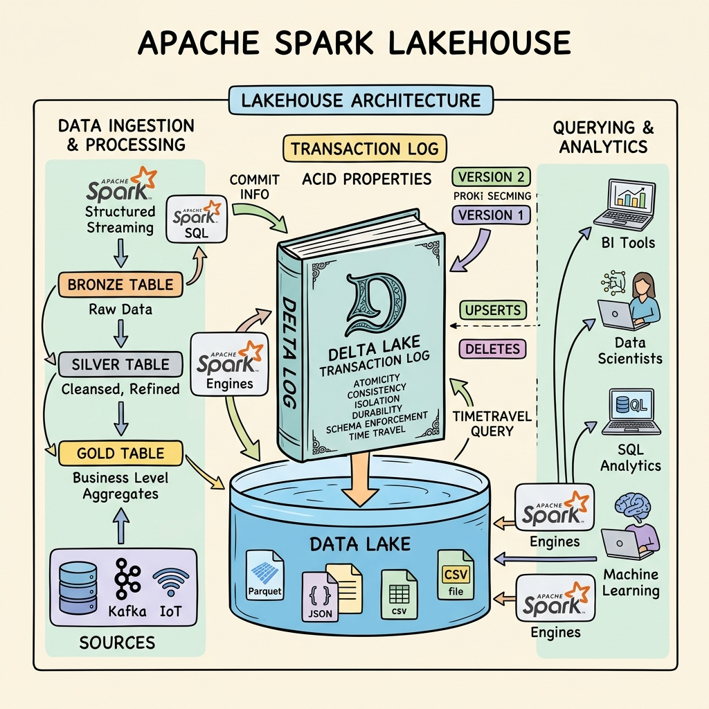
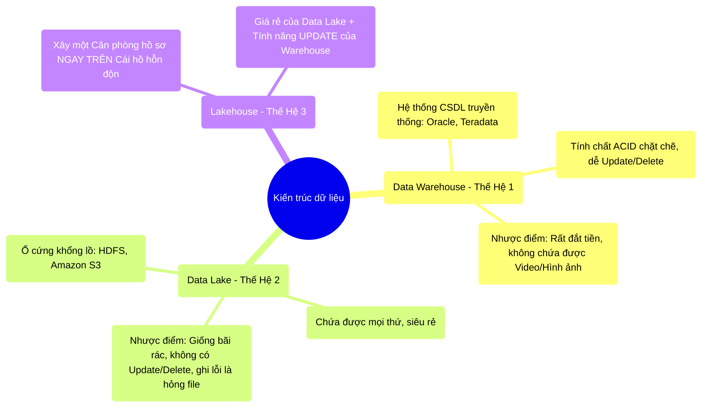

# 12.1 Sự Khác Biệt Giữa Data Lake, Data Warehouse & Lakehouse

## 1. Objectives
- [ ] Phân biệt Data Lake và Data Warehouse qua **Phép ẩn dụ Cái Hồ Hỗn Độn vs Căn Phòng Hồ Sơ**.
- [ ] Chỉ ra điểm yếu chí mạng của mỗi hệ thống.
- [ ] Giới thiệu định nghĩa Lakehouse - Đứa con lai mang sức mạnh của cả hai.

## 2. Mindmap

## 3. Content

### 3.1. Phép Ẩn Dụ: Căn Phòng Hồ Sơ (Warehouse) vs Bãi Đất Trống (Lake)
Hành trình lưu trữ dữ liệu của nhân loại đã trải qua những cuộc chiến phức tạp về mặt kiến trúc.

**Thế hệ 1: Data Warehouse (Căn phòng hồ sơ nghiêm ngặt)**
Giống như bạn bước vào một thư viện truyền thống (Oracle, SQL Server).
Bạn muốn nhét 1 cuốn sách vào? Thủ thư sẽ bắt bạn phải điền Form (Lược đồ dữ liệu - Schema-on-write). Nếu sách của bạn không đúng chuẩn chữ nhật, thủ thư ném ra ngoài (Không hỗ trợ dữ liệu phi cấu trúc như Log, Ảnh, Video).
- *Ưu điểm:* Có ông thủ thư cực kỳ nguyên tắc. Đang nhét sách mà cúp điện, thủ thư sẽ vứt cuốn sách dở dang ra ngoài (Tính chất ACID - Bảo toàn dữ liệu).
- *Nhược điểm:* Quá đắt đỏ. Không chứa được dữ liệu thập cẩm của thời đại Web.

**Thế hệ 2: Data Lake (Bãi đất trống giá rẻ)**
Các công ty công nghệ ném thư viện đi, mua một bãi đất trống ở ngoại ô (Hadoop HDFS, AWS S3).
Ở bãi đất này KHÔNG CÓ THỦ THƯ.
Bất kỳ ai (Kỹ sư, Data Scientist) cũng có thể lái xe tải, đổ cả núi tài liệu (CSV, Parquet, Video, Ảnh) xuống cái bãi đó (Schema-on-read). Vô cùng rẻ và tiện lợi.
- *Nhược điểm chí mạng:* Bãi đất nhanh chóng biến thành BÃI RÁC (Data Swamp). 
Đang đổ rác mà xe bị lật giữa chừng, rác đổ được một nửa, không ai dọn (Mất tính ACID, File bị hỏng - Corrupted). 
Muốn tìm và sửa tên của 1 người? Cả bãi rác không có mục lục, bạn phải bới tung cả cái bãi rác lên (Không có Update/Delete).

### 3.2. Sự Ra Đời Của Thế Hệ 3: Lakehouse
Cả thế giới bế tắc. Warehouse thì đắt và chảnh. Lake thì rẻ nhưng nát.

Năm 2020, khái niệm **Lakehouse** bùng nổ (Do Databricks khởi xướng).
Mô hình này nói rằng: **Tôi vẫn sẽ giữ lại Bãi Đất Trống (Data Lake - AWS S3) vì nó quá rẻ. NHƯNG, tôi sẽ thuê một ông Thủ Thư ngồi ở cửa bãi đất để ghi chép lại mọi hành động đổ rác!**

Ông thủ thư này chính là **Delta Lake** (Hoặc Apache Iceberg / Hudi).

> **[Sức Mạnh Của Đứa Con Lai]**
> Khi Spark muốn đẩy 100GB dữ liệu xuống S3. Spark không được ném thẳng như xưa nữa. 
> Spark phải báo với ông Thủ Thư Delta. 
> Thủ thư ghi vào cuốn sổ (Transaction Log): Lúc 12h, tôi đang chuẩn bị nhận 100GB.
> - Nếu Spark đổ thành công: Thủ thư đánh dấu TICK (Thành công - Commit). Khách hàng được quyền đọc.
> - Nếu Spark đổ được 50GB thì cúp điện: Thủ thư gạch chéo Hủy bỏ. 50GB rác kia bị coi là tàng hình, không ai đọc được. File không bị hỏng (Tính ACID được phục hồi trên Data Lake).

Nhờ có Lakehouse, Data Engineer lần đầu tiên trong lịch sử có thể gõ lệnh `UPDATE` hoặc `DELETE` ngay trên nền tảng Data Lake rẻ tiền, điều mà 10 năm trước Hadoop MapReduce nằm mơ cũng không làm được. Chúng ta sẽ mổ xẻ ông thủ thư Delta Lake này ở bài tiếp theo.

## 4. Key takeaways
- **Sự bế tắc của Data Lake:** Đổ dữ liệu vào (Parquet/CSV) thì cực nhanh và rẻ, nhưng việc kiểm soát chất lượng, khôi phục khi sập nguồn (ACID) và sửa/xóa dữ liệu là ác mộng tột cùng vì bản chất File Parquet là không thể thay đổi (Immutable).
- **Vị cứu tinh Lakehouse:** Một thuật ngữ ám chỉ việc mang những tính năng quản lý nghiêm ngặt của Data Warehouse ĐẶT LÊN TRÊN hạ tầng lưu trữ rẻ tiền của Data Lake.
- **Vai trò của Delta/Iceberg:** Chúng không phải là cơ sở dữ liệu. Chúng chỉ là những Tiêu chuẩn lưu trữ mở (Open Storage Format), hoạt động như một lớp Sổ Nhật Ký (Metadata Layer) nằm xen giữa Spark (Cỗ máy tính toán) và S3/HDFS (Ổ cứng).
