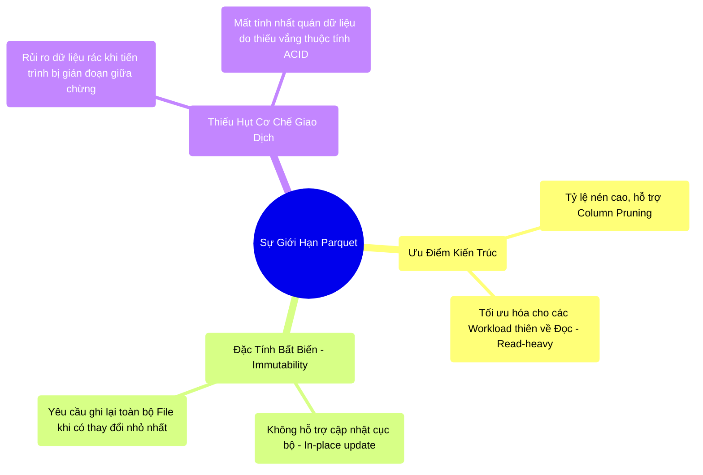

# 12.1 Hạn Chế Của Parquet Thuần Túy Và Yêu Cầu Về ACID Transaction

## 1. Objectives
- [ ] Phân tích điểm yếu kiến trúc của định dạng Parquet trên nền tảng Cloud Storage (HDFS/S3): Đặc tính Bất biến (Immutability).
- [ ] Đánh giá rủi ro hệ thống khi thực hiện thao tác Cập nhật/Xóa (Update/Delete) mà thiếu cơ chế kiểm soát giao dịch.
- [ ] Giới thiệu mô hình kiến trúc Lakehouse: Tích hợp nguyên lý ACID của cơ sở dữ liệu vào môi trường Data Lake.

## 2. Mindmap

## 3. Content

Tại Chương 7, định dạng Parquet đã được chứng minh là chuẩn mực lưu trữ Columnar tối ưu, từ kiến trúc Row Group đến Page Dictionary. Tuy nhiên, khi vận hành trên Data Lake quy mô lớn, Parquet thuần túy bộc lộ một điểm yếu vật lý nghiêm trọng: **Tính tĩnh lặng và sự bất biến (Immutability).**

### 3.1. Rào Cản Của Đặc Tính Bất Biến (Immutability)
Nền tảng lưu trữ Object Storage (S3, GCS) hoặc HDFS không vận hành như hệ thống tệp cục bộ (Local File System). Khi một tệp Parquet được đóng gói và lưu trữ, cấu trúc của nó trở thành một khối nguyên khối (Monolithic Block).
Không tồn tại cơ chế vật lý nào cho phép hệ thống mở tệp tin đó ra và sửa đổi cục bộ một dòng dữ liệu (Ví dụ: Cập nhật `Salary = 500` thành `Salary = 600`).
- **Nút thắt Update/Delete:** Để thay đổi một dòng duy nhất, hệ thống bắt buộc phải đọc toàn bộ tệp Parquet 1GB vào bộ nhớ $\rightarrow$ Áp dụng thay đổi $\rightarrow$ Ghi ra một tệp Parquet hoàn toàn mới $\rightarrow$ Xóa tệp cũ.
- **Áp lực tuân thủ (Compliance):** Khi các quy định bảo vệ dữ liệu (Ví dụ GDPR) yêu cầu xóa thông tin của người dùng nằm rải rác trên hàng vạn tệp Parquet, hệ thống sẽ đối mặt với chi phí I/O khổng lồ do phải tái cấu trúc (Rewrite) toàn bộ cụm dữ liệu.

### 3.2. Sự Đứt Gãy Do Thiếu Hụt Tính Toàn Vẹn (Lack of ACID)
Xét kịch bản Kỹ sư triển khai Job Spark để ghi đè (Overwrite) thư mục chứa 100 tệp Parquet.
- Hệ thống hoàn tất việc xóa 100 tệp cũ và bắt đầu quá trình ghi tệp mới.
- Khi ghi được 40 tệp, tiến trình sụp đổ đột ngột (Do OOM hoặc sự cố Node).
Đặc điểm hạn chế của Data Lake thuần túy là **Không hỗ trợ ranh giới Giao dịch (No ACID Transaction boundaries)**. Trạng thái dở dang (Inconsistent State) của hệ thống sẽ lập tức hiển thị cho các ứng dụng tiêu thụ dữ liệu (Downstream Consumers), dẫn đến sai lệch nghiêm trọng trong các báo cáo phân tích.

### 3.3. Tích Hợp ACID: Khởi Sinh Kiến Trúc Data Lakehouse
Để khắc phục hạn chế này, các Kỹ sư Hệ thống vay mượn nguyên lý thiết kế từ Cơ sở dữ liệu quan hệ (RDBMS) và Data Warehouse truyền thống: Mọi thao tác thay đổi trạng thái phải được bao bọc trong **Giao dịch (Transaction - ACID)**.
Nguyên lý này đảm bảo tính nguyên tử (Atomicity): Dữ liệu chỉ khả dụng khi quá trình ghi hoàn tất 100% (Commit). Nếu xảy ra sự cố, hệ thống sẽ hoàn tác (Rollback), che giấu hoàn toàn các mảnh dữ liệu dư thừa.

Tuy nhiên, RDBMS không thể mở rộng dung lượng lên mức Petabytes như Data Lake. Sự kết hợp giữa năng lực lưu trữ phi cấu trúc của Data Lake và cơ chế quản lý giao dịch khắt khe của Data Warehouse đã thiết lập một kỷ nguyên kiến trúc mới: **The Data Lakehouse**.

Và một trong những nền tảng tiên phong hiện thực hóa kiến trúc này chính là **Delta Lake** (Cùng với Apache Iceberg và Apache Hudi).

## 4. Key takeaways
- **Giới hạn vật lý**: Object Storage và Parquet thuần túy không hỗ trợ cập nhật cục bộ (In-place updates). Quá trình biến đổi yêu cầu Rewrite.
- **Rủi ro tính nhất quán**: Việc tương tác trực tiếp với dữ liệu trên Data Lake tiềm ẩn rủi ro phá vỡ tính toàn vẹn (Data Corruption) khi tiến trình thất bại.
- **Sự chuyển dịch kiến trúc**: Kiến trúc Lakehouse ra đời nhằm mang lại cơ chế kiểm soát ACID cho kho lưu trữ phi cấu trúc. Cơ chế hoạt động của Delta Lake khi Object Storage vẫn giữ nguyên tính bất biến sẽ được giải mã thông qua cấu trúc Transaction Log ở Bài 12.2.
