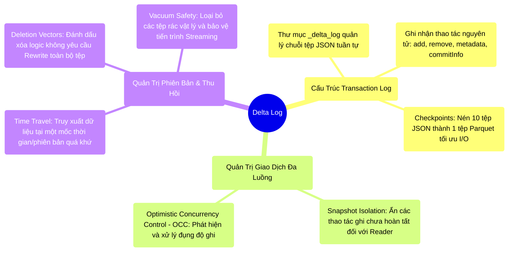

# 12.2 Delta Log: Cơ Chế Giao Dịch Cốt Lõi Của Kiến Trúc Lakehouse

## 1. Objectives
- [ ] Phân tích cấu trúc Transaction Log (`_delta_log`): Cơ chế Meta-data định đoạt trạng thái dữ liệu.
- [ ] Giải mã Snapshot Isolation và Optimistic Concurrency Control (OCC) trong việc quản trị xung đột giao dịch.
- [ ] Đánh giá cơ chế Time Travel, Deletion Vectors và chiến lược tối ưu lưu trữ thông qua VACUUM.

## 2. Mindmap


## 3. Content

Trên nền tảng lưu trữ bất biến (Immutable Storage) như S3, Delta Lake cung cấp khả năng thực thi các lệnh `UPDATE` hoặc `DELETE` mà không phá vỡ tính nhất quán của hệ thống. Cơ chế cốt lõi không nằm ở việc can thiệp vào tập tin vật lý cũ, mà dựa trên sự trừu tượng hóa Logic (Logical Abstraction) thông qua **Transaction Log (`_delta_log`)**.

### 3.1. Phân Tích Cấu Trúc Transaction Log (`_delta_log`)
Khi khởi tạo một bảng Delta, hệ thống tự động sinh ra thư mục cấu hình `_delta_log`. Thư mục này lưu trữ các tệp JSON đại diện cho các Giao dịch nguyên tử (Atomic Commits).
Các bản ghi Log không chỉ ghi nhận thao tác thêm (`add`) hoặc xóa (`remove`) tệp Parquet, mà còn chứa:
- `metaData`: Khai báo Schema và chiến lược Partitioning.
- `protocol`: Ràng buộc tính tương thích phiên bản giữa Reader và Writer.
- `commitInfo`: Dấu vết kiểm toán (Audit Trail) - Định danh người dùng, thời điểm, và tác vụ thực thi.
- `txn`: Hỗ trợ luồng Structured Streaming duy trì tính toàn vẹn Exactly-Once.

> [!CAUTION] Cảnh Báo Kiến Trúc: Tính Khả Dụng Logic
> Trong kiến trúc Delta, sự tồn tại vật lý của một tệp Parquet trên đĩa cứng không có giá trị truy xuất nếu tên tệp đó không được đăng ký hợp lệ (Add action) bên trong Transaction Log hiện hành.

**Cơ chế Checkpoint Parquet:** Để tránh tình trạng phình to của Log làm suy giảm hiệu suất truy xuất, định kỳ (Thường sau 10 Commits), Delta Lake tổng hợp trạng thái của các tệp JSON thành một tệp Parquet duy nhất (Checkpoint). Hệ thống Reader chỉ cần nạp tệp Checkpoint mới nhất và duyệt qua số ít tệp JSON phát sinh sau đó, tối ưu hóa tốc độ khởi tạo.

### 3.2. OCC, Deletion Vectors & Cơ Chế Snapshot Isolation
- **Snapshot Isolation (Cô lập phiên bản):** Khi Job A đang ghi 40 tệp Parquet nhưng chưa hoàn tất giao dịch ghi Log, hệ thống Reader truy xuất dữ liệu sẽ bỏ qua các tệp vật lý này và chỉ hiển thị trạng thái dữ liệu (Snapshot) hợp lệ gần nhất. Cơ chế này che giấu trạng thái dữ liệu trung gian (Incomplete data).
- **Optimistic Concurrency Control (OCC):** Nhằm quản lý truy cập đồng thời, Delta Lake áp dụng OCC. Nếu hai tiến trình cố gắng thực thi giao dịch trên cùng một mốc thời gian, tiến trình hoàn tất sau sẽ kiểm tra Log để phát hiện xung đột (Conflict Resolution). Nếu có xung đột về mặt Logic, hệ thống ném ngoại lệ `ConcurrentModificationException`. Nếu độc lập, giao dịch sẽ được ghi nhận vào chuỗi Log tiếp theo.
- **Deletion Vectors:** Đột phá trong phiên bản Delta hiện đại. Thay vì phải chép lại toàn bộ (Rewrite) tệp 1GB khi chỉ xóa một bản ghi, hệ thống sinh ra một tệp bitmap phụ (Deletion Vector) đánh dấu các bản ghi bị xóa. Reader sẽ kết hợp tệp gốc và bitmap để che đi dữ liệu rác, tối ưu triệt để I/O.

### 3.3. Time Travel (Du Hành Thời Gian) và Quản Trị Không Gian
Do dữ liệu bị xóa (Remove action) chỉ bị đánh dấu gỡ bỏ trên mặt logic thay vì xóa vật lý tức thì, Delta Lake cung cấp tính năng **Time Travel**.
Kỹ sư có thể truy xuất trạng thái dữ liệu tại một mốc thời gian quá khứ (Ví dụ: `VERSION AS OF 2`). Hệ thống sẽ tự động đối chiếu với tệp JSON tương ứng để phục hồi danh sách tệp Parquet khả dụng tại thời điểm đó.

**[Production Runbook: Quản Trị VACUUM & Bảo Vệ Streaming]**
Quá trình duy trì các tệp vật lý cũ làm tăng trưởng chi phí lưu trữ Cloud. Việc dọn dẹp hệ thống bằng lệnh **VACUUM** là bắt buộc.
Tuy nhiên, 🚨 **CẢNH BÁO:** Việc lạm dụng VACUUM với thông số thời gian quá ngắn (Ví dụ: `RETAIN 0 HOURS`) sẽ phá hủy hoàn toàn khả năng Time Travel. Nghiêm trọng hơn, nếu hệ thống có tiến trình Streaming đang chậm trễ nạp dữ liệu, lệnh VACUUM có thể xóa vĩnh viễn tệp gốc, dẫn đến lỗi `FileNotFoundException` và làm gián đoạn luồng Stream. Thực tiễn khuyến nghị luôn thiết lập mốc RETAIN tối thiểu là 7 ngày (168 giờ).
```sql
-- Bảo vệ hệ thống: Thiết lập ngưỡng an toàn 7 ngày cho Streaming Readers và Time Travel.
VACUUM sales_table RETAIN 168 HOURS;
```

## 4. Key takeaways
- **Meta-data định đoạt vật lý**: Trung tâm của kiến trúc Lakehouse là năng lực quản lý Meta-data tinh vi thông qua `_delta_log`, chứ không chỉ là định dạng lưu trữ cột Parquet.
- **Tối ưu hóa ghi**: Công nghệ Deletion Vectors cách mạng hóa phương thức Update/Delete, giảm thiểu áp lực Rewrite dữ liệu toàn phần.
- **Thỏa hiệp lưu trữ**: Quyền năng ACID và Time Travel yêu cầu quản trị vòng đời dữ liệu nghiêm ngặt. VACUUM là quy trình không thể thiếu nhưng đòi hỏi độ an toàn cao để bảo vệ luồng Streaming.
- **Chuyển tiếp**: Ngoài kiến trúc Delta Log gốc, Delta Lake còn cung cấp các công cụ mạnh mẽ như Change Data Feed (CDF) và thao tác REPLACE WHERE để xử lý luồng dữ liệu thay đổi. Bài 12.3 sẽ làm rõ các tính năng nâng cao này.
