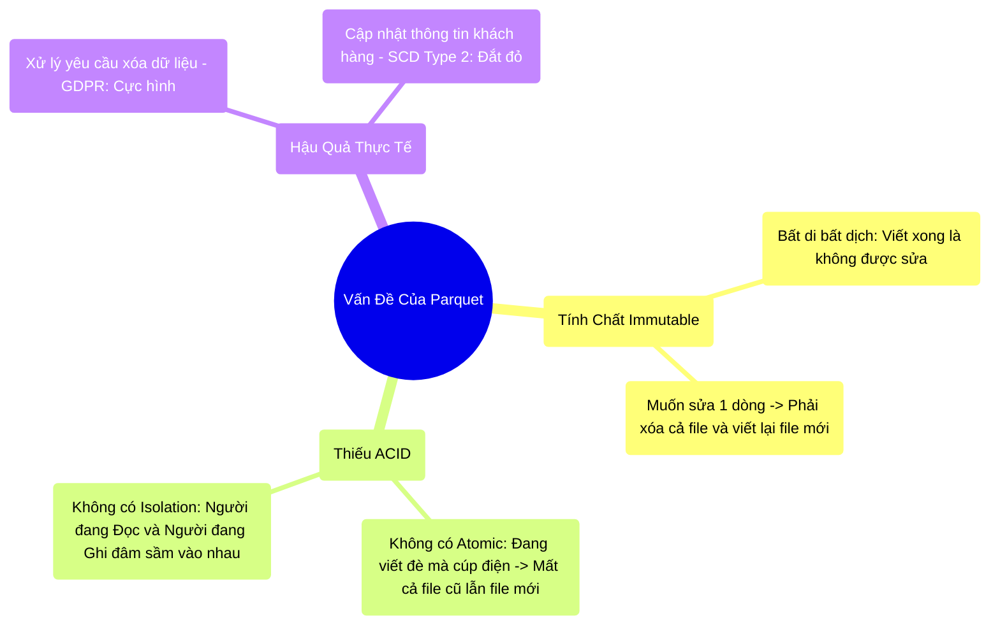

# 12.2 Điểm Yếu Của Parquet Trầm Trọng Nhất: Không Thể Cập Nhật (No ACID)

## 1. Objectives
- [ ] Bóc trần nhược điểm vật lý của định dạng Parquet qua **Phép ẩn dụ Viết Bút Dạ Lên Bảng Trắng**.
- [ ] Phân tích cơn ác mộng Data Engineering khi phải chạy lệnh UPDATE/DELETE trên Data Lake truyền thống.
- [ ] Giải thích hậu quả Đọc phải rác (Dirty Read) khi thiếu tính năng ACID.

## 2. Mindmap

## 3. Content

### 3.1. Phép Ẩn Dụ: Bút Dạ Không Thể Xóa
Ở Chương 7, chúng ta đã ca ngợi Parquet lên tận mây xanh nhờ sức mạnh Đọc theo cột (Columnar) và Trượt mục lục (Predicate Pushdown). 
Nhưng để đổi lấy tốc độ Đọc kinh hoàng đó, Parquet phải hy sinh khả năng Ghi. Khối dữ liệu Parquet bị nén và ép chặt đến mức bạn **KHÔNG THỂ THÒ TAY VÀO XÓA MỘT DÒNG DỮ LIỆU ĐƯỢC.** Tính chất này gọi là Immutable (Bất di bất dịch).

> **[Ví Dụ Trực Quan: Bảng Trắng Và Bút Dạ Không Phai]**
> Parquet giống như một cái Bảng Trắng khổng lồ. Spark là giáo viên dùng bút dạ không phai viết lên đó.
> 
> Một ngày nọ, Giám đốc bảo: *Cái anh khách hàng John ở dòng số 5 vừa đổi địa chỉ. Hãy sửa lại cho tôi*.
> - **Nếu dùng CSDL MySQL (Bảng điện tử):** Bạn chỉ cần nhảy đến dòng số 5, gõ địa chỉ mới. Mất 0.1 giây.
> - **Nếu dùng Parquet (Bút dạ không phai):** Bạn không thể lấy giẻ lau dòng số 5 đi được (Bút không phai). 
> CÁCH DUY NHẤT ĐỂ SỬA: Bạn phải đập bỏ toàn bộ cái Bảng Trắng đó (File Parquet 100GB). Lấy một cái Bảng Trắng mới tinh (File rỗng). Lật lại cuốn sổ tay, chép bằng tay lại TỪ ĐẦU ĐẾN CUỐI 99.999 dòng cũ, và thay địa chỉ mới ở dòng John. Cực hình!

Chỉ vì sửa 1 dòng dữ liệu (Update/Delete), Kỹ sư Data Lake phải quét qua toàn bộ khối dữ liệu 100GB, thực hiện Shuffle và Ghi đè lại (Overwrite). Vô cùng lãng phí tài nguyên!

### 3.2. Thiếu Tính Tách Biệt (Isolation): Đọc Nhầm Rác
Khi bạn đang cực khổ đập bỏ Bảng Trắng cũ và chép lại Bảng Trắng mới, một sự cố nghiêm trọng hơn xảy ra.

> **[Ví Dụ Trực Quan: Xông Vào Lớp Lúc Đang Chép Bài]**
> Giáo viên (Job Write) đang hì hục chép lại dữ liệu lên cái Bảng Trắng mới (Chép được 50%).
> Đột nhiên, Giám đốc (Job Read) đẩy cửa bước vào đọc báo cáo. 
> Giám đốc nhìn lên Bảng. Bảng mới chép được một nửa. Giám đốc kết luận: Doanh thu hôm nay bị sụt giảm 50%! (Dirty Read - Đọc dữ liệu sai).

Trong Data Lake (HDFS/S3), không có ai đứng canh cửa để cấm Giám đốc bước vào khi Giáo viên đang viết dở (No Isolation - Không có tính Cô Lập). Người Đọc và Người Ghi thường xuyên giẫm đạp lên nhau, dẫn đến những con số báo cáo BI bay nhảy lộn xộn mỗi phút.

### 3.3. Hậu Quả Kinh Doanh & Áp Lực Pháp Lý
- **Lưu trữ thay đổi (CDC - Change Data Capture):** Data Lake cũ hoàn toàn bó tay với việc đồng bộ trực tiếp các lệnh Update/Delete từ Database (MySQL/PostgreSQL) lên S3. Bạn chỉ có thể dùng lệnh Insert (Append). Các Kỹ sư phải dùng những kỹ thuật Join/Union vô cùng phức tạp để tái tạo lại trạng thái mới nhất của khách hàng.
- **Quyền được quên (GDPR/CCPA):** Luật pháp Châu Âu quy định: Nếu khách hàng yêu cầu, bạn phải xóa MỌI DẤU VẾT của họ trong hệ thống trong vòng 30 ngày. Trên Data Lake 100 Terabytes Parquet, việc tìm ra 1 người và đập đi xây lại cái file Parquet chứa người đó là một dự án Đốt tiền của công ty.

Để giải quyết vấn đề cực đoan này mà không làm mất đi tốc độ đọc vô đối của Parquet, các công ty công nghệ đã sinh ra **The Transaction Log (Cuốn Nhật Ký Giao Dịch)**. 

## 4. Key takeaways
- **Giá của Tốc Độ Đọc:** Parquet đọc siêu nhanh nhờ cấu trúc khối (Row Group/Column Chunk) đóng gói nguyên khối (Immutable). Chính vì nó bị nén chặt, việc sửa đổi trực tiếp 1 byte bên trong nó là điều bất khả thi về mặt vật lý.
- **Nỗi đau Overwrite:** Trước khi có Delta Lake, cách duy nhất để sửa dữ liệu trên Data Lake là đọc toàn bộ File lên RAM (Spark), dùng code thay đổi dòng cần sửa, rồi Lưu đè (Overwrite) lại toàn bộ File đó. Việc này dễ dính lỗi Nửa vời (Cúp điện giữa chừng, mất trắng dữ liệu).
- **Hệ thống không ACID:** Data Lake truyền thống không có cơ chế chặn người Đọc khi người Ghi đang làm việc dở dang (Isolation). Nó khiến độ tin cậy của dữ liệu trên Data Lake rất thấp.
