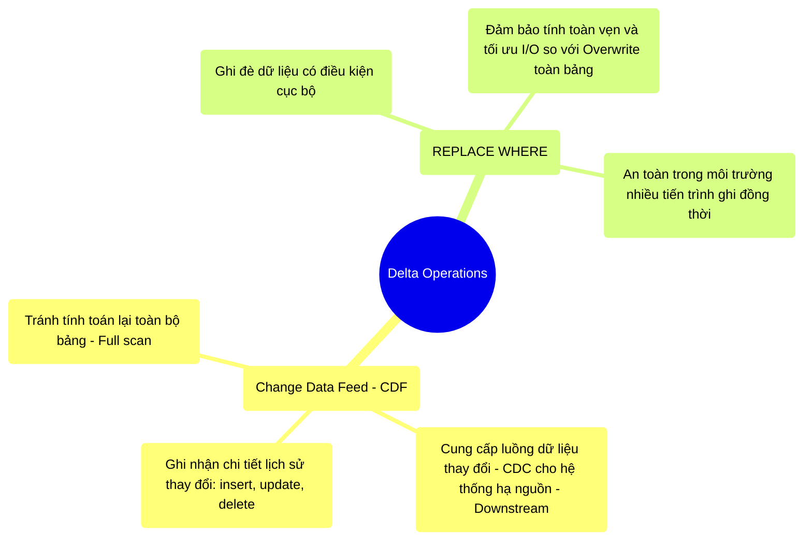

# 12.3 Change Data Feed (CDF) & REPLACE WHERE: Thao Tác Chuyên Sâu Trên Delta Lake

## 1. Objectives
- [ ] Khảo sát cơ chế Change Data Feed (CDF) và vai trò của nó trong kiến trúc Medallion (CDC luân chuyển).
- [ ] So sánh sự khác biệt giữa thao tác Overwrite truyền thống và lệnh `REPLACE WHERE`.
- [ ] Tối ưu hóa các thao tác thay đổi trạng thái khối lượng lớn (Bulk updates).

## 2. Mindmap


## 3. Content

Ngoài cấu trúc Log cốt lõi, Kỹ sư dữ liệu ở cấp độ Staff cần nắm vững các công cụ can thiệp chuyên sâu để duy trì một Data Lakehouse hiệu suất cao, đặc biệt khi xử lý các luồng Change Data Capture (CDC) và cập nhật dữ liệu cục bộ.

### 3.1. Change Data Feed (CDF): Dòng Chảy Của Sự Thay Đổi
Trong kiến trúc Medallion (Bronze $\rightarrow$ Silver $\rightarrow$ Gold), khi bảng Silver cập nhật một bản ghi (Update/Delete), làm cách nào để bảng Gold cập nhật theo mà không cần phải quét lại (Full scan) toàn bộ bảng Silver?
Đó là nhiệm vụ của **Change Data Feed (CDF)**.

Khi kích hoạt CDF trên Delta Table, hệ thống không chỉ ghi lại các thao tác thay đổi trạng thái (Giao dịch), mà còn xuất ra một luồng dữ liệu chi tiết phản ánh chính xác **những gì đã thay đổi**.
- Các sự kiện được gắn nhãn: `insert`, `delete`, `update_preimage` (Trạng thái trước khi cập nhật), `update_postimage` (Trạng thái sau khi cập nhật).
- Ứng dụng tiêu thụ (Downstream Streaming) có thể đọc luồng CDF này như một luồng dữ liệu liên tục, chỉ xử lý những bản ghi có sự thay đổi. Điều này mang lại hiệu suất vượt trội so với việc phải chạy các Job Batch so sánh (Diff) đắt đỏ.

**[Config Snippet: Kích hoạt CDF]**
```sql
-- Kích hoạt CDF cấp độ bảng
ALTER TABLE sales_silver SET TBLPROPERTIES (delta.enableChangeDataFeed = true);

-- Đọc luồng thay đổi (Ví dụ truy vấn từ version 10 trở đi)
SELECT * FROM table_changes('sales_silver', 10);
```

### 3.2. Quyền Năng Của REPLACE WHERE
Một tác vụ phổ biến: Kỹ sư cần ghi đè (Overwrite) lại toàn bộ dữ liệu của ngày hôm qua (`date = '2023-10-01'`) do dữ liệu cũ bị lỗi.

- **Phương pháp truyền thống (SaveMode.Overwrite):** Ghi đè toàn bộ bảng. Rủi ro xóa nhầm toàn bộ dữ liệu lịch sử nếu cấu hình phân vùng (Partition) không chính xác.
- **Phương pháp tối ưu (REPLACE WHERE):** Delta Lake cung cấp cơ chế giới hạn phạm vi ghi đè dựa trên điều kiện logic. 

Với `REPLACE WHERE`, Spark sẽ chỉ thay thế các dữ liệu thỏa mãn điều kiện chỉ định. Thao tác này cung cấp các lợi thế:
1. **Cô lập không gian:** Không làm ảnh hưởng đến các phân vùng hoặc dải dữ liệu khác.
2. **Xác thực dữ liệu:** Delta sẽ kiểm tra dữ liệu đầu vào. Nếu dữ liệu đầu vào chứa các bản ghi nằm ngoài điều kiện `REPLACE WHERE`, hệ thống sẽ từ chối ghi và báo lỗi (Data Validation).
3. **Hiệu suất I/O:** Tránh thao tác quét và ghi đè trên phạm vi toàn bảng, hạn chế tác động tới các tiến trình đang truy xuất.

**[Code Snippet: REPLACE WHERE]**
```python
# Ghi đè an toàn giới hạn trong một khoảng thời gian
new_data_df.write \
  .format("delta") \
  .mode("overwrite") \
  .option("replaceWhere", "date >= '2023-10-01' AND date <= '2023-10-05'") \
  .save("s3://lake/sales/")
```

## 4. Key takeaways
- **Luồng dữ liệu tối ưu**: CDF thay thế các truy vấn So sánh (Diff) tốn kém bằng việc xuất trực tiếp luồng thay đổi, lý tưởng cho kiến trúc Medallion Stream-based.
- **Ranh giới an toàn**: `REPLACE WHERE` là rào chắn bảo vệ tính toàn vẹn của dữ liệu trong các tác vụ bảo trì lịch sử, ngăn chặn thảm họa xóa nhầm toàn bảng.
- **Tiến trình tiếp theo**: Delta Lake không đơn độc trên thị trường Table Formats. Việc đánh giá và lựa chọn kiến trúc tối ưu đòi hỏi cái nhìn đa chiều với Apache Iceberg và Apache Hudi. Đón đọc phân tích so sánh tại Bài 12.4.
