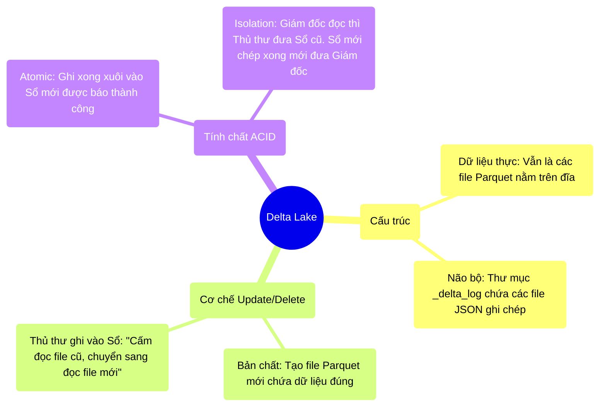

# 12.3 Delta Lake & Cuốn Sổ Nhật Ký Giao Dịch Thần Thánh

## 1. Objectives
- [ ] Bẻ khóa nguyên lý hoạt động của Delta Lake qua **Phép ẩn dụ Thủ Kho Và Cuốn Sổ Chấm Công**.
- [ ] Giải thích cách Delta Lake lừa người đọc để thực hiện lệnh UPDATE mà không cần sửa file cũ ngay lập tức.
- [ ] Hiểu được khái niệm Transaction Log (`_delta_log`).

## 2. Mindmap


## 3. Content

### 3.1. Phép Ẩn Dụ: Ông Thủ Kho Delta
Databricks hiểu rằng Không thể thay đổi được tính chất Immutable của Parquet. Muốn sửa 1 dòng vẫn phải tạo file mới. 
Nhưng họ làm ra một thứ còn thông minh hơn: **Đánh lừa người đọc bằng Cuốn Nhật Ký (Transaction Log)**.

> **[Ví Dụ Trực Quan: Thủ Kho Quản Lý Tài Liệu]**
> Data Lake giờ đây được khóa lại. Bạn thuê một Thủ Kho (Delta Lake) đứng canh cửa.
> Thủ kho cầm một cuốn sổ gọi là `_delta_log`.
> 
> **Sự kiện 1 (Lúc 8h):** Bạn chở đến 1 Tấn tài liệu (File `A.parquet`). Bạn ném vào kho. 
> Thủ Kho ghi vào Sổ (Dòng số 1): *Trong kho đang có File A hợp lệ. Ai hỏi thì lấy File A cho xem.*
> Giám đốc đến mượn tài liệu. Thủ kho mở sổ, chỉ Giám đốc ra lấy File A.
> 
> **Sự kiện 2 (Lúc 9h - Bạn muốn sửa 1 người tên John trong File A):**
> Bạn lấy dữ liệu từ File A ra, tự hì hục sửa tên John thành Jack, sau đó lưu thành một File hoàn toàn mới (File `B.parquet`). 
> Bạn ném File B vào trong Kho. 
> Lúc này trong kho ĐANG CÓ CẢ FILE A (Chứa chữ John) VÀ FILE B (Chứa chữ Jack).
> Bạn chạy ra báo Thủ Kho. Thủ kho ghi vào Sổ (Dòng số 2): *Kể từ giờ phút này, HỦY BỎ TƯ CÁCH của File A. Chỉ công nhận File B là hợp lệ.*
> 
> Lát sau, Giám đốc xuống kho. Thủ kho lật Sổ (Thấy dòng số 2). Thủ kho cấm Giám đốc đụng vào File A, chỉ cho Giám đốc đọc File B.
> **Kết quả:** Giám đốc thấy chữ Jack. Lệnh UPDATE thành công rực rỡ!

### 3.2. Sức Mạnh Của Lớp Siêu Dữ Liệu (Metadata Layer)
Nhờ có cuốn Sổ Nhật Ký (Transaction Log), Delta Lake đã ban phát tính năng ACID cho Data Lake rẻ tiền:

- **Tính ACID (Atomicity):** Nếu lúc 9h, bạn đang chép dở File B mà cúp điện. Bạn chưa kịp chạy ra báo Thủ kho. Thì Cuốn Sổ vẫn chỉ dừng ở Dòng số 1 (Chỉ công nhận File A). Dù File B đang nằm ngổn ngang trong kho, Giám đốc xuống vẫn chỉ được đọc File A. Hệ thống không bao giờ bị tình trạng Nửa vời.
- **Tính ACID (Isolation - Tách Biệt):** Đang lúc 9h bạn hì hục tạo File B. Giám đốc xuống kho. Thủ Kho vẫn đưa Sổ dòng số 1 cho Giám đốc (Cho đọc File A). Giám đốc và bạn không ai đụng chạm ai. (Giải quyết triệt để lỗi Dirty Read ở Bài 12.2).

### 3.3. Giải Phẫu Bằng Code (Sức Mạnh Của Cú Pháp Delta)

Bạn không cần phải viết code đọc/ghi đè phức tạp nữa. Cú pháp Delta Lake sinh ra các lệnh y hệt như SQL truyền thống (RDBMS).

```python
# =========================================================================
# LỆNH UPDATE THẦN THÁNH TRÊN DATA LAKE
# =========================================================================
from delta.tables import DeltaTable

# Thay vì "read.parquet", ta dùng đối tượng DeltaTable
deltaTable = DeltaTable.forPath(spark, "s3a://data_lake/customers")

# Lệnh Update: Đổi địa chỉ của John thành "New York"
# Ở bên dưới, Delta tự động đọc cục Parquet cũ, đổi chữ, ghi ra Parquet mới, 
# và update Nhật ký (_delta_log) để gạch bỏ file cũ.
deltaTable.update(
    condition = "name = 'John'",
    set = { "address": "'New York'" }
)

# Lệnh Upsert (MERGE INTO) siêu cấp:
# Nếu có rồi thì Cập Nhật. Nếu chưa có thì Thêm Mới. (Rất khó làm ở Parquet thường).
deltaTable.alias("old").merge(
    source = df_new_updates.alias("new"),
    condition = "old.id = new.id"
).whenMatchedUpdate(set = { "address": "new.address" }) \
 .whenNotMatchedInsertAll() \
 .execute()
```

## 4. Key takeaways
- **Bản chất Delta Lake:** Nó không phải là một loại File mới thay thế Parquet. Bên trong Delta Lake VẪN LÀ PARQUET. Delta Lake chỉ là **Parquet + Một thư mục `_delta_log` chứa các file JSON ghi chép lại lịch sử**.
- **Giải quyết No-ACID:** Delta dùng triết lý MVCC (Multi-Version Concurrency Control) - Quản lý đồng thời đa phiên bản. Bằng cách giữ lại cả file cũ và file mới, rồi dùng Sổ Nhật Ký để định hướng người đọc, nó giải quyết hoàn toàn sự tranh chấp Đọc/Ghi.
- **Cuộc sống dễ thở:** Kỹ sư dữ liệu không còn phải đau đầu viết Spark Code rườm rà để chèn/cập nhật dữ liệu từ Streaming hay CDC. Chỉ cần gọi hàm `update()`, `delete()`, `merge()`, phần còn lại để Ông Thủ Kho Delta tự lo liệu.
