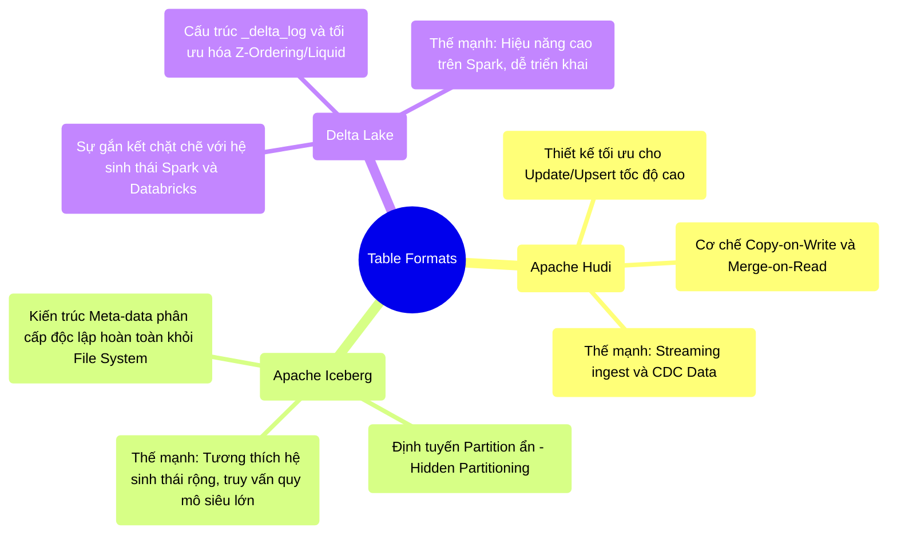

# 12.4 Cuộc Chiến Table Formats: Delta Lake vs Apache Iceberg vs Apache Hudi

## 1. Objectives
- [ ] Định vị vai trò của Table Formats (Định dạng bảng) trong kiến trúc Lakehouse.
- [ ] So sánh kiến trúc và định hướng cốt lõi của 3 nền tảng hàng đầu: Delta Lake, Iceberg, và Hudi.
- [ ] Lựa chọn nền tảng phù hợp dựa trên bài toán đặc thù của hệ thống.

## 2. Mindmap

## 3. Content

Kiến trúc Lakehouse không thể tồn tại nếu thiếu lớp **Table Format (Định dạng bảng)**. Nó hoạt động như một lớp trừu tượng (Abstraction Layer) nằm giữa Engine tính toán (Spark, Trino) và các tệp dữ liệu thô (Parquet, ORC) trên Object Storage.
Lớp này cung cấp siêu dữ liệu (Metadata) để định nghĩa cấu trúc bảng, kiểm soát giao dịch ACID, và điều phối thao tác Update/Delete. Hiện tại, có 3 nền tảng thống trị thị trường: **Delta Lake, Apache Iceberg, và Apache Hudi**.

### 3.1. Apache Hudi: Chuyên Gia Tốc Độ Cập Nhật (Upsert)
Hudi (Hadoop Upserts Deletes and Incrementals) được Uber phát triển với mục tiêu ban đầu là giải quyết bài toán cập nhật dữ liệu (Upsert) liên tục ở độ trễ thấp.

- **Đặc trưng kiến trúc:** Cung cấp hai mô hình lưu trữ:
  - *Copy-on-Write (CoW):* Cập nhật sẽ tạo ra tệp cột (Columnar) mới. Tối ưu cho tốc độ Đọc.
  - *Merge-on-Read (MoR):* Ghi các thay đổi vào tệp log dòng (Row-based) trước, sau đó hợp nhất (Compaction) vào tệp cột ở chế độ nền. Tối ưu cho tốc độ Ghi.
- **Thế mạnh:** Hệ thống được thiết kế xuất sắc để xử lý luồng Change Data Capture (CDC) liên tục (Heavy-write workloads), duy trì trạng thái dữ liệu gần như thời gian thực.

### 3.2. Apache Iceberg: Kẻ Định Hình Tiêu Chuẩn Mở
Do Netflix phát triển, Iceberg giải quyết điểm nghẽn của việc lưu trữ siêu dữ liệu trên hệ thống thư mục gốc (Directory-based như Hive Metastore).

- **Đặc trưng kiến trúc:** Thay vì quản lý dữ liệu theo cấu trúc thư mục File System, Iceberg duy trì một cây phân cấp Meta-data (Snapshot $\rightarrow$ Manifest List $\rightarrow$ Manifest Files) quản lý định danh tới từng tệp tin vật lý độc lập. 
- **Đột phá (Hidden Partitioning):** Tránh hiện tượng rò rỉ dữ liệu hoặc lỗi truy vấn do người dùng không gọi đúng cột Partition. Iceberg tự động quản lý logic biến đổi Partition (Ví dụ: `month(timestamp)`).
- **Thế mạnh:** Hệ sinh thái mở rộng, hỗ trợ đa dạng Engine (Trino, Flink, Spark, Snowflake) mà không bị phụ thuộc vào một nhà cung cấp cụ thể. Khả năng mở rộng Meta-data xuất sắc cho các bảng quy mô vĩ đại.

### 3.3. Delta Lake: Quyền Lực Của Hệ Sinh Thái
Phát triển bởi Databricks, Delta Lake có sự kết nối và tương thích sâu sắc nhất với nền tảng Apache Spark.

- **Đặc trưng kiến trúc:** Cấu trúc `_delta_log` dựa trên chuỗi tệp JSON và Checkpoint Parquet. Cung cấp tính năng mạnh mẽ như Change Data Feed (CDF), Time Travel, và tối ưu không gian Z-Ordering/Liquid Clustering.
- **Thế mạnh:** Trải nghiệm triển khai (Out-of-the-box) mượt mà nhất đối với hệ thống lấy Spark làm trung tâm. Mặc dù Databricks đã mở mã nguồn hoàn toàn (Delta Lake 3.0), một số tính năng hiệu suất cao nhất vẫn được tối ưu độc quyền trên môi trường Databricks (Photon Engine).

### 3.4. Chiến Lược Lựa Chọn (The Verdict)
Việc lựa chọn nền tảng không dựa trên thông số kỹ thuật đơn thuần, mà phụ thuộc vào bài toán kiến trúc tổng thể:
- Nếu hệ thống yêu cầu tiếp nhận hàng triệu sự kiện **Upsert/CDC liên tục mỗi giây** và độ trễ hợp nhất (Compaction) linh hoạt $\rightarrow$ Chọn **Apache Hudi**.
- Nếu tổ chức định hướng một **kiến trúc Data Mesh đa nền tảng**, sử dụng hỗn hợp Trino, Flink, Spark, Snowflake, và yêu cầu một cấu trúc Meta-data độc lập, phi tập trung $\rightarrow$ Chọn **Apache Iceberg**.
- Nếu toàn bộ quy trình ETL và luồng phân tích của tổ chức **đặt cược (All-in) vào Apache Spark / Databricks**, ưu tiên khả năng triển khai nhanh và sự ổn định cao $\rightarrow$ Chọn **Delta Lake**.

## 4. Key takeaways
- **Không có nền tảng độc tôn**: Sự cạnh tranh giữa Iceberg, Hudi và Delta đang thúc đẩy định dạng Table Format trở thành tiêu chuẩn chung của ngành dữ liệu (Ví dụ: Định dạng UniForm).
- **Trừu tượng hóa lưu trữ**: Quyền lực thực sự của Lakehouse không nằm ở định dạng tệp (Parquet) mà nằm ở khả năng tổ chức, quản lý và kiểm duyệt giao dịch của các hệ thống Table Formats này.
- **Lời tựa Phần Cuối**: Việc xử lý dữ liệu và thiết lập Lakehouse đã hoàn tất, nhưng bài toán cuối cùng là làm sao để triển khai (Deploy) toàn bộ khối lượng kiến trúc này trên nền tảng Container hiện đại. Chương 13 sẽ đưa Spark thâm nhập vào vùng đất của Kubernetes (K8s).
