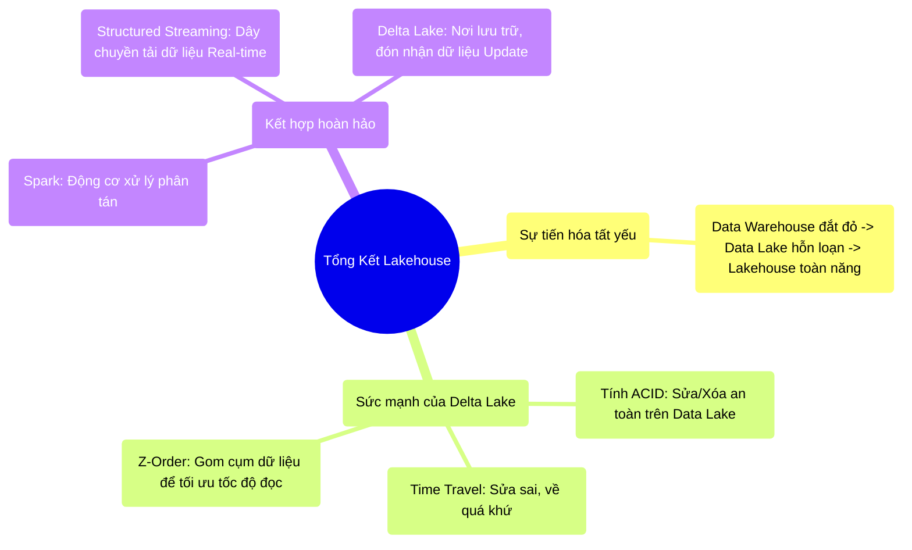

# 12.5 Tổng Kết: Tương Lai Lakehouse & Delta Lake

## 1. Objectives
- [ ] Cô đọng lại sức mạnh của hệ sinh thái Lakehouse.
- [ ] Điểm mặt 3 công nghệ trụ cột của Data Engineering hiện đại (Spark + Streaming + Delta).
- [ ] Chuyển tiếp sang Chương 13: Đám mây và Kubernetes (Cloud Native).

## 2. Mindmap

## 3. Content

### 3.1. Lakehouse Không Phải Là Đích Đến, Nó Là Tiêu Chuẩn
Chương 12 đã khép lại mảnh ghép đau đầu nhất của lưu trữ dữ liệu Big Data. Khi Data Lake ra đời, người ta từng ảo tưởng về một kho lưu trữ giá rẻ vô hạn. Tuy nhiên, sự hỗn loạn, thiếu kiểm soát ACID, và sự bất lực trước yêu cầu Sửa/Xóa (Update/Delete) đã biến Data Lake thành bãi rác.

Lakehouse ra đời (Đại diện tiêu biểu là Delta Lake, Apache Iceberg, Apache Hudi) đã lập lại trật tự cho Bãi Rác đó bằng một **Cuốn Sổ Nhật Ký (Transaction Log)**. Từ đây, Data Engineer có thể tận hưởng Tốc độ đọc của Parquet, Giá lưu trữ rẻ bèo của S3, và Khả năng quản trị mạnh mẽ (ACID, Time Travel, Z-Order) của một Data Warehouse thực thụ.

### 3.2. Chân Vạc Của Kỹ Sư Dữ Liệu Hiện Đại
Đến thời điểm này của khóa học, bạn đã nắm trong tay Kiềng 3 chân (Tech Stack) mạnh nhất của thế giới Data Engineering 2024+:

1. **Apache Spark (Chương 1-10):** Đóng vai trò là Não bộ tính toán phân tán. Chịu trách nhiệm Cắt gọt, Join, Shuffle, Lên lịch và Tối ưu hóa (Catalyst/AQE/Tungsten).
2. **Structured Streaming (Chương 11):** Đóng vai trò là Dây chuyền băng tải. Liên tục hút dữ liệu từ các hệ thống Nguồn (Kafka/Database) chảy vào Spark mà không bị sập nguồn nhờ Checkpoint và Watermark.
3. **Delta Lake (Chương 12):** Đóng vai trò là Cái Đích Đến (Target). Nó hứng trọn dòng chảy dữ liệu của Streaming. Nó cho phép Streaming liên tục Chèn (Insert) và Sửa (Update) trạng thái khách hàng mà không làm gián đoạn (Khóa - Lock) các Nhà Phân Tích (Data Analysts) đang ngồi đọc báo cáo từ cái hồ đó.

Ba công nghệ này sinh ra để làm mảnh ghép bù trừ hoàn hảo cho nhau.

### 3.3. Từ Máy Chủ Dưới Đất Lên Đám Mây (Chuyển Giao Chương 13)
Bạn đã có Kiến trúc hoàn hảo, Code hoàn hảo. Nhưng bạn lấy đâu ra 1000 máy tính để chạy nó?
Mua 1000 máy tính bằng sắt thép đặt trong phòng lạnh (On-Premises) là một mô hình cổ lỗ sĩ và tốn kém. Sẽ ra sao nếu Shopee chỉ cần 1000 máy trong 3 ngày Siêu Sale 11/11, và 362 ngày còn lại chỉ cần 50 máy? 

Thế giới di cư lên Đám Mây (Cloud AWS/GCP/Azure) để giải quyết bài toán Thuê máy tính theo phút. Và trong môi trường Đám mây đó, khái niệm Máy Tính Vật Lý bị xóa sổ, thay vào đó là khái niệm **Cloud Native và Kubernetes**. 

Ở **Chương 13**, chúng ta sẽ nói về cách thuê lính đánh thuê giá rẻ (Spot Instances) trên Mây, và cách K8s chống chọi với việc Lính đánh thuê đột nhiên đào ngũ (Bị thu hồi máy tính đột ngột).
