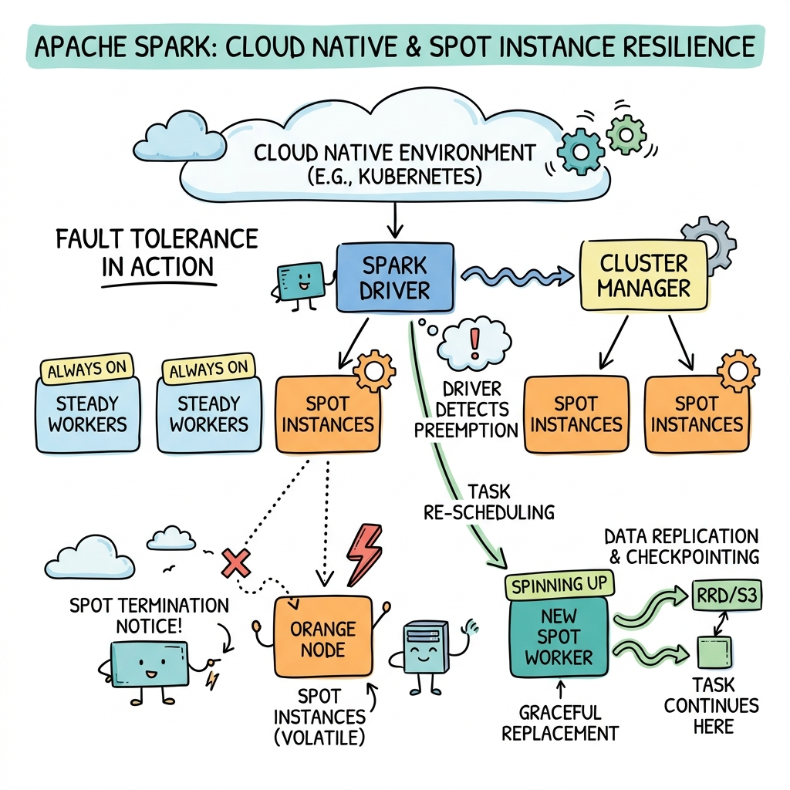
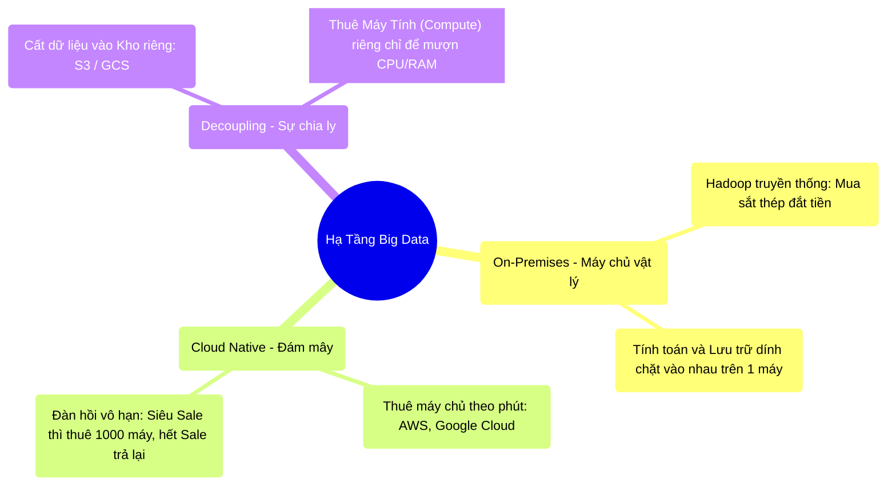

# 13.1 Dịch Chuyển Lên Đám Mây: On-Premises vs Cloud Native

## 1. Objectives
- [ ] So sánh môi trường Server vật lý (On-Premises) và Đám mây (Cloud) qua **Phép ẩn dụ Mua Xe Hơi vs Đi Grab**.
- [ ] Phân tích điểm chết người của HDFS khi đưa lên Cloud.
- [ ] Khái niệm tách rời Lưu Trữ và Tính Toán (Decoupling Compute & Storage).

## 2. Mindmap

## 3. Content

### 3.1. Phép Ẩn Dụ: Mua Đứt Xe Hơi vs Thuê Xe Theo Phút
Ngày xưa, để làm Big Data, các công ty phải chi hàng triệu Đô-la mua hàng trăm cái máy tính to bằng cái tủ lạnh (Gọi là Server On-Premises), đặt trong phòng máy lạnh.

> **[Ví Dụ Trực Quan: Mua Xe vs Đi Grab]**
> Mô hình On-Premises giống như việc bạn vung tiền **Mua đứt 10 chiếc Xe Buýt** để chở khách vào mùa Hè. 
> Đến mùa Đông ế khách, 10 chiếc Xe Buýt nằm đắp mền phủ bụi. Tiền vốn nằm chết ở đó. Nhỡ mùa Hè năm sau lượng khách đột nhiên tăng vọt gấp 10, bạn không kịp chạy đi mua thêm 100 chiếc xe! (Sự thiếu linh hoạt - Không thể Scale).
> 
> **Mô Hình Cloud (Đám Mây):**
> Bạn không mua chiếc xe nào cả! 
> Khách đến bao nhiêu, bạn mở app lên **gọi bấy nhiêu chiếc Grab**. Grab tính tiền theo phút. 
> Mùa hè đông khách, bạn gọi 100 chiếc Grab (Thuê 100 máy AWS EC2). Hết khách, bạn tắt app, không tốn thêm một xu. Hệ thống của bạn trở nên đàn hồi vô cực (Elasticity).

Đây chính là mô hình **Cloud Native** - Thiết kế phần mềm sinh ra để cắm rễ trên Đám mây.

### 3.2. Sự Đổ Vỡ Của HDFS Trên Đám Mây
Khi thế giới ồ ạt kéo lên Cloud, một tượng đài vĩ đại đã sụp đổ: **Hệ thống lưu trữ HDFS của Hadoop.**
Tại sao HDFS lại không sống được trên Mây?

Bản chất của HDFS (Được thiết kế cho On-Premises) là: **Gắn chặt Ổ cứng vào CPU (Coupled Compute & Storage)**.
Nghĩa là một máy tính (DataNode) vừa chứa ổ cứng chứa File, vừa dùng CPU của chính máy đó để tính toán cái File đó (Data Locality).
- **Vấn đề trên Cloud:** Bạn thuê 100 cái Grab (Máy EC2) để tính toán. Bạn đổ 100GB dữ liệu vào Ổ cứng của 100 cái máy EC2 đó (Giả lập HDFS).
- Lúc vắng khách, bạn muốn Trả lại (Sa thải) 90 cái máy EC2 cho AWS để tiết kiệm tiền. 
- **CHẾT RỒI!** Dữ liệu của bạn đang CẤT TRONG Ổ CỨNG của 90 cái máy đó! Bạn xóa máy là bạn xóa luôn cả dữ liệu của công ty! HDFS quá tải và báo lỗi!

### 3.3. Cuộc Ly Hôn Thế Kỷ: Tách Rời Lưu Trữ Và Tính Toán
Để tận dụng được sự rẻ mạt của Cloud, giới công nghệ Big Data quyết định cho Ổ Cứng (Storage) và CPU (Compute) LY HÔN với nhau. Thuật ngữ gọi là **Decoupling**.

> **[Kiến Trúc Cloud Native Spark]**
> 1. **Ổ Cứng (Storage):** Ném tất cả 1 Petabytes dữ liệu (Dưới dạng Delta Lake / Parquet) vào một Dịch vụ Kho Bãi Vĩnh Cửu của AWS có tên là **Amazon S3**. S3 siêu rẻ, siêu bền, không bao giờ bị tắt đi. Nó không có CPU, nó chỉ là một kho bãi thuần túy.
> 2. **CPU/RAM (Compute):** Bạn thuê 100 máy ảo (AWS EC2 / Kubernetes Pods) CHỈ ĐỂ TÍNH TOÁN. 
> Khi Spark khởi động, 100 máy ảo này chạy ra kho S3 mượn dữ liệu về RAM để nháp. Tính toán xong, nó ghi ngược kết quả về S3.
> Cuối ngày, bạn ĐẬP NÁT (Tiêu diệt) cả 100 máy tính này. Không sao cả, dữ liệu của công ty vẫn nằm an toàn 100% trong S3.

Kiến trúc Decoupled này là tiêu chuẩn Vàng của mọi hệ thống hiện đại ngày nay (Snowflake, Databricks, BigQuery đều dùng cơ chế này). Nó cho phép bạn **tắt hoàn toàn cụm Máy Tính** khi không có người dùng, giảm 90% chi phí vận hành.

## 4. Key takeaways
- **Bất lực của Hadoop:** Kiến trúc dính liền ổ cứng và CPU của Hadoop HDFS cực kỳ lãng phí. Khi bạn hết RAM mà Ổ cứng còn trống, bạn vẫn phải mua thêm một cái Máy Server nguyên chiếc (Mua cả cụm CPU/RAM/Ổ cứng) để bù vào.
- **Tiêu chuẩn Cloud Native:** Không lưu dữ liệu vĩnh viễn trên máy tính thực thi (Worker Node). Mọi dữ liệu phải nằm ở Object Storage (S3, GCS, Azure Blob).
- **Trở ngại Vật Lý:** Khi tách rời ổ cứng khỏi CPU, khoảng cách từ 100 máy Worker đến Kho S3 là qua Mạng Internet. Ở Chương 6, ta biết Network rất chậm. Vì vậy, tính năng Z-Order và Time Travel của Delta Lake (Chương 12) chính là tấm khiên để giúp Spark trên Cloud không phải kéo quá nhiều rác qua mạng!
