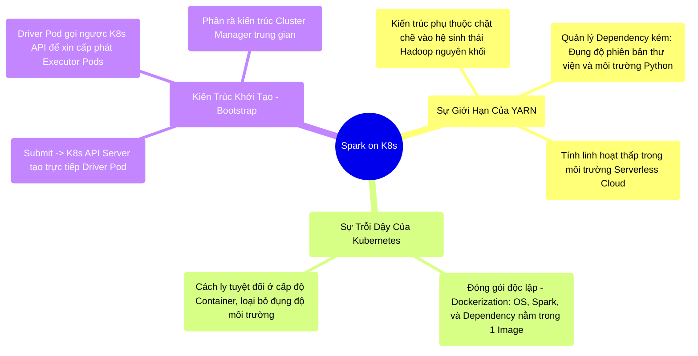

# 13.1 Kiến Trúc Chuyển Đổi: Từ YARN Sang Môi Trường Cloud Native (Kubernetes)

## 1. Objectives
- [ ] Phân tích rào cản kiến trúc của hệ thống quản lý tài nguyên YARN truyền thống.
- [ ] Mổ xẻ nguyên lý Container hóa (Containerization) và khả năng cách ly môi trường tuyệt đối của Spark trên Kubernetes (K8s).
- [ ] Khảo sát vòng đời khởi tạo Driver-Executor trực tiếp thông qua K8s API Server.

## 2. Mindmap


## 3. Content

Trong thập kỷ đầu tiên, YARN (Hadoop) là tiêu chuẩn công nghiệp đóng vai trò điều phối tài nguyên cho các ứng dụng Spark. Tuy nhiên, dưới áp lực của kỷ nguyên Cloud Native, kiến trúc nguyên khối của YARN đã bộc lộ những rạn nứt nghiêm trọng. Sự ra đời của **Kubernetes (K8s)** không chỉ là một giải pháp thay thế, mà là sự đập bỏ và tái thiết toàn bộ tư duy triển khai hệ thống phân tán.

### 3.1. Điểm Nghẽn Kiến Trúc Của YARN (Shared Environment)
Khi triển khai trên YARN, các ứng dụng Spark chia sẻ chung một cơ sở hạ tầng vật lý (Physical Node) đã được cài đặt sẵn hệ điều hành và các thư viện tĩnh.
- **Rào cản quản lý phụ thuộc (Dependency Hell):** Nếu Đội A yêu cầu môi trường Python 3.6 và Đội B yêu cầu Python 3.9, YARN gặp khó khăn lớn trong việc duy trì sự cách ly (Dẫu có sử dụng Conda / Virtualenv). Sự xung đột thư viện dùng chung (C-level libraries) có thể dẫn đến việc cập nhật OS của Đội A làm sập ứng dụng của Đội B.
- **Tính phi cục bộ (Monolithic Lock-in):** YARN được thiết kế cho hệ sinh thái Hadoop cố định, kém linh hoạt trong việc cấp phát và thu hồi tài nguyên chớp nhoáng (Elastic scaling) trên các nền tảng Serverless Cloud hiện đại.

### 3.2. Container Hóa (Dockerization): Nguyên Lý Cô Lập Cốt Lõi
Kubernetes giải quyết rào cản môi trường thông qua triết lý: **Đóng gói toàn bộ vòng đời thực thi vào Container Images.**
- Kỹ sư Đội A đóng gói Spark, Python 3.6, và toàn bộ thư viện nghiệp vụ vào một Container Image (Image A).
- Kỹ sư Đội B tự do đóng gói ứng dụng với Python 3.9 vào Image B.
Khi đệ trình lên K8s, nền tảng sinh ra các Pod (Vùng cách ly cấp độ Kernel). Image A thực thi trong Pod A hoàn toàn độc lập và mù tịt về sự tồn tại của Pod B. Spark đã chuyển hóa từ một phần mềm cài đặt tĩnh thành một tiến trình phi trạng thái (Stateless process).

### 3.3. Giải Phẫu Quá Trình Khởi Tạo Pod (Pod Bootstrap)
Luồng đệ trình ứng dụng (`spark-submit`) trên K8s thay đổi tận gốc rễ so với kiến trúc YARN Manager truyền thống:

1. **Client Đệ Trình (Submission):** Lệnh `spark-submit` tương tác trực tiếp với **K8s API Server**, truyền tải thông tin về Container Image và cấu hình.
2. **Khởi tạo Driver Pod:** K8s API điều phối tài nguyên Node vật lý khả dụng và lập tức khởi tạo một **Driver Pod** độc lập để chạy ứng dụng.
3. **Ủy quyền cho Driver (Driver-as-Client):** Thay vì phụ thuộc vào một Cluster Manager tĩnh (Như YARN ResourceManager), chính Driver Pod (Nơi vận hành SparkContext) sẽ tự động liên lạc ngược lại với K8s API Server: *Yêu cầu cấp phát N Executor Pods dựa trên Image hiện tại*.
4. **Khởi tạo Executor Pods:** K8s API tiến hành khởi tạo các Executor Pods. Sau khi Boot thành công, các Executor này sẽ tự động chủ động thiết lập kênh kết nối mạng (Network Connection) ngược về phía Driver Pod để bắt đầu tính toán.

> [!CAUTION] Cảnh Báo Kiến Trúc: Sự Cản Trở Của Lớp Mạng Trừu Tượng (Network Overhead)
> Trên YARN, các Node vật lý giao tiếp trên một mặt phẳng mạng phẳng (Flat network). Trên K8s, các Pod nhận IP ảo sinh ra từ hệ thống Overlay Network. Nếu cơ sở hạ tầng Container Network Interface (CNI) được thiết lập với hiệu năng thấp, băng thông trung chuyển (Shuffle Bandwidth) giữa các Pod sẽ bị bóp nghẹt nghiêm trọng so với hiệu suất Bare-metal mạng vật lý, tạo ra các nút thắt I/O ẩn (Hidden bottlenecks).

**[Config Snippet: Khai Báo Spark Cấp Độ K8s]**
```bash
spark-submit \
  --master k8s://https://<k8s-apiserver-host>:<k8s-apiserver-port> \
  --deploy-mode cluster \
  --conf spark.kubernetes.container.image=my-docker-repo/spark-job:v1 \
  --conf spark.kubernetes.authenticate.driver.serviceAccountName=spark \
  local:///opt/spark/work-dir/job.py
```

## 4. Key takeaways
- **Triết lý cách ly**: Kubernetes giải quyết triệt để rủi ro xung đột môi trường (Dependency Hell) của YARN thông qua sức mạnh cô lập của Container Image.
- **Tương tác API trực diện**: Driver Pod được thăng cấp quyền hạn, hoạt động như một K8s Client thu nhỏ tự chủ động giao tiếp và cấp phát Executor Pods.
- **Tính phi trạng thái và Phù du**: Khi Pod trở thành đơn vị thực thi cơ sở, sự sống còn của chúng hoàn toàn phụ thuộc vào bộ định tuyến K8s. Nếu Cloud Provider thu hồi tài nguyên (Spot Instances), Pod sẽ bị kết liễu đột ngột. Hệ thống Spark làm sao để bảo vệ trạng thái Shuffle Data trước biến cố này? Lật qua Bài 13.2 để thiết lập kiến trúc Resilience.
