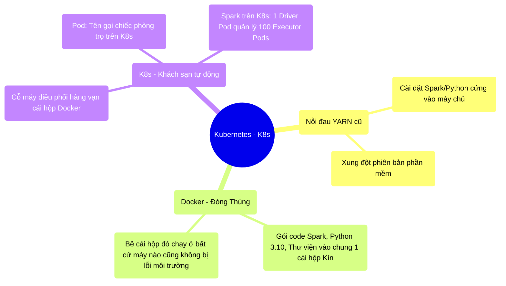

# 13.2 Kubernetes: Hệ Điều Hành Của Đám Mây

## 1. Objectives
- [ ] So sánh môi trường Bare-metal và Docker/K8s qua **Phép ẩn dụ Khách sạn Xe Nhộng**.
- [ ] Mô tả vòng đời của một Job Spark nộp vào Kubernetes (K8s).
- [ ] Lý giải tại sao các công ty lớn đều bỏ YARN để sang K8s.

## 2. Mindmap

## 3. Content

### 3.1. Phép Ẩn Dụ: Khách Sạn Xe Nhộng K8s
Ở Bài 10.1, tôi đã nói về nỗi đau của YARN khi 2 kỹ sư muốn dùng 2 bản Python khác nhau trên cùng 1 máy chủ. 
Công nghệ **Docker** và **Kubernetes (K8s)** sinh ra để chấm dứt sự kìm kẹp này.

> **[Ví Dụ Trực Quan: Đóng Thùng Code Của Bạn]**
> Thay vì cài đặt Python trực tiếp lên Máy Chủ (Bare-metal).
> Bạn mua một cái **Thùng Container bằng sắt (Docker Image)**. Bạn chui vào trong Thùng, tự tay cài Python 3.10, tự cài Spark 3.4, tự nhét đoạn code `report.py` của bạn vào, và Đóng chặt nắp Thùng lại.
> 
> **Kubernetes (K8s) là Ông Chủ Khách Sạn Xe Nhộng.**
> K8s không cần biết bên trong cái Thùng của bạn chứa cái gì. K8s chỉ cần biết: Cái thùng này nặng 4GB RAM. 
> K8s lập tức nhét cái Thùng của bạn vào một cái lỗ (Pod) trên một cái giường tầng khổng lồ (Worker Node vật lý). K8s cắm điện vào cho cái Thùng của bạn chạy. 
> 
> Thùng của bạn (Python 3.10) nằm cạnh Thùng của Kỹ sư B (Java 11). Hai thùng cách âm 100%. Không bao giờ có sự xung đột phần mềm! K8s trở thành Hệ Điều Hành vĩ đại nhất của Đám Mây.

### 3.2. Cấu Trúc Vật Lý Spark Chạy Trên K8s
Khi bạn nộp một Job Spark vào YARN, YARN sinh ra các tiến trình ảo (Process) bên trong máy vật lý.
Khi bạn nộp Job vào K8s (`spark-submit --master k8s://...`), mọi thứ trở nên gọn gàng theo Khối (Pod):

1. **Spark ném cái Thùng Container của bạn cho K8s.**
2. K8s đục 1 cái lỗ, cắm cái Thùng đó vào, phong cho nó làm **Driver Pod (Quản Đốc)**.
3. Driver Pod thức dậy, đọc code Python của bạn. Thấy code yêu cầu 100 công nhân. 
4. Driver Pod GỌI ĐIỆN cho K8s: *Ông chủ khách sạn, copy cái Thùng của tôi ra thành 100 bản sao, rồi kiếm lỗ cắm điện vào cho tôi!*
5. K8s tức tốc nhân bản 100 Thùng Container, nhét vào 100 cái lỗ trên dàn máy chủ vật lý. Đặt tên là **Executor Pods**.
6. 100 Executor Pods khởi động lên, gọi điện kết nối về Driver Pod để nhận việc.

### 3.3. Quyền Lực Của Sự Cắt Đứt Môi Trường
Sức mạnh lớn nhất của K8s không nằm ở tốc độ, mà nằm ở **Sự Độc Lập Môi Trường (Environment Isolation)**.

Trong thời đại Data Science và AI, một File code PySpark của bạn có thể import hàng chục thư viện học sâu (`tensorflow`, `pytorch`, `scikit-learn`) nặng hàng Gigabytes. 
- Nếu dùng YARN truyền thống: Bạn phải nhờ anh Quản Trị Hệ Thống (SysAdmin) đi cài thủ công thư viện `tensorflow` vào tất cả 1.000 máy chủ vật lý. Anh SysAdmin sẽ quá tải và báo lỗi và chửi rủa bạn.
- Khi dùng K8s: Anh SysAdmin không phải làm gì cả. **BẠN TỰ CÀI `tensorflow` vào trong cái Thùng Docker cá nhân của bạn trên máy tính ở nhà**. Sau đó bạn gửi cái Thùng (Image) đó cho K8s. K8s chỉ việc bê cái Thùng đó đặt lên Máy chủ. Mọi thứ tự động chạy!

Sự tiện lợi đến mức độc tài này khiến Kubernetes (K8s) đè bẹp YARN và trở thành Tiêu chuẩn số 1 thế giới để vận hành Spark (Bản thân nền tảng Databricks cũng chạy hoàn toàn dựa trên K8s).

## 4. Key takeaways
- **Docker là Thùng, K8s là Bến Cảng:** Bến cảng (K8s) quản lý hàng vạn cái Thùng (Docker Container). Spark Driver và Executor thực chất chỉ là những chiếc Thùng Container giống hệt nhau, chỉ khác nhau ở bộ nhớ RAM được cắm vào.
- **Tiêu diệt Dependency Hell:** Không bao giờ còn lỗi Chạy được trên máy tôi, lỗi trên máy chủ (It works on my machine). Mọi môi trường hệ điều hành, thư viện, version Python đều được đóng băng thành Bê Tông bên trong chiếc thùng Docker.
- **Sẵn sàng Scale Đám Mây:** Khi K8s hết chỗ chứa Thùng, nó tự động gọi điện cho AWS/Google Cloud mua thêm Máy Chủ Vật Lý (Node Auto-provisioning). Sự kết hợp giữa Spark + K8s + Cloud tạo ra một con quái vật tính toán có khả năng phình to vô hạn.
