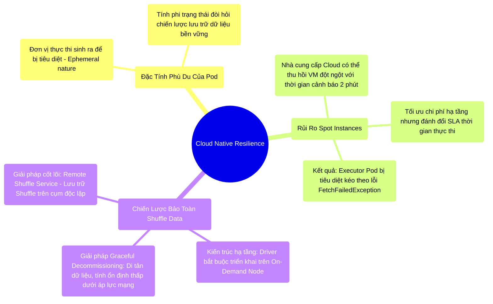

# 13.2 Tính Phù Du Của Pod & Kiến Trúc Bảo Toàn Dữ Liệu Trên Spot Instances

## 1. Objectives
- [ ] Phân tích đặc tính vòng đời phi trạng thái (Stateless) và tính phù du (Ephemeral) của Pod trên Kubernetes.
- [ ] Khảo sát rủi ro gián đoạn từ cơ chế cấp phát Spot Instances (AWS) / Preemptible VMs (GCP) và tác động của nó tới tiến trình Spark.
- [ ] Giải quyết bài toán kiến trúc bảo toàn Shuffle Data: Khuyết điểm của Decommissioning và giải pháp triệt để Remote Shuffle Service.

## 2. Mindmap


## 3. Content

Môi trường vật lý nội bộ (On-premise Bare Metal) mang lại sự ổn định tính toán hoàn hảo. Trái lại, khi chuyển dịch kiến trúc Spark lên nền tảng Kubernetes Cloud Native, hệ thống phải thích nghi với một môi trường vô định, nơi các Node tính toán và Pod thực thi có thể bị hệ điều hành Cloud kết liễu đột ngột bất kỳ lúc nào.

### 3.1. Nghịch Lý Spot Instances: Tiết Kiệm Kéo Theo Rủi Ro
Triết lý thiết kế Pod trong Kubernetes là tính phù du (Ephemeral). Sự sống của Pod không được đảm bảo, đặc biệt khi các tổ chức (Ví dụ: Enterprise) thiết lập chiến lược tối ưu chi phí thông qua **Spot Instances (AWS)** hoặc **Preemptible VMs (GCP)**.
- **Rủi ro thu hồi (Preemption Risk):** Các nhà cung cấp Cloud giảm giá tới 80% cho cấu hình Spot Instances, đổi lại quyền được thu hồi máy chủ (VM) tức thời dựa trên nhu cầu của thị trường. Khoảng thời gian cảnh báo (Grace period) thường vô cùng khắt khe, chỉ giới hạn trong **2 phút**.
- **Bi kịch sụp đổ dây chuyền:** Giả định Executor Pod A hoàn tất 5 giờ thực thi và lưu trữ 50GB Shuffle Data trên phân vùng I/O cục bộ (Local Disk). AWS đột ngột phát lệnh thu hồi Spot Instance chứa Pod A. Executor bị kết liễu lập tức, mang theo 50GB dữ liệu nháp vào hư vô.
- **Hệ quả Fetch Failed:** Khi các Executor ở Stage kế tiếp cố gắng thiết lập luồng truy xuất tới A, kết nối thất bại trả về `FetchFailedException`. Spark Scheduler buộc phải tái tính toán toàn bộ Stage bị mất, phá hủy lợi thế chi phí của Spot Instances do thời gian thực thi bị kéo dài đột biến (Tail latency degradation).

### 3.2. Cấu Trúc Bảo Toàn Shuffle Data
Khác với môi trường YARN truyền thống bảo vệ dữ liệu Shuffle qua Daemon nền tảng (ESS), Spark trên K8s buộc phải cắt bỏ sự phụ thuộc vào lưu trữ cục bộ của các Pod mỏng manh. Có 3 giải pháp kiến trúc đối trọng:

**[Giải Pháp 1: Persistent Volume Claims (PVC)]**
Gắn kết bộ nhớ ngoài (Ví dụ: AWS EBS) vào Executor Pod. Khi Pod bị kết liễu, ổ đĩa ảo được giữ lại và tái gắn kết.
- *Hạn chế:* Băng thông mạng ảo (Network Block Storage) cực kỳ kém hiệu quả khi xử lý tải trọng I/O Shuffle mật độ cao, phá hủy hiệu năng vốn có của ổ NVMe cục bộ.

**[Giải Pháp 2: Tính Năng Decommissioning (Spark 3.2+)]**
Khi Cloud Provider phát tín hiệu SIGTERM (2 phút trước khi thu hồi), K8s chuyển thông báo tới Driver. Driver ra lệnh chặn Executor nhận Task mới và kích hoạt luồng sao chép (Migrate) Shuffle Data sang các Executor an toàn khác.
> [!WARNING] Cảnh Báo Kiến Trúc: Sự Quá Tải Của Mạng (Best-effort Fallacy)
> Giải pháp Graceful Decommissioning vận hành hiệu quả trên lý thuyết nhưng tiềm ẩn rủi ro rất cao trên thực địa. Trong 120 giây then chốt, nếu khối lượng dữ liệu lên tới hàng chục GB, băng thông CNI Network thường bão hòa, dẫn đến việc di tản thất bại trước khi VM bị ngắt điện.
> **Quy tắc tuyệt đối:** Không bao giờ cho phép Driver Pod khởi chạy trên Spot Instances. Sự hy sinh của Driver tương đương với sự sụp đổ của toàn bộ Job (Single Point of Failure).

**[Giải Pháp 3: Chân Lý Cloud Native - Remote Shuffle Service (RSS)]**
Nhận thức được khuyết điểm I/O của PVC và rủi ro mạng của Decommissioning, các kiến trúc sư triển khai giải pháp dứt điểm: **Remote Shuffle Service (Ví dụ: Apache Celeborn, Uniffle)**.
Thay vì ghi Shuffle Data xuống Local Disk, Executor thiết lập luồng Stream đẩy trực tiếp dữ liệu sang một cụm RSS chuyên biệt (Tồn tại độc lập trên các Node On-Demand an toàn). Khi Executor Pod bốc hơi, dữ liệu Shuffle hoàn toàn nguyên vẹn trên cụm RSS, triệt tiêu lỗi `FetchFailed`. Đây là kiến trúc cốt lõi để triển khai Spark ở quy mô siêu lớn trên K8s.

**[Config Snippet: Định Tuyến Tài Nguyên An Toàn]**
```bash
# Ràng buộc Driver vào máy On-Demand để đảm bảo sự sống còn của bộ não điều phối
--conf spark.kubernetes.driver.node.selector.lifecycle=OnDemand

# Bật cơ chế di tản dữ liệu (Graceful Decommissioning) như một lưới an toàn thứ cấp
--conf spark.decommission.enabled=true
--conf spark.storage.decommission.enabled=true
--conf spark.storage.decommission.shuffleBlocks.enabled=true
```

## 4. Key takeaways
- **Thỏa hiệp tài chính và sự ổn định**: Việc ứng dụng Spot Instances trên hạ tầng Cloud Native đòi hỏi chiến lược thiết kế dung lỗi (Fault Tolerance) sâu sắc đối với dữ liệu tạm.
- **Phân tách tính toán và luân chuyển**: Sự ra đời của Remote Shuffle Service (RSS) chứng minh nguyên lý tách rời Computing (Các Pod dễ bay hơi) và Shuffle Storage (Cụm lưu trữ độc lập bền vững) là xu hướng tất yếu của Big Data hiện đại.
- **Hồi kết của hành trình kiến trúc**: Từ các thành phần vi mô của Memory Management (Chương 5) đến cấu trúc vĩ mô của Kubernetes (Chương 13), chúng ta đã hoàn tất việc giải mã cơ thể Apache Spark. Khép lại khóa huấn luyện, Chương 14 sẽ tổng kết các nguyên lý triết học (The Philosophy) chi phối mọi quyết định hệ thống của một kỹ sư Staff-Level.
