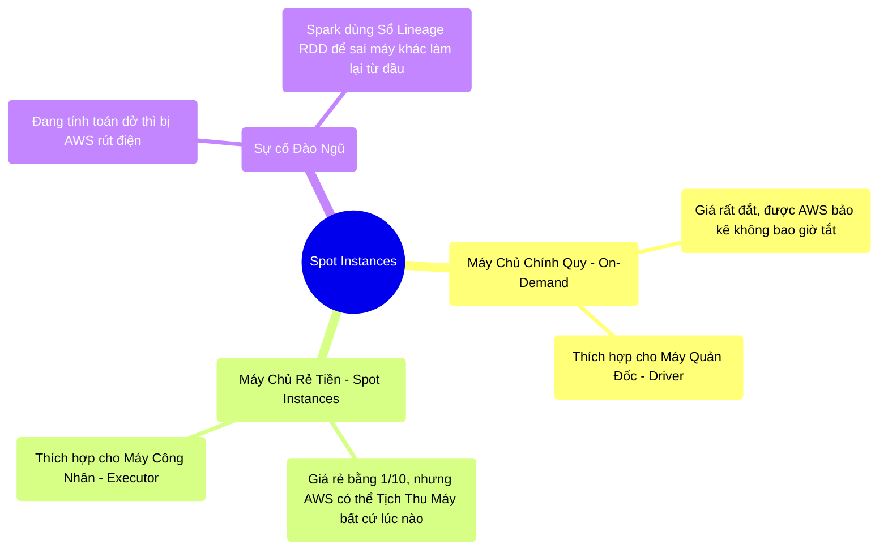

# 13.3 Lính Đánh Thuê Giá Bèo (Spot Instances) & Sự Đứt Gãy Vật Lý

## 1. Objectives
- [ ] So sánh máy chủ On-Demand (Thuê chính quy) và Spot Instances (Lính đánh thuê) qua **Phép ẩn dụ Mua vé hạng thương gia vs Đi nhờ xe**.
- [ ] Phân tích rủi ro vật lý khi Lính đánh thuê đột ngột đào ngũ (Bị thu hồi máy).
- [ ] Giải thích cơ chế Fault Tolerance (Chịu lỗi) của Spark bằng Sổ Lineage.

## 2. Mindmap


## 3. Content

### 3.1. Phép Ẩn Dụ: Mua Vé Thương Gia vs Lính Đánh Thuê
Khi chạy Spark trên đám mây (AWS/GCP), bài toán đau đầu nhất của Giám đốc là: **TIỀN**.
Chạy 1.000 máy chủ AWS tốn hàng ngàn Đô-la mỗi giờ. Kỹ sư phải tìm cách tối ưu chi phí. 

Đám mây AWS có 2 loại Máy tính để bạn thuê:

> **[Ví Dụ Trực Quan: Vé Thương Gia vs Lính Đánh Thuê]**
> - **Máy On-Demand (Lính Chính Quy):** Bạn trả đủ tiền (Rất đắt). AWS cam kết cái máy đó là của bạn. Dù trời có sập, AWS cũng không tắt cái máy đó. (Giống mua vé hạng Thương gia, chắc chắn có ghế ngồi).
> 
> - **Máy Spot (Lính Đánh Thuê):** AWS có rất nhiều máy tính bị ế không ai thuê. AWS cho bạn thuê mấy cái máy ế đó với **Giá Rẻ Gấp 10 Lần** (Giảm 90%). 
> **NHƯNG AWS ra một điều luật nghiêm ngặt:** Nếu có khách hàng nhà giàu nào cần gấp, tôi sẽ đuổi anh ra khỏi cái máy này. Tôi chỉ BÁO TRƯỚC CHO ANH 2 PHÚT để thu dọn đồ đạc, rồi tôi rút phích cắm cái máy của anh!.

### 3.2. Cấu Trúc Đội Hình Hoàn Hảo (Driver On-Demand + Executor Spot)
Vì Spark là hệ thống phân tán, sự sống còn phụ thuộc vào Máy Quản Đốc (Driver). 
Nếu Driver bị AWS rút phích cắm, TOÀN BỘ CÔNG TRƯỜNG 1.000 MÁY CỦA BẠN SẼ SẬP THEO!

> **[Chiến thuật Bày Binh Bố Trận]**
> 1. **Máy Quản Đốc (Driver Pod):** Bắt buộc phải thuê Lính Chính Quy (On-Demand). Tốn 1 ít tiền đắt cũng được, miễn là cái Não Bộ không bao giờ bị chết.
> 2. **Máy Công Nhân (Executor Pods):** 1.000 Máy công nhân đều thuê bằng Lính Đánh Thuê (Spot Instances). Bọn này chỉ làm tay chân, tiết kiệm được 90% tiền cho công ty.

Chuyện gì xảy ra nếu 1 Lính Đánh Thuê (Ví dụ: Máy 92) đang làm việc hăng say thì bị AWS... rút phích cắm đuổi cổ đi?

### 3.3. Cơ Chế Chịu Lỗi (Fault Tolerance) Bằng Cuốn Sổ Lineage
Đừng lo! Spark sinh ra là để chống chọi với cái chết. Spark có một cơ chế sinh tồn kinh điển mang tên **DAG Lineage (Cuốn Sổ Công Thức Gia Truyền)** - Đã học ở Bài 3.3.

```python
# =========================================================================
# LUỒNG VẬT LÝ KHI MÁY SPOT BỊ TỊCH THU
# =========================================================================

"""
Lúc 10:00: Máy Quản Đốc (Driver) giao cho Máy số 92 (Spot) tính tổng doanh thu TP.HCM.
Lúc 10:45: Máy 92 chạy được 45 phút, gần xong việc. 
Lúc 10:46: AWS phát thông báo: "Tịch thu máy 92!". 
Lúc 10:48: AWS rút phích cắm. Máy 92 bốc khói. Mất sạch 45 phút công sức.

MÁY QUẢN ĐỐC SẼ LÀM GÌ?
1. Quản Đốc thấy Máy 92 bị đứt liên lạc (Timeout).
2. Quản đốc LẬT CUỐN SỔ LINEAGE RA xem: "Hồi nãy mình giao cho thằng 92 việc gì nhỉ? À, tính doanh thu TP.HCM".
3. Quản đốc gọi K8s cấp cho 1 cái máy mới (Máy 101).
4. Quản đốc ném Sổ Công Thức cho Máy 101: "Mày chạy lại từ đầu cái việc tính doanh thu TP.HCM cho tao!"
"""
```

Hệ thống chỉ bị CHẬM ĐI một chút (Vì Máy 101 phải chạy lại công sức 45 phút của Máy 92), chứ Job hoàn toàn KHÔNG BỊ SẬP (Fault Tolerance). Đó là sự vĩ đại của Spark trên Cloud. Nó cho phép công ty bạn xài đồ rẻ tiền (Spot) mà vẫn ngủ ngon giấc.

*(Lưu ý đau đớn: Nếu cái Máy 92 bị tắt chứa tờ giấy Nháp Shuffle của thằng khác cần, thì thảm họa mất dữ liệu dây chuyền sẽ xảy ra. Để giải quyết, hãy xem Bài 13.4).*

## 4. Key takeaways
- **Spot Instances:** Bí kíp vô giá của Kỹ sư Cloud. Giảm 90% hóa đơn tiền điện cho các Job xử lý Batch khổng lồ.
- **Quy tắc Vàng:** Không bao giờ đặt Driver lên máy Spot. Driver chết là toàn bộ Job chết (Sổ Lineage bị cháy), Spark không thể tự phục hồi được Driver.
- **Tính Chịu Lỗi (Fault Tolerance):** Khả năng tái sinh vĩ đại của Spark không đến từ việc copy dữ liệu (như Hadoop), mà đến từ việc **Lưu Trữ Công Thức Tính Toán (Lineage DAG)**. Máy hỏng $\rightarrow$ Lấy công thức cho máy khác chạy lại.
