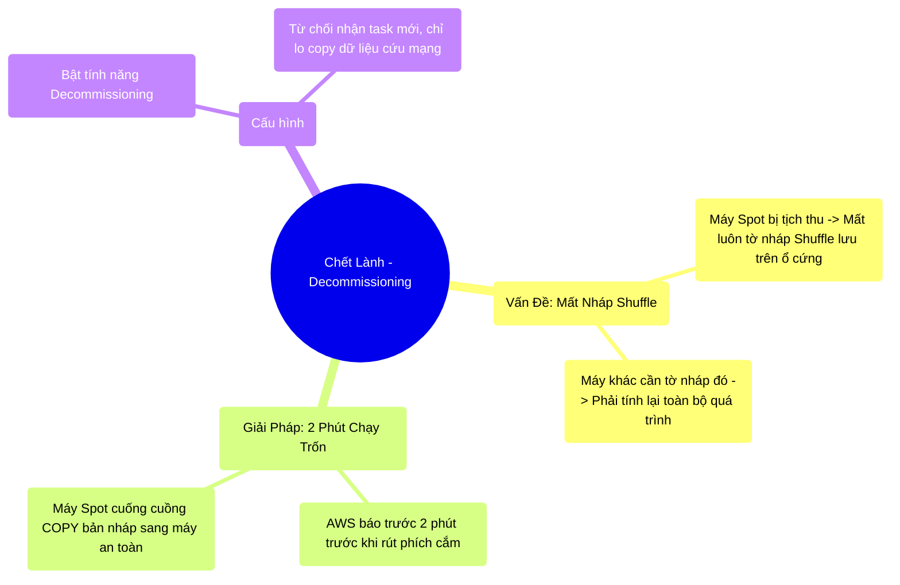

# 13.4 Chết Lành (Graceful Decommissioning): Bàn Giao Trước Khi Nghỉ Việc

## 1. Objectives
- [ ] Xử lý điểm yếu tột cùng của Máy Spot: Mất bản nháp Shuffle.
- [ ] Khái niệm Graceful Decommission (Nghỉ việc có bàn giao) qua **Phép ẩn dụ Chạy bo nhặt thính**.
- [ ] Cấu hình Decommissioning cho Spark 3.x trên Kubernetes.

## 2. Mindmap


## 3. Content

### 3.1. Phép Ẩn Dụ: 2 Phút Chạy Trốn Trước Khi Trạm Phát Nổ
Ở Bài 13.3, ta thấy Spark rất ngầu: Máy 92 bị nổ, Quản Đốc bảo Máy 101 chạy lại từ đầu là xong.
Nhưng đó là khi làm một việc Độc lập (Không có Shuffle/Join).

Nếu Job của bạn CÓ SHUFFLE (Group By / Join), một tai họa khủng khiếp sẽ ập xuống:
- Máy 92 làm xong giai đoạn 1, lưu TỜ NHÁP (Shuffle Data) xuống ổ cứng cục bộ của nó.
- AWS báo: Thu hồi máy 92.
- Máy 92 bốc hơi. **TỜ NHÁP SHUFFLE CŨNG CHÁY THEO!**
- Lát sau, Máy số 93 đang làm Giai đoạn 2, nó qua hỏi Máy 92 lấy tờ nháp. Thấy Máy 92 đã gặp sự cố nghiêm trọng, Máy 93 quá tải và báo lỗi báo lỗi về Quản Đốc (FetchFailedException).
- Quản Đốc hoảng loạn, phải điều 1 chục cái máy khác **TÍNH LẠI TOÀN BỘ GIAI ĐOẠN 1 CỦA CẢ HỆ THỐNG** chỉ để khôi phục lại Tờ nháp của Máy 92! (Dịch ứng chuyền, làm Job chậm đi hàng tiếng đồng hồ).

### 3.2. Chết Lành (Graceful Decommissioning)
May mắn thay, AWS không nghiêm ngặt rút phích cắm ngay lập tức. AWS gửi một tờ giấy báo tử: *Ê, 2 phút nữa tao rút điện nha*.

Các Kỹ sư Apple, Palantir và Databricks đã hợp sức viết ra một tính năng chuyên sâu cho Spark 3.x: **Decommissioning (Quy trình bàn giao trước khi nghỉ hưu)**.

> **[Ví Dụ Trực Quan: Nhặt Đồ Chạy Bo]**
> Khi Máy 92 nhận được Giấy báo tử (2 phút nữa nổ):
> 1. Nó lập tức gọi báo cho Quản Đốc: *Sếp ơi, em sắp chết, ĐỪNG GIAO VIỆC MỚI CHO EM NỮA!* (Ngừng nhận Task).
> 2. Nó vội vàng mở Ổ cứng ra, lấy tờ giấy nháp Shuffle quan trọng nhất.
> 3. Nó phi như bay qua Máy 93 (Máy an toàn, không bị báo tử), ném tờ giấy nháp cho Máy 93 giữ giùm. (Shuffle Block Migration).
> 4. 2 phút sau, Máy 92 bị rút điện gặp sự cố nghiêm trọng. Nhưng Tờ nháp đã được an toàn nằm ở nhà Máy 93.

Nhờ có 2 phút di tản này, khi các máy khác cần nháp, chúng chỉ cần sang nhà Máy 93 để lấy. Không có bất kỳ ai phải vất vả tính lại từ đầu. Quá trình tính toán diễn ra mượt mà như chưa từng có ai chết!

### 3.3. Cấu Hình Cứu Sống Cluster Trên K8s

Để kích hoạt tính năng Chết Lành di tản dữ liệu, bạn PHẢI nhúng các dòng lệnh then chốt sau vào Tờ khai `spark-submit` của mình:

```bash
# =========================================================================
# KÍCH HOẠT QUY TRÌNH CHẠY TRỐN KHI CHẾT DÀNH CHO MÁY SPOT (K8s)
# =========================================================================

spark-submit \
  --master k8s://https://... \
  --deploy-mode cluster \
  \
  # 1. Bật tính năng Bàn Giao
  --conf spark.decommission.enabled=true \
  \
  # 2. Bật tính năng Di tản Dữ liệu Nháp (Shuffle Blocks) sang máy khác
  --conf spark.storage.decommission.shuffleBlocks.enabled=true \
  \
  # 3. Ép Máy Spot ráng thức 120 giây (2 phút) để copy cho xong rồi mới được chết
  --conf spark.executor.decommission.killInterval=120s \
  \
  my_script.py
```

## 4. Key takeaways
- **Giá trị của Tờ Nháp:** Không phải lúc nào tái tính toán (Recompute) cũng là tốt. Recompute một Stage đằng sau lệnh Join/GroupBy cực kỳ tốn tài nguyên và thời gian. Mất Shuffle Data trên Máy Spot là cơn ác mộng của Cloud.
- **Biết chết để sống:** Tính năng Decommissioning biến Spark thành một sinh vật cực kỳ thông minh. Nó tận dụng triệt để 2 phút hấp hối của AWS để bàn giao tài sản, ngăn chặn sự sụp đổ dây chuyền (Cascade failure).
- **Vũ khí cốt lõi của Cloud Native:** Kết hợp Dynamic Allocation (Thuê tự động lúc cần) + Spot Instances (Thuê máy giá bèo) + Decommissioning (Chết thì di tản) tạo ra một cỗ máy xử lý dữ liệu KHÔNG THỂ BỊ HỦY DIỆT, với chi phí rẻ như cho không. Đây chính là trình độ Thượng Thừa của một Cloud Data Engineer.
