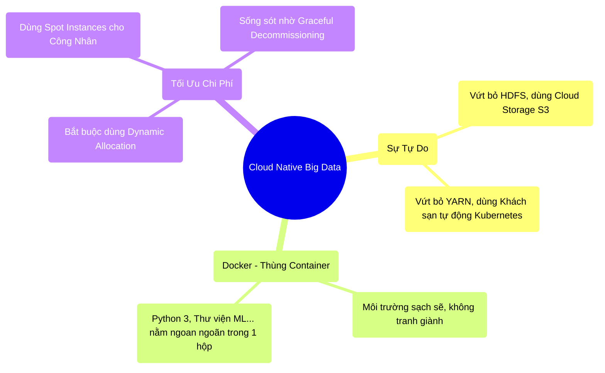

# 13.5 Tổng Kết: Tương Lai Đám Mây (Cloud Native)

## 1. Objectives
- [ ] Cô đọng lại sự chuyển dịch kiến trúc vĩ đại từ Bare-metal lên Cloud.
- [ ] Ghi nhớ bộ quy tắc vàng khi thiết kế ứng dụng Cloud Native.
- [ ] Chuyển tiếp sang Chương 14: Triết lý Kỹ Sư Toàn Cầu (Full Stack).

## 2. Mindmap

## 3. Content

### 3.1. Sự Kết Thúc Của Kỷ Nguyên Hadoop
Trong 10 năm, Big Data đồng nghĩa với Hadoop (YARN + HDFS + MapReduce). Đó là một thời đại vĩ đại nhưng cồng kềnh.
Hôm nay, bạn có thể tự tin tuyên bố với nhà tuyển dụng: Hadoop đã chết.

Chương 13 đã phác họa ra một chân trời mới: **Cloud Native Data Engineering**. Nơi mà bạn không cần phải mua một cái máy tính nào. Không cần biết vặn ốc vít hay đi dây cáp mạng. Bạn giao phó toàn bộ gánh nặng vật lý đó cho Đám Mây (AWS, GCP, Azure). 

Nhưng Đám Mây không phải là cây rụng tiền. Nếu bạn bê nguyên xi tư duy viết code On-Premise quăng lên Cloud, Công ty của bạn sẽ phá sản vào cuối tháng vì hóa đơn tiền điện (Bill Shock).

### 3.2. Bộ Quy Tắc Vàng Của Kỹ Sư Cloud Native
Để sống sót và làm chủ Đám Mây, Kỹ sư dữ liệu hiện đại phải nằm lòng các nguyên tắc Vật lý sau:

1. **Decoupling (Ly Hôn):** Không bao giờ dùng HDFS hay lưu dữ liệu vĩnh viễn trên máy tính cục bộ. Lưu trữ (S3) và Tính toán (K8s/EC2) phải tách rời nhau để bạn có thể tắt máy tính khi đi ngủ mà không mất dữ liệu.
2. **Containerization (Đóng Thùng):** Không bao giờ lên Máy chủ cài đặt thư viện bằng tay. Hãy tự đóng gói mọi thứ vào Thùng Docker (Container) ngay tại nhà, và ném cái thùng đó cho Kubernetes quản lý.
3. **Embrace Failure (Ôm Lấy Thất Bại):** Trên Cloud, chuyện máy tính bị rút điện (Spot Instance) xảy ra cơm bữa. Đừng viết code cầu nguyện cho máy không chết. Hãy dùng cơ chế Checkpoint (Streaming), Sổ Lineage và tính năng Decommissioning (Bàn giao) để hệ thống tự động Bơm máu và Hồi sinh.

### 3.3. Từ Thợ Gõ Code Trở Thành Kiến Trúc Sư (Chuyển Giao)
Từ Chương 1 đến Chương 13, chúng ta đã đi một hành trình vĩ đại.
- Bạn học cách Spark suy nghĩ (RDD, DataFrame, Catalyst).
- Bạn học vật lý máy tính (RAM, Network, Disk).
- Bạn giải quyết các bài toán hóc búa (Skew, OOM, Streaming, Lakehouse).
- Bạn đưa tất cả lên Môi trường chuyên nghiệp (Kubernetes).

Bạn đã không còn là một Thợ gõ SQL (SQL Monkey) nữa. Bạn đã hiểu thấu đáo những Định luật Vật lý (First Principles) chi phối Big Data.
Nhưng để thật sự thăng hoa, bạn cần một Triết Lý. Một tư duy sắc bén để đối mặt với những công nghệ mới sẽ ra mắt trong 5-10 năm tới.

Hãy bước vào **Chương 14 (The Full Stack & Philosophy)** - Chương dành riêng cho việc rèn luyện Tư duy cốt lõi (Mindset) của một Staff Data Engineer, trước khi chúng ta bơi vào phòng thí nghiệm (Labs).
