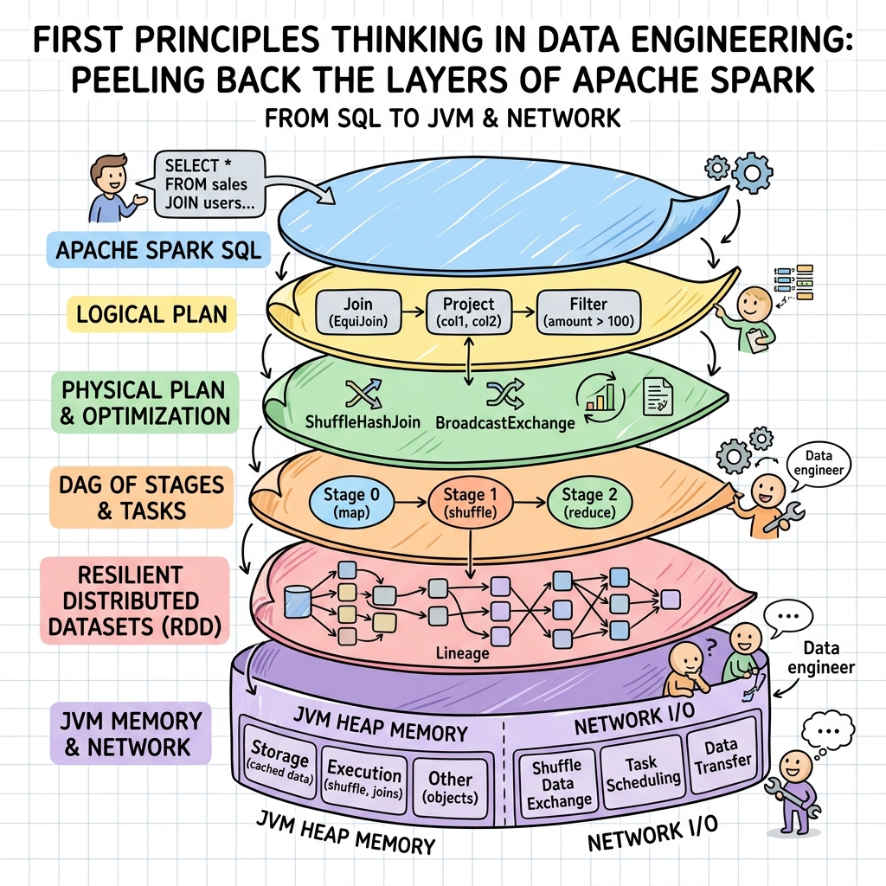
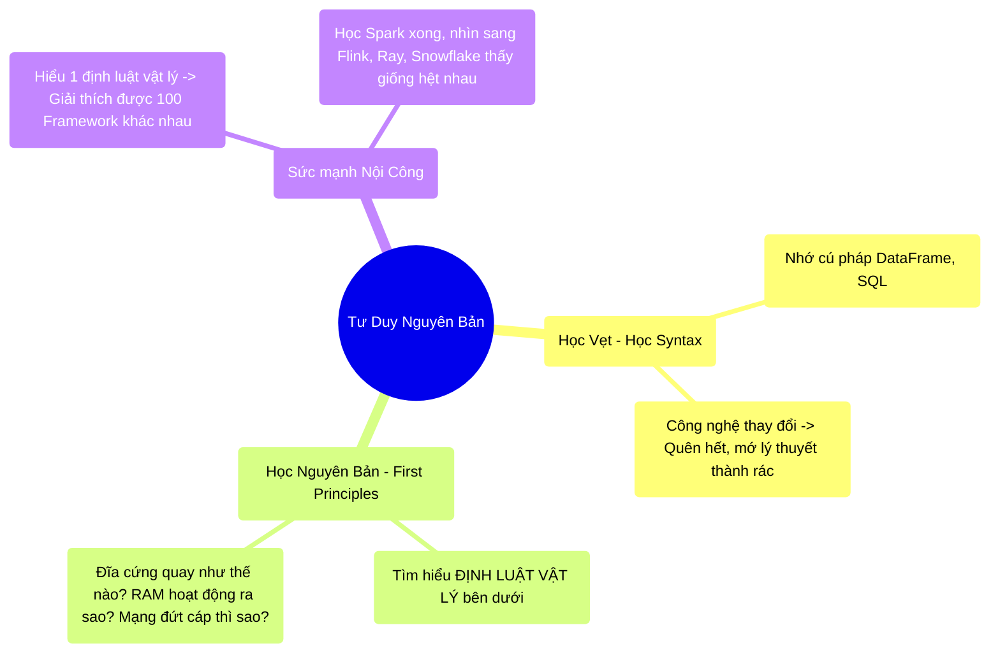

# 14.1 Tư Duy Nguyên Bản (First Principles Thinking)

## 1. Objectives
- [ ] Phá bỏ tư duy Học vẹt Cú pháp (Syntax) qua **Phép ẩn dụ Học Chiêu Thức vs Rèn Nội Công**.
- [ ] Định nghĩa phương pháp First Principles (Tư duy nguyên bản).
- [ ] Ứng dụng First Principles để giải thích mọi công nghệ Big Data mới.

## 2. Mindmap

## 3. Content

### 3.1. Phép Ẩn Dụ: Học Chiêu Thức vs Rèn Nội Công
Suốt 13 chương qua, rất hiếm khi tôi yêu cầu bạn phải học thuộc lòng một đoạn Code hay một Cú pháp (Syntax) nào đó. Thay vào đó, chúng ta luôn nói về **Vật lý học** (Băng chuyền, Kho bãi, Ổ cứng, RAM, Xe buýt).

Đó chính là sự khác biệt giữa một Thợ Gõ Code và một Kỹ Sư Thực Thụ.

> **[Ví Dụ Trực Quan: Học Võ]**
> - **Thợ Gõ Code (Học Chiêu Thức):** Lên mạng copy đoạn code `df.groupBy().count()`. Học thuộc lòng cách viết hàm. Khi Spark nâng cấp lên bản mới (thay đổi cú pháp), hoặc khi công ty bắt chuyển sang dùng Pandas/Snowflake, người thợ gõ code BỊ TÀU HỎA NHẬP MA. Họ phải học lại từ đầu.
> - **Kỹ Sư Hệ Thống (Rèn Nội Công):** Họ KHÔNG quan tâm chữ `groupBy` viết hoa hay viết thường. Họ quan tâm: **Khi chữ GroupBy được chạy, bao nhiêu Gigabyte dữ liệu sẽ bị ép phải chạy qua Dây Cáp Mạng (Shuffle)?**. 
> Khi nắm được Nội công này, cho dù bắt họ dùng Spark, Flink, hay viết code bằng ngôn ngữ C++ / Rust, họ vẫn thiết kế ra được một hệ thống siêu nhanh!

### 3.2. First Principles (Tư Duy Nguyên Bản) Là Gì?
Được tỷ phú Elon Musk cực kỳ đề cao, Tư Duy Nguyên Bản là việc **Bóc tách một vấn đề phức tạp thành những định luật Vật lý và Toán học cơ bản nhất không thể chia nhỏ hơn được nữa**, sau đó xây dựng lại giải pháp từ những hạt mầm đó.

Trong Big Data, mọi Framework (Hadoop, Spark, Kafka, Delta Lake) dù có tên gọi hoa mỹ đến đâu, bản chất vẫn bị trói buộc bởi 3 ĐỊNH LUẬT VẬT LÝ sau:
1. **Network (Mạng):** Tốc độ ánh sáng có giới hạn. Gửi 1 Byte qua cáp quang chậm hơn gấp 10.000 lần so với việc đọc nó từ RAM. $\rightarrow$ *Sinh ra Broadcast Join (Chương 8).*
2. **Memory (RAM):** RAM đắt và dung lượng nhỏ. Nhét một File 100GB vào 8GB RAM chắc chắn sẽ nổ (OOM). $\rightarrow$ *Sinh ra Spill to Disk và Tungsten Encoding (Chương 4, 6).*
3. **Disk (Ổ cứng):** Ổ cứng từ tính quay vật lý rất chậm. Đọc ngẫu nhiên (Random Access) là tự sát. $\rightarrow$ *Sinh ra Sequential Read của Parquet và Z-Order của Delta (Chương 7, 12).*

### 3.3. Siêu Năng Lực Của Tư Duy Nguyên Bản
Nếu bạn đã master (làm chủ) được Tư Duy Nguyên Bản, bạn sẽ có một Siêu năng lực: **Miễn nhiễm với sự thay đổi của Công nghệ**.

- Hôm nay công ty dùng **Spark**. Bạn biết Spark dùng RAM để nháp dữ liệu.
- Ngày mai sếp bắt chuyển sang **Apache Flink**. Bạn mỉm cười: *Flink cũng chỉ là Streaming, nó cũng phải dùng State (RAM) và Checkpoint (Disk) như Spark thôi*.
- Tuần sau công ty xài hàng xịn **Snowflake**. Bạn gật gù: *Snowflake bản chất cũng xài Micro-partition (Giống Parquet) và Decoupling (Tách rời Compute & Storage giống K8s)*.

Bạn nhìn xuyên thấu qua lớp vỏ bọc Marketing hào nhoáng của các công ty công nghệ, và nhìn thẳng vào Cấu Trúc Vật Lý bên trong chúng. Bạn trở thành một Kiến Trúc Sư Hệ Thống không bao giờ bị đào thải!

## 4. Key takeaways
- **Giá trị của cú pháp:** Code Syntax (Cách viết hàm) có giá trị bằng KHÔNG trong thời đại AI (ChatGPT, Copilot có thể viết code tốt hơn bạn).
- **Giá trị của Vật lý:** Việc hiểu rõ Dữ liệu bơi qua mạng lưới như thế nào, Ổ cứng quay ra sao mới là thứ giúp bạn debug được một Job bị tắc nghẽn. (AI không thể vào Data Center sửa mạng thay bạn).
- **Tư Duy Nguyên Bản:** Là chiếc chìa khóa vạn năng. Khi gặp một công nghệ mới, đừng hỏi Viết lệnh đó như thế nào?, hãy hỏi Nó lưu dữ liệu xuống Ổ cứng theo chiều ngang hay chiều dọc? Nó xử lý Join bằng Network hay RAM?.
