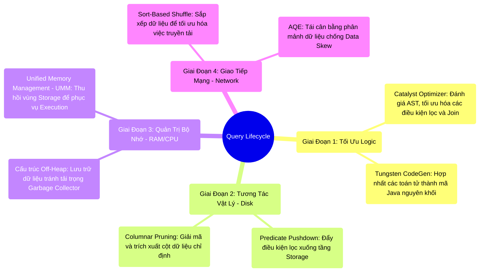

# 14.1 Kiến Trúc Chấp Hành: Vòng Đời Hoàn Chỉnh Của Một Truy Vấn (The Full Stack)

## 1. Objectives
- [ ] Tái thiết lập vòng đời toàn diện của một truy vấn (Query Lifecycle) dưới lăng kính Staff-Level Engineer.
- [ ] Liên kết các thành phần kiến trúc từ mức logic (Catalyst) xuống tầng vật lý (CPU, RAM, Disk, Network).
- [ ] Trình bày sự tương tác đồng bộ của các thuật toán lõi (Tungsten, UMM, AQE) trong quá trình thực thi.

## 2. Mindmap

## 3. Content

Mỗi truy vấn (Ví dụ: `df.show()`) hoàn tất trong hệ thống phân tán không phải là kết quả của một phép màu API, mà là hệ quả của hàng loạt cơ chế đàm phán và tối ưu hóa khắt khe giữa lớp **Phần Mềm (Logic)** và lớp **Phần Cứng (Physical Hardware)**.
Dưới lăng kính kiến trúc sư, quá trình thực thi trong vài giây đó được chia thành 4 giai đoạn cốt lõi.

### Giai Đoạn 1: Lớp Trừu Tượng Logic và Biên Dịch (Software Layer)
1. **Tiếp nhận truy vấn (Query Parsing):** Chuỗi truy vấn SQL hoặc DataFrame API được phân tích cú pháp (Parsed) thành Abstract Syntax Tree (AST).
2. **Tối ưu hóa (Catalyst Optimizer - Xem Chương 4):** Trình biên dịch Catalyst loại bỏ các bước tính toán dư thừa (Logical Optimization - RBO). Tiếp đó, nó đánh giá cấu trúc dữ liệu để quyết định phương án Join tối ưu nhất, ví dụ chỉ định **Broadcast Hash Join (CBO)** để triệt tiêu giai đoạn Shuffle đối với các bảng nhỏ.
3. **Biên dịch động (Tungsten CodeGen):** Kế hoạch thực thi vật lý (Physical Plan) được chuyển giao cho Tungsten. Động cơ này áp dụng **Whole-Stage Code Generation**, nấu chảy nhiều hàm tính toán rời rạc thành một chu trình lặp `for` nguyên khối dưới dạng Bytecode Java. JVM JIT (Just-In-Time) tiếp tục tối ưu hóa thành mã máy (Machine Code) để CPU thực thi trực tiếp, loại bỏ chi phí gọi hàm ảo (Virtual Dispatch).

### Giai Đoạn 2: Tầng Lưu Trữ (Disk/Storage I/O)
4. **Bộ lọc tầng đáy (Predicate Pushdown - Xem Chương 7):** Thay vì đọc toàn bộ tập dữ liệu thô (Ví dụ 10TB) vào RAM, Engine điều hướng mũi kim I/O đọc metadata (Footer) của tệp Parquet. Các khối dữ liệu không thỏa mãn điều kiện lọc bị loại trừ ngay từ bề mặt đĩa (Skipping).
5. **Trích xuất cột (Columnar Pruning):** Quá trình giải nén chỉ tương tác với các khối bộ nhớ chứa những cột dữ liệu (Column) được yêu cầu, bỏ qua toàn bộ phần còn lại. Dữ liệu vật lý lọt qua lưới lọc được tối thiểu hóa (Ví dụ chỉ còn 10GB).

### Giai Đoạn 3: Không Gian Bộ Nhớ và Xử Lý Cục Bộ (RAM/CPU)
6. **Lưu trữ Off-Heap (Tungsten Binary Format - Xem Chương 5):** Khối lượng 10GB dữ liệu không được khởi tạo thành các đối tượng Java Objects thông thường. Chúng được ghi nhận dưới dạng chuỗi byte nhị phân đặc trên phân vùng **Off-Heap**. Thuật toán Garbage Collector (GC) của JVM hoàn toàn không bị ảnh hưởng, đảm bảo hiệu năng CPU ở mức tối đa.
7. **Cân bằng bộ nhớ (UMM):** Khi bộ đệm xử lý (Execution Memory) có nguy cơ cạn kiệt, hệ thống **Unified Memory Manager (UMM)** sẽ chủ động đẩy các dữ liệu lưu trữ (Storage) xuống đĩa (Spill) để giải phóng không gian RAM, ưu tiên tuyệt đối cho quá trình thực thi nhằm ngăn chặn OOM.

### Giai Đoạn 4: Giao Thức Mạng và Tái Định Tuyến (Network & Shuffle)
8. **Kiểm soát I/O (Sort-Based Shuffle - Xem Chương 6):** Khi dữ liệu bắt buộc phải di chuyển chéo qua các Node (Shuffle), Engine từ chối ghi hàng triệu tệp tin nhỏ. Thay vào đó, CPU phải chịu tải để sắp xếp (Sort) luồng dữ liệu, tập hợp chúng thành duy nhất một Tệp Dữ Liệu và một Tệp Chỉ Mục (Index), bảo vệ Kernel OS khỏi thảm họa cạn kiệt File Descriptors.
9. **Thích ứng động (Adaptive Query Execution - Xem Chương 8):** Ngay tại ranh giới kết thúc của một Stage, AQE phân tích cấu trúc dữ liệu thực tế. Nếu phát hiện Data Skew (Một phân vùng quá lớn), hệ thống sẽ linh hoạt phân tách khối lượng tính toán đó thành nhiều luồng nhỏ hơn, tái cân bằng tải trên toàn Cluster trước khi bắt đầu Stage tiếp theo.

Kết quả cuối cùng của tiến trình tinh vi này được hợp nhất và trả về nút Driver, khép lại vòng đời của một truy vấn phân tán.

## 4. Key takeaways
- **Bản chất của hiệu suất**: Sức mạnh của Apache Spark không đến từ sự ngẫu nhiên, mà là chuỗi các thuật toán lách qua giới hạn I/O, RAM và CPU với tính toán cực kỳ chi li.
- **Tầm nhìn tổng thể**: Một Kỹ sư Staff-Level không chỉ am hiểu các hàm API, mà phải ánh xạ được cấu trúc mã nguồn tới trạng thái vận hành vật lý của từng thành phần phần cứng. Bài học tổng kết triết lý kiến trúc (Bài 14.2) sẽ định hình lại tư duy của một Kỹ sư Dữ liệu tinh hoa.
