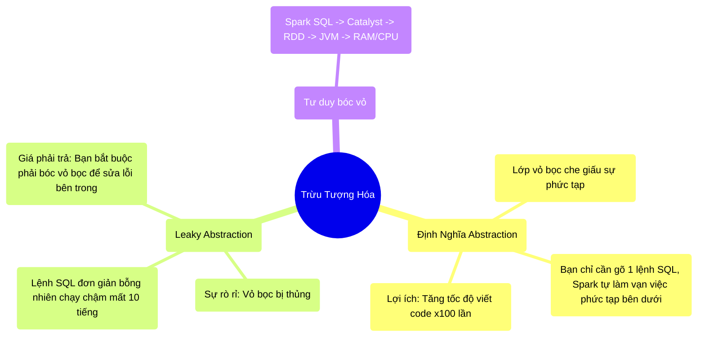

# 14.2 Cái Giá Của Sự Tiện Lợi (The Cost of Abstraction)

## 1. Objectives
- [ ] Giải mã khái niệm Abstraction (Trừu tượng hóa) qua **Phép ẩn dụ Ăn Nhà Hàng vs Tự Nấu Ăn**.
- [ ] Cảnh báo về cái giá phải trả khi bị rò rỉ Abstraction (Leaky Abstractions).
- [ ] Nguyên tắc bóc tách các lớp vỏ bọc để debug hệ thống ngầm.

## 2. Mindmap

## 3. Content

### 3.1. Phép Ẩn Dụ: Ăn Nhà Hàng Kháng Cáo (The Cost of Abstraction)
Một trong những từ khóa được dùng nhiều nhất trong Khoa học máy tính là **Abstraction (Sự trừu tượng hóa / Lớp vỏ bọc)**.
Mọi Framework (như Spark, Pandas, Keras) đều là các Abstraction. Chúng sinh ra để che giấu đi sự phức tạp tột cùng của mã máy, giúp bạn nhàn hạ.

> **[Ví Dụ Trực Quan: Bữa Ăn Nhà Hàng]**
> Abstraction giống hệt việc bạn đi ăn tại Nhà Hàng 5 Sao.
> Bạn là Người dùng (User). Bạn nhìn vào Menu (API), và gọi: *Cho tôi 1 đĩa bò bít tết*. (Bạn chỉ gõ lệnh `df.join()`).
> 
> Bạn KHÔNG CẦN BIẾT đầu bếp (Spark) trong bếp phải mổ bò ra sao, đun lửa bao nhiêu độ, đi chợ mua muối lúc mấy giờ. Sự tiện lợi đó (Abstraction) giúp bạn có bữa ăn trong 15 phút.
> 
> **Tuy nhiên, Bữa ăn 5 sao đó có 1 cái giá rất đắt:** 
> Nếu Bít tết hôm nay bị KHÉT lẹt! Bạn hét lên: *Tại sao thịt khét?*. 
> Vì bạn không ở trong bếp, bạn sẽ không bao giờ biết được là do lửa to, hay do đầu bếp làm đổ chảo. (Khó Debug).

### 3.2. Sự Rò Rỉ Của Vỏ Bọc (Leaky Abstraction)
Trong lập trình, có một định luật mang tên: *Mọi Abstraction đều sẽ bị rò rỉ (Leaky) tại một thời điểm nào đó*.

Bạn viết một câu lệnh `SELECT * FROM table ORDER BY price`. Nhìn qua thì cực kỳ đơn giản (Sự tiện lợi của Abstraction).
Nhưng đột nhiên, Job của bạn chạy 10 tiếng đồng hồ không xong, cuối cùng văng ra lỗi **OOM (Out Of Memory)**.

Sự tiện lợi đã biến mất. Cái Vỏ Bọc SQL hào nhoáng đã bị THỦNG (Leaky) và để lộ ra một sự thật gớm ghiếc bên trong: Toàn bộ dữ liệu đang dồn về 1 máy chủ duy nhất để sắp xếp (Sort), làm máy đó gặp sự cố nghiêm trọng.

Lúc này, cái giá phải trả của Abstraction ập đến: **Nếu bạn chỉ học thuộc Lệnh SQL, bạn sẽ bó tay ngồi khóc.** Bạn bắt buộc phải xách dao đi vào trong Căn Bếp (Mở Spark UI, đọc DAG, xem Catalyst Plan) để xem Đầu Bếp làm khét miếng thịt ở chỗ nào.

### 3.3. Nghệ Thuật Bóc Vỏ Hành (Peeling The Layers)
Để trở thành Kỹ sư Senior, bạn phải biết cách Bóc từng lớp vỏ (Từ bậc cao nhất xuống bậc thấp nhất) mỗi khi hệ thống có lỗi.

**Các lớp vỏ bọc của Spark (Từ cao xuống thấp):**
1. **Lớp 1 (Vỏ ngoài - SQL / DataFrame):** *Sắp xếp bảng theo giá*. Rất nhàn nhã. 
2. **Lớp 2 (Catalyst Optimizer):** Spark dịch lệnh trên thành Kế hoạch Thực thi (Physical Plan) gồm 3 bước: Đọc, Shuffle, Sort.
3. **Lớp 3 (RDD / DAG):** Kế hoạch trên biến thành 1000 mảnh rác RDD chia cho 100 máy Worker làm việc.
4. **Lớp 4 (JVM - Máy ảo Java):** Các RDD được nhét vào Bộ nhớ RAM của Java. Gây ra hiện tượng dọn rác (Garbage Collection).
5. **Lớp 5 (Vật lý phần cứng - OS):** CPU của máy chủ nóng lên 100%, Ổ đĩa Disk báo đầy (Spill).

Đó là lý do toàn bộ khóa học này tôi đưa bạn đi từ Lớp 5 (Vật lý) ngược lên Lớp 1 (Lệnh Spark). Khi bạn hiểu được Lớp 5, mọi lỗi xảy ra ở Lớp 1 chỉ là chuyện trẻ con!

## 4. Key takeaways
- **Abstraction là con dao 2 lưỡi:** Nó giúp bạn viết code siêu nhanh, nhưng nó che giấu đi sự thật vật lý. Khi mọi thứ hoạt động bình thường, Abstraction là thiên thần. Khi hệ thống lỗi, Abstraction là ác quỷ.
- **Leaky Abstraction:** Khi lỗi OOM, Skew hoặc Network Bottleneck xảy ra, đó là lúc Lớp Vỏ bị thủng. Đừng cố gắng sửa ở Tầng Code (Sửa đi sửa lại câu SQL). Hãy nhảy xuống Tầng Vật Lý (Mở Flame Graphs, check Disk Spill) để trị bệnh tận gốc.
- **Bóc vỏ hành:** Tư duy của người thợ máy giỏi là biết rõ Động cơ SQL được dịch ra RDD thế nào, RDD đẩy vào RAM ra sao, RAM ép CPU chạy bao nhiêu chu kỳ. Hiểu được cả 5 lớp, bạn là Bậc Thầy.
