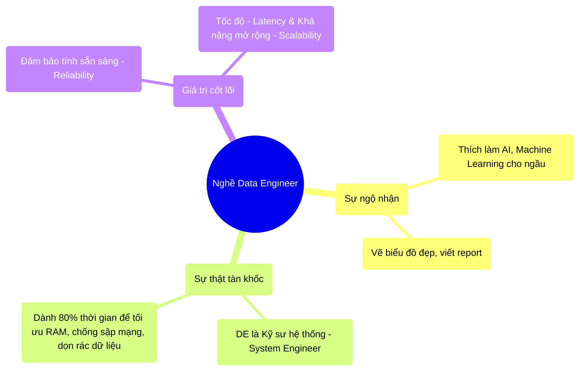

# 14.3 Tư Duy Của Kỹ Sư Dữ Liệu (The Data Engineer Mindset)

## 1. Objectives
- [ ] Phân định rõ ràng vai trò của Data Engineer (DE) và Data Scientist (DS) qua **Phép ẩn dụ Kỹ Sư Cầu Đường vs Kiến Trúc Sư**.
- [ ] Phác họa chân dung một Data Engineer thực thụ (Ops + Software Engineering).
- [ ] Kết luận chương và chuẩn bị tinh thần cho việc Thực hành (Labs).

## 2. Mindmap

## 3. Content

### 3.1. Phép Ẩn Dụ: Kỹ Sư Cầu Đường Và Nhà Thiết Kế Nội Thất
Rất nhiều sinh viên mới ra trường bị nhầm lẫn giữa Data Engineer (Kỹ sư dữ liệu) và Data Scientist (Nhà khoa học dữ liệu). Họ nghĩ DE chỉ đơn giản là kéo dữ liệu về cho DS chạy mô hình AI.

> **[Ví Dụ Trực Quan: Xây Một Tòa Cao Ốc]**
> - **Data Scientist (Nhà thiết kế nội thất):** Họ mặc vest, cầm iPad. Họ vẽ ra những căn phòng lộng lẫy, trang trí đèn chùm AI, rèm cửa Machine Learning. Báo cáo của họ đẹp lung linh khiến Giám đốc mê mẩn.
> - **Data Engineer (Kỹ sư cầu đường / Kết cấu):** Họ mặc áo bảo hộ, mặt đầy bùn đất (Logs, OOM). Công việc của họ là Đào móng (HDFS/S3), đổ bê tông (Spark), xây trụ chịu lực (Kubernetes) để tòa nhà không bị sập khi có động đất (Đứt mạng, Sập nguồn). 

Nếu không có Kỹ Sư Kết Cấu, cái đèn chùm AI của Data Scientist sẽ rơi vỡ tan tành ngay ngày đầu tiên đưa lên Production vì không có khung thép (Tài nguyên tính toán) nào đỡ nổi nó.

### 3.2. Data Engineer: Không Phải Là Thợ Viết SQL
Nghề Data Engineering đã thay đổi chóng mặt. 
5 năm trước, viết được những câu lệnh SQL dài 1.000 dòng đã được coi là DE xịn. 
Nhưng hôm nay, **Data Engineer thực chất là Software Engineer (Kỹ sư phần mềm) chuyên trị Dữ liệu lớn**.

Để sống sót, một DE phải có tư duy của người làm **Hệ Thống (System/Ops)**:
1. **Ám ảnh với Độ Tin Cậy (Reliability):** Code của bạn chạy ra kết quả đúng? Chưa đủ! Câu hỏi là: Nếu máy chủ chết lúc 2h sáng, nó có tự động hồi sinh không? Nếu dữ liệu đầu vào bị lỗi font chữ, nó có báo động đỏ không, hay âm thầm ghi rác vào Database?
2. **Ám ảnh với Cảnh Báo (Observability):** (Chương 9). Một DE giỏi không đợi khách hàng chửi mới biết hệ thống sập. Họ dán mắt vào Grafana. Nếu Pipeline chạy chậm hơn trung bình 10%, tin nhắn cảnh báo sẽ bắn vào điện thoại của họ ngay lập tức.
3. **Ám ảnh với Khả Năng Mở Rộng (Scalability):** Dữ liệu hôm nay là 10GB. Tháng sau là 100GB. Năm sau là 10.000GB. Code của bạn có cần phải viết lại khi dữ liệu tăng gấp 1.000 lần không? (Nếu bạn đã nắm vững Dynamic Allocation và Z-Order, câu trả lời là Không!).

### 3.3. Lời Kết Cho Hành Trình Lý Thuyết (Chuyển Giao)
Từ Chương 1 đến Chương 14, bạn đã được trang bị một hệ thống Mật Mã vô giá: Từ cách đọc hiểu Bộ nhớ (RAM, Off-heap), cách Mạng lưới truyền tin (Shuffle), cách Ổ cứng ghi chép (Parquet, Delta), cho đến cách Đám mây chứa chấp chúng (K8s, Spot Instances).

Bạn đã hoàn thiện TƯ DUY (Mindset) của một Staff Data Engineer đến từ các Big Tech.

Nhưng Nói có sách, mách có chứng. Không có lý thuyết nào sống sót nổi nếu không được rèn trong lò bát quái của những dòng code thực tế.
Chúng ta sẽ bước sang **Chương Cuối Cùng (Chương 15: Forensic Labs)** - Nơi chúng ta xắn tay áo lên, giải phẫu từng dòng Code, đập vỡ hệ thống để chứng minh toàn bộ những định luật vật lý chúng ta đã học là SỰ THẬT.
