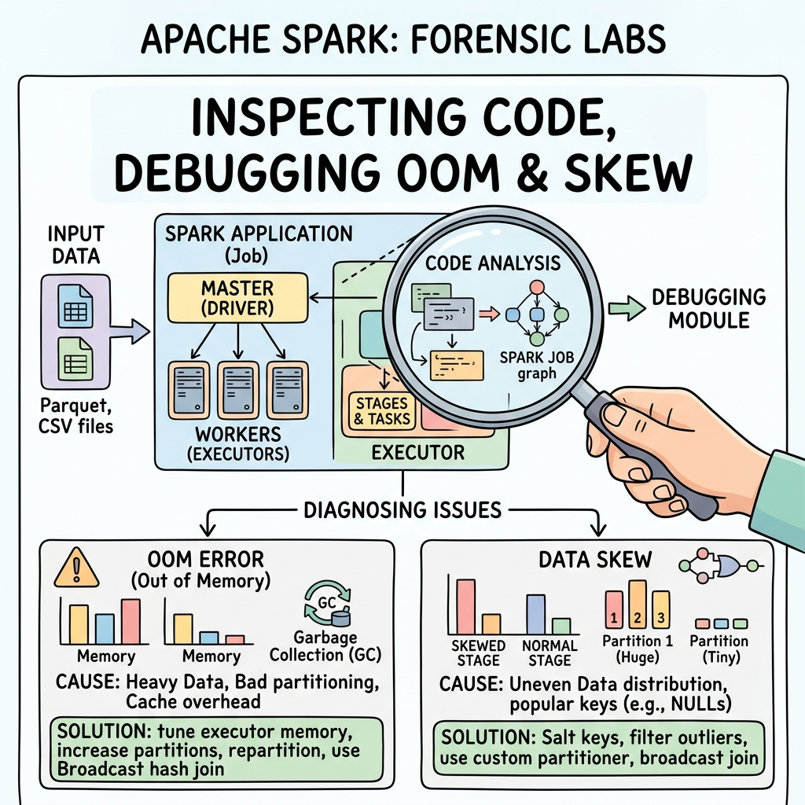

# 15.1 Lab: Phân Tích Sự Cố OOM (Out Of Memory)




## 1. Objectives
- [ ] Tái tạo lại một sự cố OOM kinh điển bằng code thực tế.
- [ ] Phân tích từng dòng code (Step-by-Step Code Anatomy) để tìm ra Nguyên nhân gây sự cố.
- [ ] Đề xuất cách viết lại code (Mitigation) để chữa dứt điểm bệnh phình RAM.

## 2. Sự Cố Kỹ Thuật: Mọi Thứ Ngừng Hoạt Động Tại Lệnh `collect()`

### 2.1. Mã Nguồn Hiện Tại (Bad Code)
Một Kỹ sư Data mới vào nghề được giao nhiệm vụ: Đọc 1 File Parquet khổng lồ (100GB, 500 triệu dòng) chứa Log lịch sử truy cập Web, sau đó in ra danh sách các địa chỉ IP bị nghi ngờ tấn công (Có chữ hack).

Kỹ sư đó viết đoạn code sau và bấm chạy trên Laptop 16GB RAM:

```python
# =========================================================================
# THE INITIAL CODE (SUBOPTIMAL CODE)
# =========================================================================
from pyspark.sql import SparkSession

spark = SparkSession.builder.appName("OOM_Killer").getOrCreate()

# Bước 1: Đọc 100GB dữ liệu (Chưa có chuyện gì xảy ra, vì Spark là Lazy)
df = spark.read.parquet("s3a://massive_logs/web_traffic.parquet")

# Bước 2: Lọc tìm chữ "hack" (Spark vẫn nằm im)
df_hacked = df.filter(df["url"].contains("hack"))

# Bước 3: Đưa TẤT CẢ kết quả về Laptop để in ra màn hình bằng vòng lặp Python
# ĐIỂM GÂY LỖI!
list_of_hackers = df_hacked.collect()  # <--- CẢNH BÁO: HỆ THỐNG TREO BỊ QUÁ TẢI!

for row in list_of_hackers:
    print(f"Hacker IP: {row['ip']}")
```

### 2.2. Phân Tích Nguyên Nhân Cốt Lõi (Phân Tích Vật Lý)
Chuyện gì đã xảy ra tại dòng số 14 (`collect()`)?

1. **Khối lượng dữ liệu quá lớn:** Giả sử sau khi lọc (Filter), số lượng Hacker lên tới 50 triệu dòng (Nặng khoảng 20GB).
2. **Hành động của lệnh `collect()`:** Nó ra lệnh cho 100 máy Công Nhân (Executors) ở trên Cloud phải DỒN TOÀN BỘ 20GB kết quả đó, nhồi nhét vào **MỘT ĐƯỜNG ỐNG DUY NHẤT** để gửi về cái Laptop của Kỹ sư (Máy Quản Đốc - Driver).
3. **Hiện tượng vật lý:** Laptop của Kỹ sư chỉ có 16GB RAM (Dành cho HĐH Windows hết 4GB, Driver Spark được chia 4GB). Khi 20GB dữ liệu ập thẳng vào 4GB RAM, Vượt quá giới hạn bộ nhớ. Lỗi `java.lang.OutOfMemoryError: Java heap space` đỏ rực màn hình. Laptop bị đơ, phải rút điện cắm lại.

### 2.3. Giải Pháp Khắc Phục (Good Code)
Đừng bao giờ cố gắng dùng Vòng lặp `for` của Python để duyệt dữ liệu Big Data. Hãy giao việc in ấn đó cho chính các máy Công Nhân (Thực thi phân tán). Hoặc nếu muốn xuất ra File, hãy lưu thẳng nó xuống Đĩa Cứng (HDFS/S3), đừng kéo nó về RAM của Driver.

```python
# =========================================================================
# THE OPTIMIZED SOLUTION (OPTIMIZED CODE)
# =========================================================================

# Bước 1 & 2 giữ nguyên
df = spark.read.parquet("s3a://massive_logs/web_traffic.parquet")
df_hacked = df.filter(df["url"].contains("hack"))

# CÁCH 1: Nếu chỉ muốn xem vài dòng cho vui (Dùng show)
# Lệnh show() giới hạn chỉ kéo 20 dòng về Driver. RAM hoàn toàn an toàn!
df_hacked.show(20, truncate=False)

# CÁCH 2: Xuất toàn bộ kết quả xuống Đĩa cứng (S3/HDFS)
# Lúc này 100 ông công nhân tự động ghi thẳng 20GB đó xuống Ổ cứng. 
# Không một byte nào bị ép phải kéo về Laptop của Driver. An toàn tuyệt đối!
df_hacked.write.mode("overwrite").csv("s3a://massive_logs/hacker_ips.csv")
```

## 3. Key takeaways
- **Tác nhân số 1 của Driver:** Hàm `collect()`. Bất cứ khi nào bạn viết chữ `collect()`, hãy tự hỏi: *Dữ liệu kéo về là bao nhiêu MB? Driver của mình có bao nhiêu RAM?*. 
- **Nguyên Tắc Cốt Lõi:** Không bao giờ dùng danh sách (List) và vòng lặp `for` của Python để xử lý kết quả của một DataFrame. Đó là hành vi chống lại định luật tính toán phân tán. Hãy luôn để Spark tự động ghi kết quả ra ổ đĩa phân tán bằng lệnh `write`.
