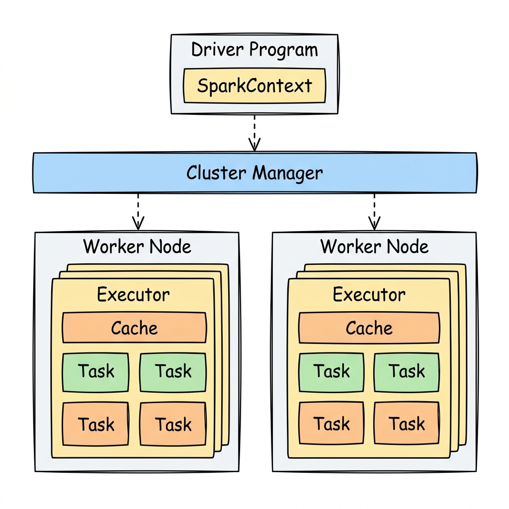
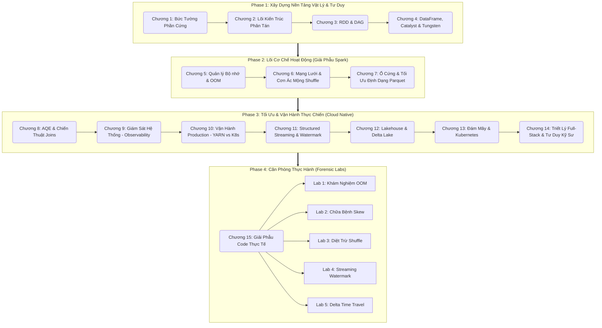

# I-Learn-Spark: Hành Trình Làm Chủ Apache Spark (Từ số 0 đến Staff Data Engineer)

Chào mừng bạn ghé thăm **I-Learn-Spark** - sổ tay ghi chép cá nhân của tôi trong quá trình làm chủ Apache Spark. Đây không phải là một tài liệu hướng dẫn gõ lệnh (Syntax) thông thường. Tôi tổng hợp những ghi chép này nhằm tự loại bỏ phương pháp học vẹt và xây dựng lại nền tảng vững chắc cho chính mình bằng **Tư Duy Nguyên Bản (First Principles Thinking)**.

Tôi lưu trữ lộ trình này để tự củng cố kiến thức và chia sẻ cho bất kỳ ai (kể cả người chưa có nền tảng Khoa học Máy tính) đang muốn thấu hiểu bản chất vật lý (RAM, CPU, Ổ đĩa, Mạng lưới) chi phối sức mạnh của hệ thống phân tán Apache Spark.

---

## 🗺️ Bản Đồ Học Tập (Learning Roadmap)

Hành trình được thiết kế theo nguyên lý tuần tự: Bắt đầu từ Phần cứng Vật lý, đi lên Tầng Ứng dụng, và kết thúc ở Môi trường Triển khai thực tế.

*(Bạn có thể mở và chỉnh sửa trực tiếp sơ đồ lộ trình học và kiến trúc tại đây: [learning_roadmap.drawio](./learning_roadmap.drawio) | [architecture_spark.drawio](./architecture_spark.drawio))*

---

## 🛠️ Triết Lý Biên Soạn Của Repository Này

1. **Không Lệ Thuộc Cú Pháp:** Công nghệ thay đổi mỗi ngày. Thay vì chỉ ghi nhớ cách viết hàm `.groupBy()`, tôi tập trung giải thích tại sao hàm `.groupBy()` lại có thể gây quá tải băng thông mạng lưới (Network) của hệ thống.
2. **Ngôn Ngữ Ẩn Dụ (Analogies):** Khoa học máy tính thường có nhiều thuật ngữ trừu tượng. Để tự mình dễ nhớ và dễ hiểu, tôi thường kết nối các khái niệm kỹ thuật với những hình ảnh đời thường:
    - *RAM* là Bàn nháp làm việc.
    - *Spark UI* là Bảng theo dõi sức khỏe hệ thống.
    - *Shuffle* là Quá trình chuyển phát và phân phối dữ liệu.
    - *Data Skew* là Sự mất cân bằng tải tại một điểm xử lý.
3. **Giải Phẫu Mã Nguồn (Code Anatomy):** Mọi dòng code ví dụ đều đi kèm lời giải thích về sự tác động vật lý của nó ở tầng dưới cùng (JVM, Disk, Network).
4. **Chuẩn Mực Kỹ Sư Hệ Thống (System Engineer):** Hướng dẫn cách tăng cường khả năng chịu lỗi (Fault Tolerance), giám sát (Observability) và cấp phát tài nguyên linh hoạt (Dynamic Allocation) trên môi trường Cloud (Kubernetes).

---

## 🚀 Hướng Dẫn Sử Dụng & Những Điều Cần Lưu Ý

- **Bắt đầu từ đâu?** Hãy đọc lần lượt từ Chương 1 đến Chương 4. Vui lòng đọc theo trình tự. Nếu bỏ qua định luật Moore và Bức tường phần cứng ở Chương 1, bạn sẽ khó hiểu được lý do Spark cần phân chia dữ liệu thành nhiều Partitions.
- **Có cần cài đặt Spark ngay lập tức?** KHÔNG. Giai đoạn 1 và 2 tập trung vào việc định hình tư duy. Việc nắm vững nguyên lý (Ví dụ: Sự khác nhau giữa Hash Shuffle và Sort Shuffle) quan trọng hơn việc chạy thử code một cách vội vã.
- **Khi nào thì thực hành?** Hãy chờ đến **Chương 15 (Forensic Labs)**. Tại đây, bạn sẽ đóng vai trò của một Kỹ sư hệ thống, phân tích những đoạn code gây lỗi OOM, nghẽn mạng (Skew), và tự tay tối ưu mã nguồn (Mitigation) để khắc phục hoàn toàn sự cố.
- **Dành cho ai?**
    - *Người mới chuyển ngành (Non-CS):* Tận dụng các ví dụ ẩn dụ để hình dung luồng chảy của dữ liệu một cách trực quan.
    - *Data Scientist:* Giúp bạn biết cách tối ưu hóa mã nguồn để hạn chế tiêu hao quá mức tài nguyên của Data Engineer.
    - *Data Engineer:* Tài liệu tham khảo để gỡ lỗi (Debug) các quy trình đang gặp sự cố trên Production, tối ưu hóa chi phí Cloud và nâng cao năng lực lên Staff Engineer.

Chúc chính tôi và những ai tình cờ đọc được sổ tay này có một hành trình học tập hiệu quả, từ việc nắm vững lệnh SQL cho đến việc hiểu rõ bản chất vận hành của hệ thống phân tán!
