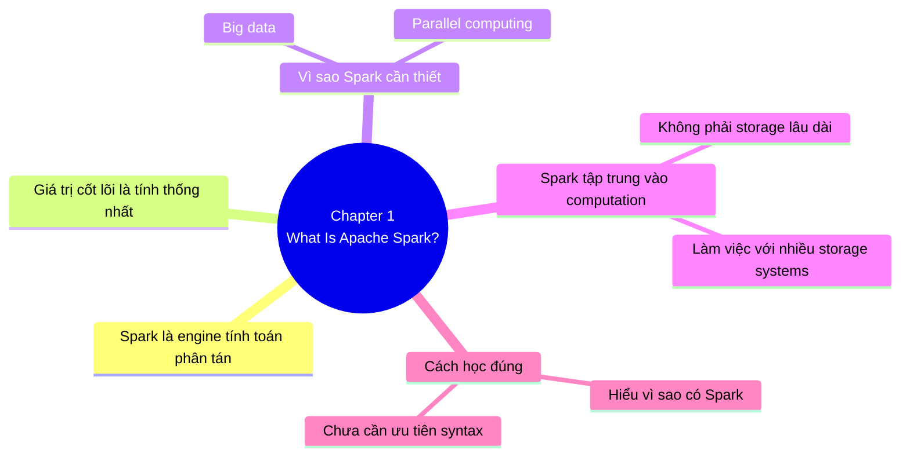

## **Chapter 1: What Is Apache Spark?**

## **1. Tóm tắt**

- Điều quan trọng nhất của Chapter 1 **không phải syntax**, mà là hiểu đúng “vì sao Spark tồn tại” và “nó giải quyết lớp bài toán nào”.
- Spark khác mô hình Hadoop đời đầu ở chỗ nó **tập trung vào computation** trên nhiều storage system khác nhau thay vì gắn chặt compute với một storage duy nhất.
- Spark ra đời vì dữ liệu tăng rất nhanh trong khi phần cứng không còn tăng tốc chủ yếu bằng CPU đơn ngày càng nhanh hơn, nên cần mô hình xử lý song song.
- Điểm mạnh cốt lõi của Spark là **tính thống nhất**: cùng một engine cho SQL, machine learning, streaming và graph analytics.
- Spark là engine tính toán phân tán, **không phải hệ lưu trữ dữ liệu lâu dài**.

## **2. Key takeaway**

Chapter 1 xoay quanh ba câu hỏi:

1. Spark là gì?

2. Vì sao bối cảnh dữ liệu hiện đại làm Spark trở nên cần thiết?

3. Người mới nên bắt đầu học và chạy Spark như thế nào?

Apache Spark được định nghĩa là một **unified computing engine**, đi kèm một tập thư viện để **xử lý dữ liệu song song** trên cluster, **hỗ trợ nhiều ngôn ngữ** như Python, Java, Scala và R, và có thể chạy từ laptop đến các cụm máy rất lớn.

# **A. Phần 1: Spark – Một Unified Computing Engine**

## 1. Định nghĩa và bản chất cốt lõi của Spark

- Spark là một “unified computing engine and a set of libraries for parallel data processing on computer clusters,” và đây là định nghĩa cần giữ rất chắc vì nó chứa gần như toàn bộ bản chất của Spark.
    - Từ “engine” cho biết Spark tập trung vào việc thực thi tính toán trên dữ liệu.
    - Từ “unified” cho biết Spark không chỉ tối ưu cho một tác vụ đơn lẻ, mà cố gắng gom nhiều kiểu xử lý dữ liệu vào cùng một nền tảng và cùng một triết lý API.
    - Từ “libraries” cho biết Spark không phải một lõi trần trụi; nó đi kèm những thư viện cấp cao để giải quyết các bài toán phổ biến như SQL, machine learning, stream processing và graph analytics.

## **2. Tại sao “unified” lại quan trọng trong pipeline thực tế?**

- Bản chất của dữ liệu trong thế giới thực là **hiếm khi đứng yên trong một kiểu xử lý duy nhất**.
- Một luồng công việc thực tế thường bắt đầu bằng đọc dữ liệu, sau đó làm sạch, truy vấn tổng hợp, tạo feature, huấn luyện model, rồi có thể triển khai thành xử lý gần thời gian thực.
- Nếu mỗi bước nằm ở một hệ khác nhau, bạn phải trả giá bằng việc di chuyển dữ liệu, học nhiều API, vận hành nhiều hệ thống và chấp nhận việc tối ưu chỉ dừng ở từng chặng nhỏ.
- Spark cố giải quyết đúng vấn đề đó: **dùng cùng một engine** để các bước khác nhau trong pipeline có thể “nói chuyện” với nhau một cách tự nhiên hơn.

## **3. Phân tích chi tiết**

1. Unified platform cho nhiều tác vụ xử lý dữ liệu
    - Spark được thiết kế để hỗ trợ nhiều tác vụ phân tích dữ liệu, từ data loading và SQL cho đến machine learning và streaming computation, trên cùng một computing engine và với một tập API nhất quán.
    - Các tác vụ phân tích dữ liệu ngoài đời thật thường là tổ hợp của nhiều kiểu xử lý, chứ không chỉ một phép biến đổi riêng lẻ.
    - Điểm mạnh của sự thống nhất không chỉ là **tiện dùng**, mà còn là **dễ tối ưu**, vì engine có thể nhìn qua nhiều bước liên tiếp để đưa ra kế hoạch thực thi tốt hơn.
2. Vai trò “computing engine” (không phải storage)
    - Spark tự giới hạn phạm vi của mình ở vai trò **engine tính toán: đọc dữ liệu từ hệ lưu trữ, xử lý dữ liệu đó, và trả kết quả ra ngoài**.
    - Spark **không định vị mình như nơi lưu dữ liệu lâu dài**.
    - Vì vậy Spark **có thể làm việc với nhiều hệ lưu trữ khác nhau** như cloud storage, distributed file systems, key-value stores và message buses.
    - Đây là một quyết định kiến trúc rất quan trọng vì dữ liệu trong doanh nghiệp thường nằm rải rác ở nhiều nơi, và chi phí di chuyển dữ liệu thường rất đắt.
3. Bộ thư viện cốt lõi (SQL, MLlib, Streaming, GraphX)
    - **Spark SQL** phục vụ cho dữ liệu có cấu trúc và truy vấn theo mô hình bảng.
    - **MLlib** phục vụ machine learning.
    - **Spark Streaming** và **Structured Streaming** phục vụ xử lý luồng dữ liệu.
    - **GraphX** phục vụ graph analytics.
    - Ngoài thư viện chuẩn còn có rất nhiều thư viện bên ngoài do cộng đồng phát triển.
4. “Unified” sâu hơn mức có nhiều module
    - Spark là unified, ý không chỉ là “có nhiều module.”
    - Ý sâu hơn là các module đó được xây để interoperable, tức là có thể kết hợp trong cùng ứng dụng thay vì tồn tại như các đảo tách biệt.
    - Đây là khác biệt lớn giữa một hệ sinh thái chắp vá và một platform có chủ đích thiết kế thống nhất từ đầu.

## **4. Bảng so sánh khái niệm**

| **Concept** | **Nghĩ đơn giản** | **Hiểu đúng hơn** |
| --- | --- | --- |
| Unified engine | Một tool làm nhiều việc | Một nền tảng thống nhất để nhiều bước trong pipeline dữ liệu cùng chạy và cùng được tối ưu. |
| Engine | Phần mềm xử lý dữ liệu | Lớp thực thi tính toán trên cluster, không phải nơi lưu trữ dữ liệu lâu dài. |
| Libraries | Add-on phụ thêm | Những khối chức năng chuẩn giúp giải các workload phổ biến trên cùng engine. |

## **5. Ví dụ minh họa**

- Hãy hình dung một công ty thương mại điện tử có dữ liệu clickstream, đơn hàng và hành vi người dùng.
- Với Spark, công ty đó có thể dùng SQL để truy vấn và tổng hợp dữ liệu có cấu trúc, dùng machine learning để dự đoán khả năng mua hàng, dùng streaming để xử lý tín hiệu mới đi vào, và dùng graph analytics nếu muốn phân tích quan hệ giữa người dùng và sản phẩm.
- Giá trị không nằm ở việc “Spark biết làm nhiều thứ,” mà ở chỗ các bước đó có thể nằm trong cùng một stack xử lý.

# **B. Phần 2: Tại sao Spark lại quan trọng trong bối cảnh dữ liệu hiện đại?**

## **1. Bối cảnh: Sự thay đổi của phần cứng và sự bùng nổ dữ liệu**

- Spark quan trọng vì nó xuất hiện đúng lúc thế giới dữ liệu bước vào một trạng thái mới: dữ liệu tăng rất nhanh, việc lưu và thu thập dữ liệu rẻ hơn nhiều, nhưng **khả năng tăng tốc tự nhiên của phần cứng theo mô hình cũ đã chậm lại**.
- Trong phần lớn lịch sử máy tính, ứng dụng tự nhiên hưởng lợi từ việc CPU mỗi năm chạy nhanh hơn.
- Tuy nhiên khoảng từ năm 2005, vì giới hạn tản nhiệt, nhà sản xuất phần cứng **chuyển từ tăng xung nhịp sang tăng số lõi xử lý song song**.
- Điều này tạo ra một thay đổi căn bản: phần mềm muốn chạy nhanh hơn thì phải biết khai thác **parallelism**.
- Spark là một mô hình lập trình và engine giúp hiện thực hóa điều đó ở quy mô dữ liệu lớn.

## **2. Phân tích các vấn đề cốt lõi**

1. Bản chất của bài toán Big Data
    - Vấn đề của big data không chỉ là dung lượng lớn.
    - Vấn đề thật là khối lượng, tốc độ và độ phức tạp của dữ liệu vượt quá khả năng xử lý hiệu quả của một máy đơn trong thời gian chấp nhận được.
    - Khi đó ta cần cluster để gom tài nguyên của nhiều máy lại thành một môi trường tính toán thống nhất.
2. Tại sao parallel computing trở thành bắt buộc
    - Khi CPU không còn tăng tốc đơn nhân như trước, cách duy nhất để tăng throughput là tận dụng nhiều core và nhiều máy.
    - Nhưng song song hóa không chỉ là **chia file ra nhiều mảnh**; nó còn liên quan đến **điều phối công việc, quản lý lỗi, phân phối dữ liệu và tối ưu trao đổi dữ liệu giữa các nút**.
    - Spark giúp người dùng không phải trực tiếp xử lý toàn bộ độ phức tạp thấp tầng đó.
3. Khác biệt với Hadoop-style processing
    - **Hadoop đời đầu gắn khá chặt storage và computation thông qua HDFS và MapReduce**.
    - Lựa chọn đó có giá trị lịch sử lớn, nhưng nó khiến việc dùng compute mà không đi kèm storage tương ứng trở nên kém linh hoạt hơn.
    - **Spark thì tập trung vào computation, còn dữ liệu có thể nằm trên nhiều storage system khác nhau**.
    - Điều này phù hợp hơn với thực tế hiện đại, nơi doanh nghiệp có thể lưu dữ liệu trên cloud object storage, file system phân tán, NoSQL store hoặc message bus.
4. Vì sao Spark thuận lợi hơn cho ứng dụng nhiều bước
    - MapReduce khiến các ứng dụng nhiều bước và iterative workloads trở nên cồng kềnh.
    - Ví dụ, một thuật toán machine learning có thể phải quét dữ liệu 10 hoặc 20 lần, và trong MapReduce, mỗi pass có thể trở thành một job riêng phải được launch riêng và đọc dữ liệu lại từ đầu.
    - Spark được thiết kế để biểu diễn các ứng dụng nhiều bước ngắn gọn hơn và hỗ trợ chia sẻ dữ liệu hiệu quả hơn giữa các bước.

## **3. Ví dụ minh họa**

- Giả sử bạn có một bài toán recommendation cần lặp nhiều vòng để tối ưu tham số mô hình.
- Nếu mỗi vòng lặp là một job rời rạc, chi phí orchestration và đọc dữ liệu sẽ phình to rất nhanh.
- Một engine như Spark phù hợp hơn vì nó được xây để diễn tả và thực thi loại pipeline lặp nhiều bước này hiệu quả hơn.

# **C. Phần 3: Bắt đầu học và chạy Spark như thế nào?**

## **1. Lịch sử ngắn gọn của Spark**

- Spark bắt đầu ở UC Berkeley năm 2009 như một research project.
- Bản paper đầu tiên xuất hiện năm sau đó, trong bối cảnh Hadoop MapReduce đang là mô hình thống trị cho cluster computing.
- Sau các phiên bản đầu cho batch, Spark nhanh chóng mở rộng sang interactive data science và ad hoc queries, rồi có thêm Shark, MLlib, Spark Streaming và GraphX.
- Năm 2013, Spark được đưa vào Apache Software Foundation, sau đó phát hành Spark 1.0 vào 2014 và Spark 2.0 vào 2016.
- Các API structured đời mới là một trọng tâm lớn của hệ Spark hiện đại.

## **2. Các cách bắt đầu thực tế**

1. Local setup
    - Để chạy Spark local, bạn cần Java; nếu dùng Python API thì cần thêm Python interpreter.
    - Có thể tải Spark bản pre-built và giải nén để bắt đầu.
    - Đây là lối vào đơn giản vì bạn có thể chạy ví dụ ngay, không cần dựng cả cluster.
2. Interactive consoles
    - `pyspark` là shell tương tác cho Python.
    - `spark-shell` là shell tương tác cho Scala.
    - `spark-sql` là shell cho truy vấn SQL.
    - Các shell này cực kỳ quan trọng cho người mới vì chúng rút ngắn vòng lặp học tập: thử lệnh, xem kết quả, sửa lại, hiểu dần mô hình.
3. Cloud option
    - Databricks Community Edition là một môi trường cloud miễn phí để học Spark.
    - Lợi thế của mô hình này là có sẵn môi trường notebook, dữ liệu và code ví dụ, nên giảm đáng kể chi phí setup ban đầu.
