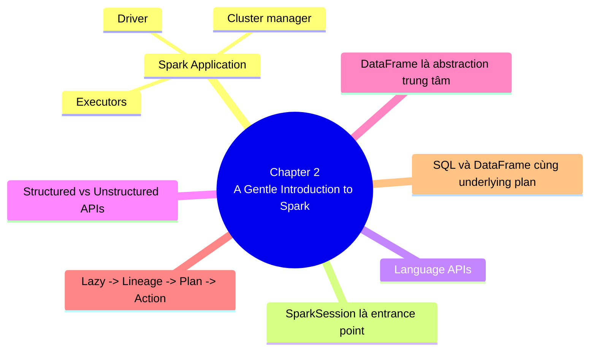

## **Chapter 2: A Gentle Introduction to Spark**

## **1. Tóm tắt**

Chapter 2 là chương chuyển từ mức “biết Spark là gì” sang mức “bắt đầu dùng Spark như một hệ thống thật”, bằng cách giới thiệu kiến trúc cơ bản của Spark Application, vai trò của SparkSession, các abstraction cốt lõi như DataFrame, partitions, transformations, actions, và một workflow đầu-cuối từ đọc CSV đến chạy cùng logic bằng SQL và DataFrame.

Điểm quan trọng nhất của chương không nằm ở syntax, mà ở mental model: Spark không xử lý dữ liệu theo kiểu mỗi dòng code tác động trực tiếp và ngay lập tức lên dữ liệu local, mà bạn mô tả một chuỗi biến đổi trên dữ liệu phân tán; Spark giữ lại lineage của chuỗi biến đổi đó, tối ưu nó thành plan thực thi, rồi chỉ chạy thật khi có action.

Chapter này cũng đặt nền cho phần còn lại của cuốn sách bằng cách phân biệt giữa low-level unstructured APIs và higher-level structured APIs, đồng thời cho thấy SQL và DataFrame chỉ là hai bề mặt biểu đạt khác nhau mà Spark có thể compile xuống cùng underlying plan khi business logic tương đương.

## **2. Key takeaway**

- Một Spark Application gồm **driver process** và nhiều **executor processes**, còn tài nguyên của cluster được quản lý bởi **cluster manager** như Spark Standalone, YARN hoặc Mesos.
- **SparkSession** là entrance point để chạy Spark code từ góc nhìn người dùng.
- Spark hỗ trợ nhiều **Language APIs** như Scala, Java, Python, SQL và R; với Structured APIs, các ngôn ngữ có đặc tính hiệu năng tương tự, còn Python hoặc R được dịch sang dạng mà executor JVM có thể chạy.
- Spark có hai họ API lớn: **low-level unstructured APIs** và **higher-level structured APIs**, và chapter này chủ yếu đặt nền cho Structured APIs.
- **DataFrame**, **Dataset**, **SQL tables/views** và **RDDs** đều là abstraction quan trọng, nhưng DataFrame là abstraction trung tâm và dễ tiếp cận nhất trong phần mở đầu này.
- Chuỗi tư duy cốt lõi của chapter là: **immutable transformations → lazy evaluation → lineage → plans/optimizer → action → Spark UI**.
- SQL và DataFrame chỉ là hai cách biểu đạt khác nhau; Spark có thể compile SQL và DataFrame xuống cùng underlying plan khi business logic tương đương.

# **A. Phần 1: Spark architecture basics, SparkSession và Language APIs**

## **1. Spark Application là gì?**

- Spark được xây để điều phối việc xử lý dữ liệu trên một **cluster**, tức một nhóm máy tính gom tài nguyên lại để giải những bài toán mà một máy đơn thường không đủ CPU, RAM hoặc thời gian để xử lý hiệu quả.
- Bản thân nhiều máy chưa đủ tạo ra sức mạnh; cần một framework biết cách chia việc, điều phối việc thực thi và gom kết quả lại, và Spark chính là framework đó.

## **2. Ba thành phần trung tâm: Driver, Executor, Cluster Manager**

1. Driver process
    - Driver là tiến trình chạy `main()` của ứng dụng Spark và là trung tâm điều phối của Spark Application.
    - Nó giữ thông tin của toàn bộ ứng dụng, phản hồi với chương trình hoặc input của người dùng, rồi phân tích, phân phối và lên lịch công việc cho các executors.
2. Executor processes
    - Executors là các tiến trình thực sự làm việc do driver giao xuống.
    - Mỗi executor chịu trách nhiệm chạy code được giao và báo lại trạng thái tính toán về cho driver.
3. Cluster manager
    - Cluster manager là lớp quản lý tài nguyên vật lý của cluster, ví dụ Spark Standalone, YARN hoặc Mesos.
    - Bạn submit Spark Application lên cluster manager, và nó sẽ cấp tài nguyên để application chạy.

## **3. Local mode: hiểu đúng để không lệch mental model**

- Ngoài cluster mode, Spark còn có **local mode**.
- Vì driver và executors về bản chất là processes, nên trong local mode chúng chạy trên máy cá nhân của bạn dưới dạng **threads** thay vì phân tán trên nhiều máy.
- Điều này rất quan trọng cho người học, vì bạn có thể học Spark trên laptop nhưng vẫn phải giữ tư duy về distributed execution.

## **4. SparkSession là entrance point**

- **SparkSession** là entrance point để chạy Spark code từ góc nhìn người dùng.
- Trong interactive shells như `pyspark` hoặc `spark-shell`, biến `spark` thường đã có sẵn; trong application độc lập, bạn phải tự tạo SparkSession.
- Khi bạn gọi `spark.read`, `spark.sql` hoặc `spark.range`, bạn đang dùng SparkSession để mô tả công việc cần Spark thực hiện.

## **5. Language APIs: không chỉ là “Spark hỗ trợ nhiều ngôn ngữ”**

- Spark hỗ trợ **Scala, Java, Python, SQL và R**.
- Spark cố giữ các **core concepts** nhất quán giữa các ngôn ngữ này.
- Nếu bạn dùng Structured APIs, bạn có thể kỳ vọng các ngôn ngữ có **đặc tính hiệu năng tương tự nhau**.
- Với Python hoặc R, bạn không viết chỉ thị JVM trực tiếp; thay vào đó, Spark dịch code Python hoặc R sang dạng mà executor JVM có thể chạy.

## **6. Bảng mental model kiến trúc**

| **Thành phần** | **Nghĩ đơn giản** | **Hiểu đúng hơn** |
| --- | --- | --- |
| Driver | Bộ não ứng dụng | Giữ state của Spark Application, nhận input của người dùng, rồi phân tích và lên lịch công việc cho executors. |
| Executor | Worker | Chạy code do driver giao và báo trạng thái/kết quả về lại. |
| Cluster manager | Quản lý máy | Cấp phát tài nguyên cho Spark Applications trên cluster. |
| SparkSession | Cổng vào | Entrance point để chạy Spark code. |
| Language APIs | Cú pháp khác nhau | Các bề mặt biểu đạt khác nhau của cùng core concepts Spark. |

## **7. Ví dụ**

- Nếu xem Spark Application như một công ty, driver là nơi ra quyết định, executors là đội vận hành làm việc thực tế, còn cluster manager là bộ phận quản lý cơ sở hạ tầng và phân bổ tài nguyên.
- SparkSession là bàn làm việc nơi người dùng gửi yêu cầu vào hệ thống.

# **B. Phần 2: Core abstractions của Spark**

## **1. Hai họ API lớn của Spark**

- Spark có hai họ API nền tảng: **low-level “unstructured” APIs** và **higher-level structured APIs**.
- Chapter 2 chủ yếu đặt nền cho **Structured APIs**, vì đây là hướng tiếp cận chính của phần lớn cuốn sách.
- Việc phân biệt này quan trọng vì nó giải thích vì sao sách về sau tập trung mạnh vào DataFrames, SQL và Datasets trước khi quay lại các API thấp hơn như RDDs.

## **2. Các abstraction quan trọng cần nhìn cùng nhau**

1. DataFrame
    - DataFrame là abstraction trung tâm trong chapter này, đại diện cho dữ liệu dạng bảng với rows, columns và schema.
2. Datasets
    - Dataset là một abstraction thuộc Structured APIs và đứng cạnh DataFrame.
3. SQL tables/views
    - Tables và views cho phép biểu đạt cùng dữ liệu bằng ngôn ngữ SQL trên cùng execution model.
4. RDDs
    - RDD là abstraction low-level truyền thống hơn của Spark và là đại diện tiêu biểu của nhóm API thấp hơn.

## **3. DataFrame: abstraction nên ưu tiên ở giai đoạn đầu**

- DataFrame là abstraction dễ tiếp cận và hiệu quả để bắt đầu vì nó cho phép bạn nghĩ dữ liệu theo mô hình bảng thay vì phải thao tác trực tiếp từng object hoặc từng partition.
- Nó cũng phù hợp với các tối ưu hoá của Structured APIs, nên vừa dễ học vừa sát thực tế.

## **4. DataFrame: trực giác đúng khi đi từ local sang distributed**

## **Explain**

- Spark DataFrame giống DataFrame trong Python hoặc R ở chỗ đều biểu diễn dữ liệu dạng bảng có cột.
- Tuy nhiên, Spark DataFrame có thể trải trên nhiều máy thay vì bị giới hạn trong tài nguyên của một máy đơn.

## **Intuition**

- Điểm khác biệt quan trọng không phải là “cú pháp bảng” mà là **quy mô** và **execution model**.
- Bạn vẫn nhìn dữ liệu như hàng, cột và schema, nhưng Spark xử lý bảng đó như một collection phân tán trên cluster.

## **Example**

- Một Pandas DataFrame sống trên máy local và bị ràng buộc bởi RAM cũng như CPU của máy đó.
- Một Spark DataFrame có thể được phân tán trên nhiều executors trong cluster để xử lý dữ liệu lớn hơn nhiều.

## **Application**

- Khi chuyển từ Pandas sang Spark, hãy giữ trực giác về bảng dữ liệu.
- Nhưng hãy bỏ thói quen nghĩ rằng mọi thứ đều nằm trong RAM của một máy.

## **5. Partitions: nền của thực thi song song**

- Spark chia dữ liệu thành **partitions**, là các đơn vị dữ liệu vật lý để phân bố và thực thi song song.
- Mức độ song song thực tế phụ thuộc vào cả số partitions lẫn tài nguyên thực thi hiện có.
- Tuy nhiên ở chapter này, người dùng không trực tiếp thao tác per-partition, mà mô tả logic ở mức cao để Spark tự quản lý execution.

## **6. Transformations: immutable và lazy**

- Các abstraction cốt lõi của Spark là **immutable**, nghĩa là bạn không sửa dữ liệu tại chỗ mà luôn tạo ra một biến đổi mới từ dữ liệu cũ.
- Những phép biến đổi đó được gọi là **transformations**.
- Spark không chạy chúng ngay lập tức mà trì hoãn cho tới khi cần.

## **7. Lineage: mắt xích còn thiếu nếu chỉ hiểu “lazy”**

- Spark giữ lại chuỗi các transformations như một **lineage** của dữ liệu.
- Điều này quan trọng vì Spark không coi mỗi lệnh là một thao tác phá huỷ trực tiếp lên dữ liệu, mà giữ lịch sử biến đổi để biết dữ liệu được tạo ra từ đâu và có thể **recompute** partition như thế nào khi cần.
- Chính lineage là cây cầu nối giữa immutable transformations và khả năng thực thi muộn của Spark.

## **8. Narrow và wide transformations**

1. Narrow transformations
    - Narrow transformation là loại biến đổi mà một input partition chỉ ảnh hưởng tới tối đa một output partition.
    - Các phép lọc là ví dụ điển hình của loại này.
2. Wide transformations
    - Wide transformation là loại biến đổi mà dữ liệu từ nhiều input partitions phải được tái phân phối để tạo output.
    - Đây là nơi thường xảy ra **shuffle**.

## **9. Actions: không chỉ kích hoạt execution mà còn quyết định kiểu kết quả đầu ra**

## **Explain**

- Chapter 2 không chỉ nói action là thứ kích hoạt execution, mà còn chia actions thành ba nhóm chính.
- Nhóm thứ nhất là xem dữ liệu trên console.
- Nhóm thứ hai là collect dữ liệu về native objects của ngôn ngữ đang dùng.
- Nhóm thứ ba là ghi kết quả ra output data sources.

## **Intuition**

- Dù khác nhau về bề mặt sử dụng, cả ba nhóm đều có cùng ý nghĩa: buộc Spark biến lineage và plan thành **kết quả thật**.

## **Example**

- `show()` thuộc nhóm xem dữ liệu trên console.
- `take()` hoặc `collect()` thuộc nhóm đưa dữ liệu về local objects.
- Ghi file hoặc ghi database thuộc nhóm output data source.

## **Application**

- Trước khi gọi một action, hãy luôn tự hỏi mình đang làm việc gì: xem mẫu dữ liệu, kéo dữ liệu về local, hay đẩy kết quả ra hệ thống ngoài.

## **10. Chuỗi mental model đúng của chapter**

- Nếu nối các ý lại với nhau, thứ tự đúng là: dữ liệu bất biến → bạn khai báo transformations → Spark giữ lineage → trì hoãn execution → tối ưu thành plans → action kích hoạt chạy thật → Spark UI cho bạn quan sát jobs, stages và tasks.
- Nếu thiếu một mắt xích trong chuỗi này, người học rất dễ hiểu Spark như một thư viện local “to hơn Pandas,” và đó là cách hiểu sai.

## **11. Spark UI: nơi execution trở nên nhìn thấy được**

- Spark UI là nơi bạn quan sát được jobs, stages, tasks, environment và trạng thái của application.
- Trong local mode, giao diện này thường ở `http://localhost:4040`.
- Đây là nơi lý thuyết về action và execution plan bắt đầu hiện ra thành thứ có thể quan sát.

## **12. Bảng nối chuỗi tư duy**

| **Mắt xích** | **Ý nghĩa** |
| --- | --- |
| Immutable transformations | Không sửa dữ liệu tại chỗ mà tạo mô tả biến đổi mới. |
| Lazy evaluation | Chưa chạy ngay, giúp tích luỹ và tối ưu logic. |
| Lineage | Giữ lịch sử biến đổi để biết dữ liệu đến từ đâu và recompute thế nào. |
| Plans / optimizer | Chuyển logic mức cao thành kế hoạch thực thi hiệu quả hơn. |
| Action | Kích hoạt execution thật. |
| Spark UI | Nơi quan sát jobs, stages và tasks. |

# **C. Phần 3: First end-to-end workflow với CSV, DataFrame và SQL**

## **1. Đọc CSV vào DataFrame**

- Chương dùng dữ liệu chuyến bay dạng CSV để minh hoạ một workflow đầu-cuối.
- Dữ liệu được đọc vào bằng SparkSession và DataFrameReader, thường đi kèm các option như `inferSchema` và `header`.
- Việc đọc này đi vào flow của Structured APIs, nên bạn đang mô tả nguồn dữ liệu và schema chứ chưa nhất thiết materialize toàn bộ dữ liệu ngay.

## **2. Kiểm tra dữ liệu bằng action nhỏ**

- `take(3)` hoặc `show()` là những action rất quan trọng ở đầu workflow vì chúng cho phép bạn kiểm tra dữ liệu thật trước khi viết logic tiếp theo.
- Đây là thói quen rất nên giữ khi học Spark: đọc dữ liệu, nhìn schema, xem một ít dòng mẫu, rồi mới aggregate hay sort.

## **3. `groupBy` chưa phải kết quả aggregate cuối cùng**

- Một điểm sách cố tình nhấn mạnh là `groupBy` chưa tạo ra kết quả aggregate cuối cùng.
- Về bản chất, nó tạo ra một trạng thái nhóm trung gian để chờ các phép tổng hợp tiếp theo; trong Scala, kiểu đối tượng này là **RelationalGroupedDataset**.
- Điều này giúp người học hiểu rằng Spark DataFrame API đang xây dựng logic từng bước, chứ không “tính xong ngay” ở mỗi lệnh.

## **4. `desc` trả về Column expression**

- Khi bạn dùng `desc("count")`, sách muốn bạn thấy rằng đây không chỉ là “sắp xếp giảm dần.”
- Quan trọng hơn, `desc` trả về một **Column expression**, tức một biểu thức logic sẽ được đưa vào plan của Spark.
- Đây là bước đệm để hiểu rằng nhiều thao tác trong DataFrame API thực ra đang xây các expression chứ không thao tác trực tiếp lên giá trị local.

## **5. Aggregation phân tán thường chạy nhiều pha**

- Các phép như `sum` có thể được thực thi theo nhiều pha vì phép cộng có tính giao hoán và kết hợp.
- Điều đó cho phép mỗi partition tính phần cục bộ trước, rồi Spark mới gộp kết quả ở pha sau trên quy mô toàn cục.
- Đây là một ý rất quan trọng để hiểu vì sao aggregation phân tán có thể chạy hiệu quả.

## **6. `sort`, `Exchange` và cách nhận ra shuffle**

- `sort` là một wide transformation vì nó đòi hỏi dữ liệu phải được phối hợp giữa nhiều partitions.
- Dấu hiệu quan trọng trong `explain()` là các node như **`Exchange`**, vì đó là tín hiệu cho thấy Spark đang tái phân phối dữ liệu và có shuffle.
- Học Spark tốt không phải chỉ nhớ “wide transformation là gì,” mà phải biết cách **nhìn thấy** shuffle trong plan.

## **7. `spark.sql.shuffle.partitions`: không phải thao tác dữ liệu vật lý trực tiếp**

- Khi sách chỉnh `spark.sql.shuffle.partitions`, ý nghĩa không chỉ là làm ví dụ local gọn hơn.
- Tầng nghĩa sâu hơn là: người dùng không trực tiếp thao tác dữ liệu vật lý, nhưng vẫn có thể điều chỉnh một số **execution characteristics** như số partitions sau shuffle.
- Đây là một ví dụ đẹp cho việc Spark tách tầng **logic biểu đạt** khỏi tầng **đặc tính thực thi vật lý**.

## **8. Temp view và SQL**

- DataFrame có thể được đăng ký thành temp view bằng `createOrReplaceTempView`.
- Sau đó, bạn có thể gọi `spark.sql(...)` để chạy truy vấn SQL trên cùng dữ liệu đó.
- Điều quan trọng là `spark.sql(...)` vẫn trả về một **DataFrame**.

## **9. SQL và DataFrame: đổi bề mặt biểu đạt, không đổi lõi thực thi**

- SQL và DataFrame là hai bề mặt biểu đạt khác nhau của cùng một hệ thống xử lý.
- Spark có thể compile SQL và DataFrame xuống cùng **underlying plan** khi business logic tương đương.
- Sách không chỉ nói điều này ở mức khái quát, mà còn minh hoạ bằng hai `explain()` cho ra kế hoạch giống nhau khi logic tương đương.

## **10. Ví dụ trực giác của workflow đầu-cuối**

- Một workflow điển hình của chapter là: đọc CSV → kiểm tra dữ liệu → `groupBy` → `sum` → đổi tên cột → `sort` với `desc` → `limit` → action như `show()`.
- Toàn bộ chuỗi đó tạo thành một DAG của transformations cho tới khi action được gọi.
- Spark nhìn cả chuỗi như một kế hoạch tính toán có thể tối ưu, chứ không xem chúng là những lệnh rời rạc không liên quan.

## **11. Bảng so sánh SQL và DataFrame trong chapter này**

| **Cách biểu đạt** | **Ưu điểm** | **Điểm cần nhớ** |
| --- | --- | --- |
| SQL | Gần với analyst, ngắn gọn cho query và aggregation. | Có thể chạy trên temp view và vẫn trả về DataFrame. |
| DataFrame API | Tự nhiên hơn với lập trình viên và dễ ghép vào code Python/Scala. | Nhiều thao tác thực chất đang xây expressions và plans. |
| Cả hai | Khác cú pháp biểu đạt. | Spark có thể compile chúng xuống cùng underlying plan khi business logic tương đương. |

# **D. Kết nối cuối chương: Chapter 2 thực sự muốn dạy gì?**

## **1. Từ Chapter 1 sang Chapter 2**

- Nếu Chapter 1 trả lời “Spark là gì và vì sao cần nó,” thì Chapter 2 bắt đầu trả lời “Spark vận hành và được dùng như thế nào ở mức cơ bản.”
- Đây là chương đầu tiên khiến bạn phải chuyển từ tư duy local sang tư duy distributed nhưng vẫn giữ bề mặt làm việc tương đối quen thuộc.

## **2. Mental model cần mang sang các chapter sau**

1. Dữ liệu là phân tán.
    - Bạn không nên mặc định mọi thứ nằm trong RAM của một máy.
2. Logic là bất biến.
    - Bạn không sửa object tại chỗ mà khai báo biến đổi mới.
3. Execution là lazy.
    - Chưa có action thì chưa có kết quả thật.
4. Spark giữ lineage và plan.
    - Nhờ đó Spark biết cách tối ưu và biết cách recompute khi cần.
5. SQL và DataFrame không phải hai thế giới tách biệt.
    - Chúng là hai cách biểu đạt của cùng execution model.
